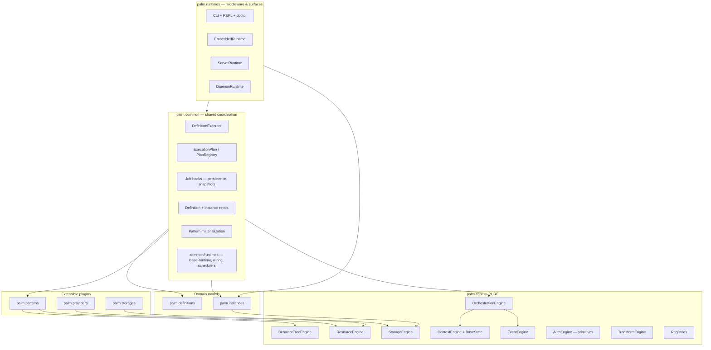
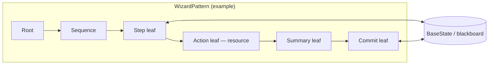
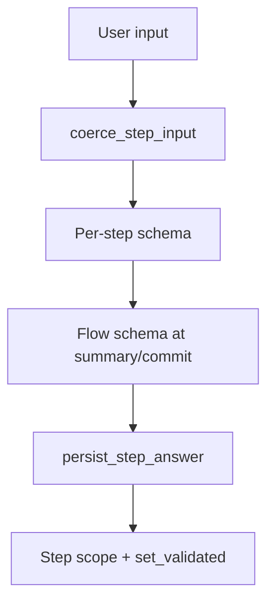
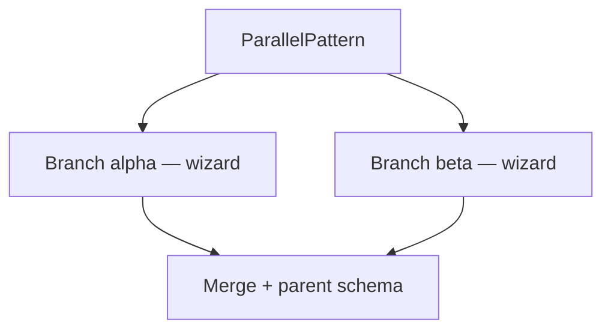
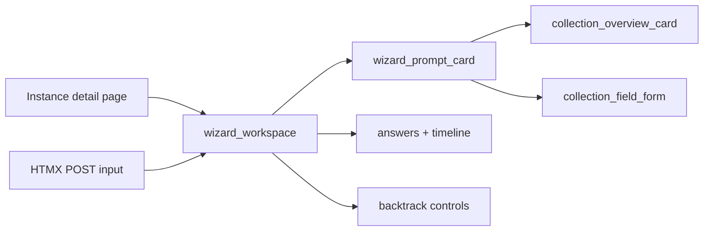
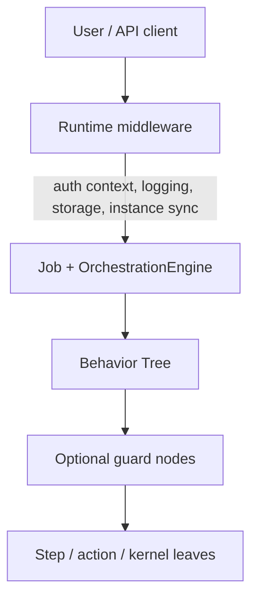
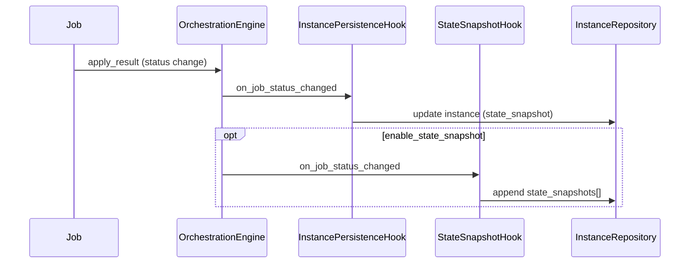
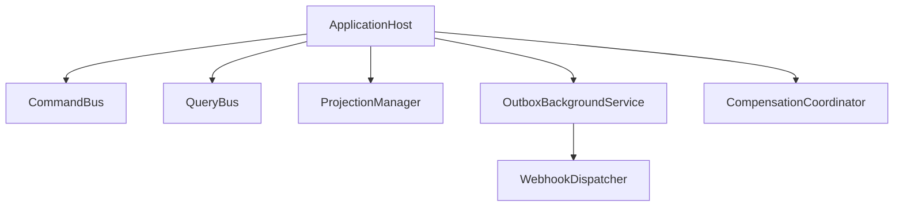
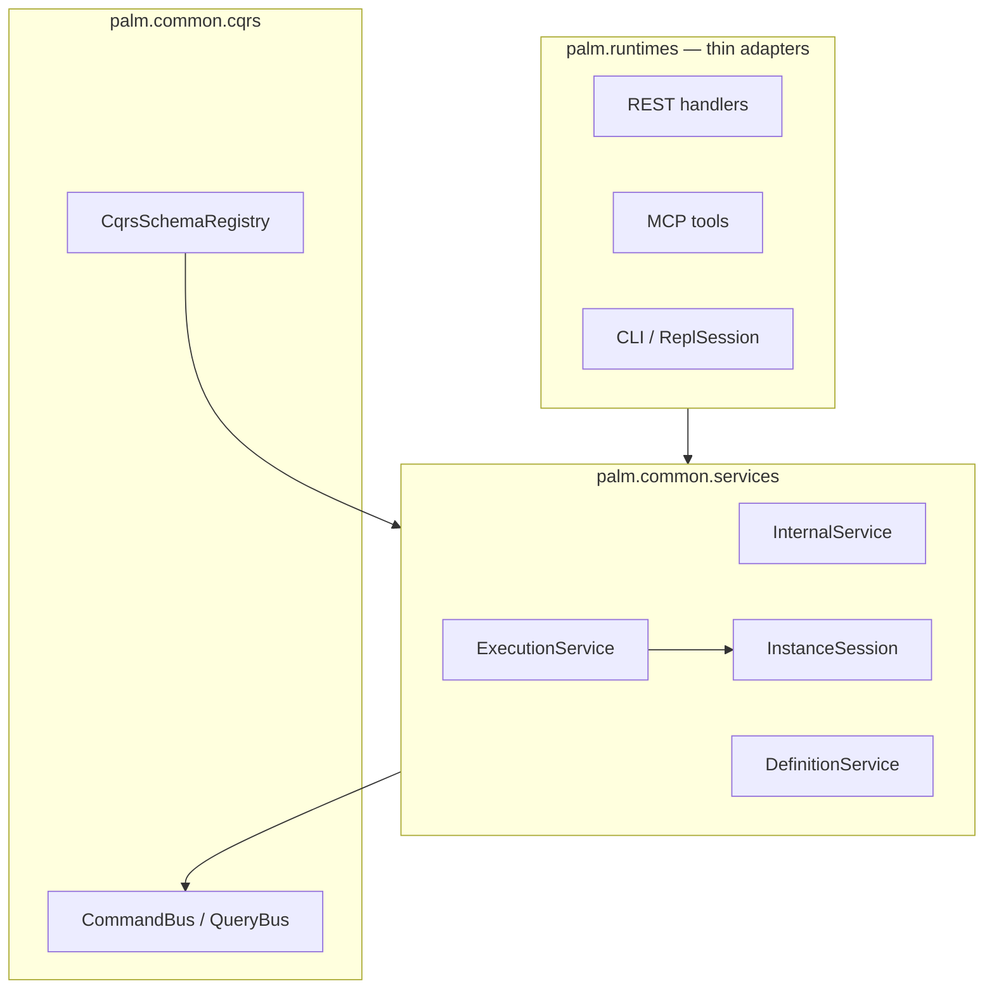
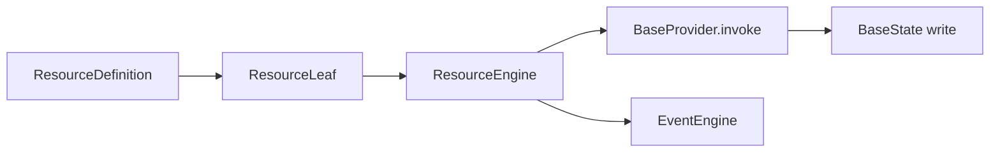

# ARCHITECTURE.md

**Palm Engine** · **0.13.13** · Provider apps + Wizard Experience + Compositional Power · June 2026 · PyPI: `palmengine`

High-level technical architecture for Palm: layers, engines, control flow, middleware, and extension. For product scope and roadmap, see [SCOPE.md](SCOPE.md).

---

## Design stance

Palm is a **layered orchestration engine** with a **pure core** and **registry-based extension**. Behavior Trees provide the execution model: workflows are trees of nodes, state lives on a pluggable blackboard, and jobs move through an explicit lifecycle.

Three ideas recur everywhere:

1. **Core purity** — `palm/core/` never imports patterns, providers, storages, definitions, or runtimes.
2. **Definitions as contract** — `FlowDefinition` / `ProcessDefinition` describe *what* to run; `palm.common` builds and submits *how*.
3. **Hybrid middleware** — cross-cutting concerns (auth, observability, persistence) live primarily at the **runtime**; optional **BT guard nodes** handle step-level policy without polluting step definitions.

---

## Layer diagram



**Dependency rule:** arrows point inward toward core. Core never points outward.

### `palm.common` layout

Shared, non-plugin coordination lives under `palm.common/`:

| Subpackage | Responsibility |
|------------|----------------|
| `common/executions/` | `DefinitionExecutor`, flow/process submission prep |
| `common/plans/` | `ExecutionPlan`, `ProcessPlan`, `PlanRegistry` |
| `common/hooks/` | Orchestration hooks (`InstancePersistenceHook`, `StateSnapshotHook`) |
| `common/persistence/` | Definition and instance repositories, resume/sync |
| `common/storage/` | `StorageFactory` — lazy backend load, settings-driven options |
| `common/managers/` | `InstanceManager` — cache, active tracking, summaries, reconciliation |
| `common/cqrs/` | Command/query buses, projections, rebuild policy |
| `common/events/` | Outbox, reliable publishing, webhook dispatch |
| `common/compensation/` | Optional saga-style undo on commit failure |
| `common/patterns/` | Materialize definitions via `pattern_registry` (not new patterns) |
| `common/transforms/` | Built-in transform rules, `TransformExecutor`, and `register_transform()` helpers |
| `common/runtimes/` | `BaseRuntime`, `RuntimeHost`, scheduler resolution, runtime middleware hooks |

Import shared coordination from **`palm.common`** (and its subpackages). Pattern-specific APIs (e.g. wizard commit handlers, CQRS commands, read models) live in the owning pattern app under `palm.patterns`.

### Pattern apps (`palm/patterns/`)

Each pattern is a **Django-style app** with a `PatternApp` manifest (`app.py`), `registry.py` wiring, and a `bindings/` + `flow/` layout. `palm.common.patterns` materializes definitions via `pattern_registry` — it does not own wizard, parallel, or pipeline semantics.

| Pattern | `bindings/` | `flow/` | Host hooks |
|---------|-------------|---------|------------|
| wizard | Full (definitions, instances, context, BT, CQRS, compensation, read model) | collection, extensions, phases | projection, CQRS, interactive runtime, child wait |
| parallel | definitions, instances, context, behavior_tree | branch, scope, merge | instance sync, submission metadata |
| pipeline | definitions, behavior_tree | — | builder |
| dag, etl | definitions (scaffold) | scaffold | builder |

Canonical guide: [docs/PATTERN-APPS.md](docs/PATTERN-APPS.md) · ADR: [docs/adr/002-pattern-apps-and-common-boundaries.md](docs/adr/002-pattern-apps-and-common-boundaries.md)

### `common/transforms/` — shared transformation rules

Core defines the engine contract (`TransformEngine`, `BaseTransformRule`, `transform_registry` in `palm/core/transform/`). **`palm.common.transforms`** holds reusable rule implementations and registration helpers — the same split as pattern builders vs `pattern_registry`:

| Piece | Location | Role |
|-------|----------|------|
| Engine + contract | `palm/core/transform/` | Pure coordination; resolves rules by name |
| Built-in rules | `common/transforms/rules/` | 22 rules — see `common/transforms/catalog.py` and `palm doctor` |
| Catalog | `common/transforms/catalog.py` | Short descriptions for docs and CLI diagnostics |
| Registration | `common/transforms/rules/registry.py` | Wires builtins at import (like `patterns/<app>/registry.py`) |
| Helpers | `common/transforms/registration.py` | `register_transform(name, cls)`, `@transform_rule`, `registered_transforms()` |
| Execution | `common/transforms/execution.py` | `TransformExecutor`, `apply_transform_to_state()` |

Patterns register custom rules at bootstrap with `register_transform("my_rule", MyRule)` or `@transform_rule` on a `BaseTransformRule` subclass. Rules run through `TransformEngine.apply_to_state()` with scoped reads/writes and optional schema validation via `BaseState.effective_schema()`.

`bootstrap()` imports `palm.common.transforms` so builtins are available before flows run; `palm doctor` lists the `transforms` registry with per-rule descriptions.

**Built-in rules (22):** field rules (`rename_field`, `map_fields`, `filter_items`, `lookup`, `conditional`, `jsonpath_*`, `calculate`, `string_format`, `date_*`), integration (`enrich_resource`, `callable`), and serialization (`json_load`/`json_dump`, `csv_load`/`csv_dump`, `yaml_load`/`yaml_dump`, `toml_load`, `xml_load`, `parquet_load` stub). See `catalog.py` or `palm doctor`.

Use in **pipelines** (`pattern: pipeline`), **wizard** steps (`step_kind: transform`), or programmatically via `TransformExecutor` / `TransformLeaf`. `enrich_resource` receives `ResourceEngine` from the hosting runtime automatically.

Runtime **infrastructure** (engine wiring, schedulers, auth/observability hooks) lives in **`palm.common.runtimes`**. Concrete surfaces (CLI, embedded, daemon, server) live in **`palm.runtimes.<name>`** subpackages.

### `palm.app` — application layer

**Recommended entrypoint:** :class:`~palm.app.host.ApplicationHost` — orchestrates roles, CQRS, projections, outbox, compensation, and recovery.

| Component | Role |
|-----------|------|
| `ApplicationHost` | Top-level orchestrator — `start()`, `execute()`, `ask()`, `submit_flow()`, … |
| `HostProfile` | Composable roles: `all_in_one`, `master`, `worker`, `server` |
| `PalmApp` | Infrastructure — shared storage, runtime registry, definition loading |
| `PalmSettings` | Central config (`PALM_*` env vars, `.env`) |
| `create_cli_host()` | CLI bootstrap — collapsed `all_in_one` host |

`PalmApp` is intentionally **not** the primary public API for services or the CLI. Use it directly only for low-level embedding tests or when you need fine-grained runtime registry control without CQRS.

```python
from palm.app import ApplicationHost, HostProfile

with ApplicationHost(profile=HostProfile.all_in_one()) as host:
    job = host.submit_flow("onboard")
    view = host.get_instance_view(job.metadata["instance_id"])
```

**Extensible plugins** stay in `palm.patterns`, `palm.providers`, and `palm.storages` — each is a Django-style app subpackage with its own `registry.py`. Add the app name to `INSTALLED_PATTERNS` / `INSTALLED_PROVIDERS` / `INSTALLED_STORAGES`; never modify core to add a plugin.

See [ApplicationHost, CQRS, and reliability](#applicationhost-cqrs-and-reliability-010) and [MIGRATION-0.10.md](MIGRATION-0.10.md).

---

## Control flow: Behavior Trees first

All patterns ultimately execute through the behavior tree engine. A **pattern** (wizard, DAG, ETL) is a `BasePattern` that owns or builds a tree of nodes.



| Concept | Role |
|---------|------|
| **Node** | Unit of work — interactive leaf, action, guard, sequence |
| **Tick** | Advance tree; returns running, waiting, success, or failure |
| **State** | Pluggable `BaseState` (e.g. blackboard) holding answers, prompts, flags |
| **Job** | Orchestration wrapper around an executable pattern + isolated state |

Wizard steps are **nodes**, not callbacks scattered through a framework. Future **guard decorators** and **KernelLeaf** nodes follow the same model.

---

## Core engines

| Engine | Responsibility |
|--------|----------------|
| **BehaviorTreeEngine** | Tick trees, shared pattern state |
| **OrchestrationEngine** | Job lifecycle: pending, running, waiting for input, terminal |
| **ContextEngine** | Stack-scoped execution metadata (job, instance ids) |
| **StorageEngine** | Active backend selection and key/value persistence |
| **ResourceEngine** | Provider resolution and fetch lifecycle (0.12: definition resolve, invoke, events — see [Future: Resource layer](#future-resource-layer-012-compositional-power)) |
| **EventEngine** | Synchronous observability bus |
| **AuthEngine** | Minimal auth primitives (enforcement at runtime / BT) |

**Invariant:** `palm/core/` imports only from `palm/core/`.

### Pluggable state

`BaseState` in `core/context` decouples engines from a specific state implementation. Production wizards use a blackboard-style state; tests may substitute lightweight fakes. Job state and tree state can be coordinated without hard-coding dict semantics in core.

### State schemas & scoping (0.8)

Execution state can carry optional **schemas** and **named scopes** without leaving core:

| Concept | API | Role |
|---------|-----|------|
| **Flow schema** | `FlowDefinition.state_schema` / `state_schema_ref` | Validates full answers at summary/commit |
| **Per-scope schema** | `bind_scope_schema(name, schema)` | Validates values while a scope is active |
| **Scope stack** | `enter_scope` / `exit_scope` | Nested execution contexts (wizard steps, sessions) |
| **Effective schema** | `effective_schema()` | Innermost bound schema on the active stack |
| **Validated writes** | `set_validated(key, value)` | Root key write + schema check |

**Schema engine:** `DictStateSchema` implements a JSON Schema-inspired subset (`type`, `enum`, `minimum`/`maximum`, nested `object`/`array`, `default`) with zero external validation dependencies. All logic stays in `palm.core`.

**Wizard integration:** each input step enters a scope named by its slug. Per-step `state_schema` binds to that scope; flow schema validates the aggregated answers. CLI text input is coerced to schema types before validation (`coerce_step_input`).

**Snapshots:** `snapshot_state()` embeds `__palm:meta` with `scope_stack`, `scope_schemas`, and `effective_schema`. `state_from_snapshot()` restores scope context for resume — not just flat key/value data.

**Observability:** `palm.common.state.observe_state()` attaches an `EventEngineStateObserver`. Scope and schema events emit by default; per-value events are opt-in to avoid tick noise.



---

## Registries

Extension is explicit and import-time registered:

| Registry | Location | Examples |
|----------|----------|----------|
| `pattern_registry` | `core/registry.py` | wizard, parallel, dag, etl |
| `provider_registry` | `core/registry.py` | rest, graphql, postgres |
| `storage_registry` | `core/registry.py` | memory, filesystem, postgres, mongodb |
| Pattern builder map | `patterns/_registry.py` | per-pattern `build()` in `bindings/definitions/` |
| `PatternApp` manifests | `patterns/<name>/app.py` | `palm_layers`, `registry_hooks`, `ready()` |
| `CommitRegistry` | `patterns/wizard/bindings/compensation/handler.py` | named commit handlers |
| CQRS contributors | `patterns/<name>/bindings/cqrs/` | wizard commands/queries via `register_cqrs_contributor()` |
| `PlanRegistry` | `common/plans/registry.py` | deferred execution plans |
| `RuntimeRegistry` | `app/registry.py` | named `PalmApp` runtimes |

New capabilities are added by new modules under `patterns/`, `providers/`, or `storages/`—not by editing orchestration internals.

### Storage layer (0.7)

Persistence is coordinated by `StorageEngine` in core; concrete backends live in `palm.storages/`.

| Component | Role |
|-----------|------|
| `StorageEngine` | Select active backend, CRUD through `get` / `set` / `delete` |
| `StorageFactory` | Lazy-import backends, build `backend_options` from `PalmSettings`, initialize engines |
| `FilesystemStorageBackend` | Production JSON files under `data_dir` with atomic writes |
| `DefinitionRepository` / `InstanceRepository` | Namespace keys (`palm:definitions:*`, `palm:instances:*`) + index keys |

**Filesystem key layout:** colon-separated keys map to nested JSON paths — e.g. `palm:instances:inst-abc` → `<data_dir>/palm/instances/inst-abc.json`. Writes use a temp file in the target directory followed by `os.replace()` for crash safety. Corrupted or missing files return `None` on read (logged); permission failures raise `StoragePermissionError`.

**Lazy loading:** `memory` and `filesystem` register at import (`CORE_STORAGES`). `postgres` and `mongodb` register on first `StorageFactory.ensure_registered()` — optional uv extras gate future driver dependencies.

**v0.6 compatibility:** legacy flat files (`<data_dir>/palm:instances:…` without `.json`) are still readable when they contain valid JSON; new writes always use the nested layout.

### Instance coordination (0.7)

`InstanceManager` sits above `InstanceRepository` as the single lifecycle coordinator shared by `PalmApp` runtimes:

| Concern | Approach |
|---------|----------|
| **Cache** | `OrderedDict` LRU (`max_loaded_instances`); active instances are never evicted |
| **Active tracking** | `mark_active` / `release_active`; terminal statuses auto-release; `max_concurrent_active` limit |
| **List performance** | `list_summaries()` reads raw storage records — CLI `instance list` avoids full deserialization |
| **Reconciliation** | On startup (configurable): `RUNNING` → `WAITING_FOR_INPUT`; orphan index entries removed |
| **Thread safety** | `RLock` around cache, active set, and eviction |
| **Hooks** | `InstancePersistenceHook` and `StateSnapshotHook` delegate through the manager |

### Thread-safety contract

Registries are **read from multiple threads** after bootstrap (queued schedulers, daemon workers, multi-runtime `PalmApp` setups, CLI + background runtimes). All registry-like maps use **`threading.RLock`** (reentrant) to protect mutations and consistent reads:

- `Registry.register()` / `get()` / `names()` / `clear()`
- Pattern `register_builder()` / `get_builder()` / `registered_builders()`
- `CommitRegistry`, `PlanRegistry`, `RuntimeRegistry`

**Design choices:**

- **RLock** — cheap reentrant guard; registration during bootstrap may nest (e.g. plugin import chains).
- **Idempotent re-registration** — registering the same `(name, implementation)` pair is a no-op; changing the implementation still overwrites.
- **Handler invocation outside the lock** — `CommitRegistry.run()` resolves the handler under lock, then calls it unlocked to avoid deadlocks during user code.
- **Read-heavy after bootstrap** — lock hold time is minimal (dict get/set); no read-copy-update needed at current scale.

**Operational guidance:** register plugins during `PalmApp.bootstrap()` / module autoload, not from hot job-drive paths. Runtime code should only **read** registries during job execution.

---

## Definitions

| Type | Purpose |
|------|---------|
| `FlowDefinition` | One runnable flow: pattern name + options (e.g. wizard steps, commit hook) |
| `ProcessDefinition` | Ordered group of flows submitted together |

Definitions serialize to storage records. They are the **stable contract** between authors, CLI, and executor.

---

## Executions layer

Executions sit between runtimes and core: they understand definitions and patterns; core does not.

| Component | Role |
|-----------|------|
| `DefinitionExecutor` | `prepare_*_plan`, `submit_plan(s)`, `submit_flow`, `resume_process` |
| `ExecutionPlan` / `ProcessPlan` | Orchestration-ready handoff; prepare vs submit |
| `PlanRegistry` | Deferred plan staging (server / batch) |
| `builder` | `FlowDefinition` → `WizardPattern` / DAG / ETL |
| `DefinitionRepository` | In-memory cache + storage-backed CRUD |
| `InstanceRepository` | Durable `ProcessInstance` CRUD |
| `InstancePersistenceHook` | Job lifecycle → latest instance state (resume authority) |
| `StateSnapshotHook` | Optional status transitions → bounded snapshot history (audit/replay) |

Keeping the executor outside core preserves a single orchestration model while allowing rich wizard options and resume logic to evolve independently.

---

## Instances & resume

`ProcessInstance` captures durable orchestration state:

- Stable `instance_id`, active `job_id`, status
- **`state_snapshot`** — authoritative latest blackboard (used for resume)
- **`state_snapshots[]`** — optional ring buffer of point-in-time captures (audit, debugging, future replay)
- Flow metadata, wizard step slug, status history

| Field | Written by | Purpose |
|-------|------------|---------|
| `state_snapshot` | `InstancePersistenceHook` on every status change | Resume after restart |
| `state_snapshots[]` | `StateSnapshotHook` at configured transitions | Historical audit trail |

**Resume path** (uses `state_snapshot` only):

1. Load instance from `InstanceRepository`
2. Rebuild pattern from stored `flow_definition`
3. Restore blackboard from `state_snapshot`
4. Register job; continue via `provide_input` or orchestration resume

`EmbeddedRuntime.resume_process()`, `PalmApp.resume_process()`, and CLI `process resume` expose this path. Historical `state_snapshots[]` entries are **not** used for resume today—they are for inspection and future time-travel replay.

---

## State schemas & scoping

Palm validates execution state with a lightweight, dependency-free **JSON Schema subset** in `palm.core.context.state_schema` (`DictStateSchema`). Flow and step definitions attach schemas at submission time; wizards bind per-step schemas to **named scopes**.

| Layer | Configured on | Validated when |
|-------|---------------|----------------|
| Built-in field rules | `field_type`, `required`, `choices` | Each input |
| Declarative rules | `validation` array on step | Each input |
| Per-step schema | `state_schema` on step dict | Each input (active scope) |
| Flow schema | `state_schema` on `FlowDefinition` | Summary, commit, collection finish |

**Scoped blackboard** (`BaseState`):

- `enter_scope` / `exit_scope` — stack of named contexts
- `set_scoped` / `get_scoped` — values isolated per scope
- `bind_scope_schema` — schema active while scope is on stack
- `effective_schema()` — innermost schema wins

Snapshots embed `__palm:meta` with `scope_stack`, `scope_schemas`, and `effective_schema` so resume restores scope context—not only flat answers.

**CLI coercion:** string REPL input is coerced to schema types (e.g. `"27"` → `27`) before validation. Choice fields resolve index, exact, and unique partial matches to canonical enum values.

Reference flow: `schema-onboard` (`examples/definitions/schema_wizard.py`).

---

## Parallel pattern

The **parallel** pattern runs multiple child flows (wizard branches) concurrently against one parent blackboard:



| Concern | Approach |
|---------|----------|
| Isolation | Per-branch blackboard snapshots; input routed to active branch |
| Scopes | Branch slug prefix in wizard step slugs and CLI (`@parallel:alpha`) |
| Merge | `all`, `any`, or `first` strategy on branch completion |
| Validation | Parent flow schema validates merged answers |

Example: `parallel-demo` (`examples/definitions/parallel_demo.py`).

---

## Transactional wizards

The wizard pattern is Palm’s most complete expression of **human-first, transactional** orchestration:

- Declarative **validation** on input steps (built-in, rule-based, per-step schema, flow schema)
- **Step scopes** with schema binding and scope-aware prompt bundles
- **Collection steps** — repeatable item lists with per-item field scopes (see below)
- **CLI coercion** — string input converted to schema types before validation
- **Choice resolution** — numbered/partial selection for `field_type: choice`
- **Backtracking** with protected summary/commit steps
- **Resource action** steps via `ResourceEngine`
- **Transform steps** (`step_kind: transform`) — declarative rules/chains via `TransformExecutor`, with CLI feedback
- Auto **summary** and **commit** with named handlers
- Commit failure → job failure (no silent partial commit)

Commit handlers run inside the tree; results are visible on job state.

### Collection step kind

`step_kind: collection` builds repeatable structured lists inside one wizard step:

| Phase | Operator action |
|-------|-----------------|
| `menu` | Add, edit, remove, or continue (compact menu) |
| `select_item` | Pick item by number or partial `label_field` match |
| `field` | Walk `item_fields` with per-field schemas and scopes |
| `remove_confirm` | Confirm deletion |

Scope path example: `todos > item-2 > title`. Session keys (`collection_phase`, `collection_draft`, …) persist in snapshots for resume.

Configuration: `collection_key`, `item_fields`, `min_items`, optional `label_field` (defaults to first required text field or `title`/`name`).

Reference flow: `todo-builder` (`examples/definitions/todo_builder.py`).

### Wizard REST + Explorer (0.13)

Interactive wizards are addressable by **durable instance id** — not only by ephemeral `job_id`:

| Surface | Path | Role |
|---------|------|------|
| REST submit | `POST /v1/wizards` | Start wizard (`wizard`, `flow`, or `flow_name` body variants) |
| REST status | `GET /v1/wizards/{instance_id}` | Rich view: `prompt`, `answers`, `wizard_progress`, `next_actions` |
| REST input | `POST /v1/wizards/{instance_id}/input` | Deliver operator input (`{"value": ...}`) |
| REST backtrack | `POST /v1/wizards/{instance_id}/backtrack` | Return to prior step (`to_step` optional) |
| Explorer workspace | `GET /explorer/instances/{instance_id}` | Full SSR wizard detail page |
| Explorer HTMX | `POST /explorer/instances/{instance_id}/input` | Partial workspace refresh (`HX-Request: true`) |

Read model assembly lives in `palm/patterns/wizard/bindings/read_model.py` (`build_wizard_view`), dispatched via `palm/common/patterns/pattern_read_model.py` (`build_pattern_read_model`). Live prompt metadata comes from `inspect_job_json()` via `GetWizardStatusQuery` (wizard CQRS bindings).

**Explorer workspace** (`palm/runtimes/server/surfaces/ssr/explorer/`):



Collection steps render a dedicated UI (overview grid, per-item edit/remove, field-phase draft, remove confirm) that maps to the same backend phase strings the CLI uses. See [EXPLORER-WIZARD.md](EXPLORER-WIZARD.md).

**Wizard phase system** (0.13 internal refactor): each `step_kind` registers a phase factory under `palm/patterns/wizard/phases/`. Collection steps compose a `PhaseKeyedSelectorNode` subtree (`menu` → `select_item` → `field` → `remove_confirm`). `WizardPattern.tick()` only drives the root tree — backtrack, validation, and completion are phase responsibilities. See [MIGRATION-WIZARD-PHASES.md](src/palm/patterns/wizard/MIGRATION-WIZARD-PHASES.md).

### Transform step kind

`step_kind: transform` runs a registered rule or chain between interactive steps:

| Field | Purpose |
|-------|---------|
| `source_key` | Blackboard key to read (supports `scoped`) |
| `target_key` | Write destination (defaults to `source_key`) |
| `rule` / `chain` | Single rule name or ordered chain |
| `options` / `options_by_rule` | Rule parameters |
| `scoped`, `validate_output`, `batch`, `per_item`, `trace_key`, `skip_if_missing` | Same semantics as pipeline `TransformLeaf` |

Transform output is promoted into wizard answers under `target_key` for summary and flow-schema validation. The CLI prints `Applied transform: …` after each successful step.

Reference flow: `transform-example` (`examples/definitions/transform_example.py`).

---

## Middleware architecture

Palm uses a **hybrid** model:



| Concern | Preferred home |
|---------|----------------|
| Session / principal | Runtime |
| Instance persistence | Runtime + `InstancePersistenceHook` |
| State snapshot history | Runtime + `StateSnapshotHook` (optional, settings-driven) |
| Structured logging / tracing | Runtime (future: EventEngine subscribers) |
| Step may run? / quota / feature flag | BT guard node |
| User prompt & validation | Wizard step leaf (definition-driven) |

Avoid encoding middleware chains inside step JSON. Keep steps declarative; compose policy in the tree and runtime.

### Job hooks (orchestration middleware)

Hooks implement the `JobHook` protocol and register on `OrchestrationEngine` at runtime start. `BaseRuntime.start()` wires the default chain; `PalmSettings` controls optional hooks.



| Hook | Default | Role |
|------|---------|------|
| `InstancePersistenceHook` | Always on | Maintain latest `ProcessInstance` for resume |
| `StateSnapshotHook` | Off (`enable_state_snapshot=False`) | Append historical `StateSnapshot` records |
| `AuthMiddleware` | When `auth_enforce=True` | Gate job drive by principal/roles |
| `DriveObservabilityHook` | When `observability=True` | Log drive slices |

**`StateSnapshotHook` design:**

- Lives in `palm/common/hooks/state_snapshot.py` (not core—respects layer boundaries).
- Fires on `on_job_status_changed` after `apply_result` has committed the new status.
- Captures `BlackboardState` via `snapshot_state()` plus wizard position metadata.
- Appends to `ProcessInstance.state_snapshots[]`; trims to `max_snapshots_per_instance` (ring buffer).
- **Non-blocking** — all failures are swallowed; job execution never depends on snapshot I/O.
- Registered **after** `InstancePersistenceHook` so the instance record exists before history attaches.

**Configuration** (`PalmSettings`, env prefix `PALM_`):

| Setting | Default | Meaning |
|---------|---------|---------|
| `enable_state_snapshot` | `False` | Master switch |
| `snapshot_on_status` | `WAITING_FOR_INPUT`, `SUCCEEDED`, `FAILED` | Statuses that trigger a capture |
| `max_snapshots_per_instance` | `10` | Ring buffer size per instance |

Wiring path: `PalmSettings` → `runtime_start_options()` → `palm.common.runtimes.BaseRuntime.start()` → hook list on `OrchestrationEngine`.

**Trade-offs:**

- **Storage:** each snapshot duplicates blackboard dicts; bounded by ring buffer but still proportional to state size × capture count.
- **Performance:** one serialize + repository read/write per matching transition when enabled; zero cost when disabled (hook not registered).
- **Operational:** narrow `snapshot_on_status` in high-throughput deployments; use durable storage backends when snapshots must survive restarts.

**Inspection:** `host.list_instance_snapshots(instance_id)` (or `PalmApp.list_instance_snapshots` when embedding infra directly) and CLI `palm instance snapshots <id>`.

---

## ApplicationHost, CQRS, and reliability (0.10)

:class:`~palm.app.host.ApplicationHost` is the top-level orchestrator: role-based runtime spawning, command/query buses, projections, outbox drain, compensation, and startup recovery.



### Service layer (0.15)

User-facing business API in `palm/common/services/`. Services **compose** CQRS (many commands/queries per method); runtimes stay thin.



| Service | Access | Responsibility |
|---------|--------|----------------|
| `InternalService` | `host.internal`, `ctx.internal` | Inspect, doctor, job/instance lists, snapshots, cancel |
| `DefinitionService` | `host.definition`, `ctx.definition` | Flow/process/resource catalog + `validate_flow` |
| `ExecutionService` | `host.execution`, `ctx.execution` | `on(instance_id)`, `run_wizard`, `run_flow` |
| `InstanceSession` | `execution.on(id)` | `input`, `backtrack`, `resume`, `resume_child_wait`, `status` |
| `ReplSession` | `CliContext.repl` | REPL active-instance handle (metaphor C) |

**Runtime adapter rule:** Handlers and MCP tools map transport args → `service.method()` → serialize view dicts. Business branching (pattern-aware inspect, interactive input) lives in services + `palm.common.interactive_runtime`, not in route tables.

**MCP:** `PalmInProcessBackend` calls services on `ServerContext` when `PALM_MCP_IN_PROCESS=1` (default in `.grok/config.toml`). `PalmRestClient` remains for remote-only mode.

ADR: [docs/adr/004-cqrs-schemas-service-layer.md](docs/adr/004-cqrs-schemas-service-layer.md) · Vision: [docs/VISION-0.15.md](docs/VISION-0.15.md)

| Piece | Location | Role |
|-------|----------|------|
| Commands / queries | `palm/common/cqrs/` | Write/read routing (`SubmitFlowCommand`, `ListInstancesQuery`, …) |
| CQRS schemas | `palm/common/cqrs/schemas.py` | `CqrsSchemaRegistry` — validate commands/queries before dispatch |
| Services | `palm/common/services/` | User-facing API composing buses (see table above) |
| Projections | `palm/common/cqrs/projections/` | Event-driven read models (instance index, wizard progress, job board) |
| Rebuild policy | `palm/common/cqrs/rebuild.py` | Batch rebuild + skip-if-fresh safeguards for large instance counts |
| Outbox | `palm/common/events/outbox.py` | Durable critical events; master drains via `OutboxBackgroundService` |
| Compensation | `palm/common/compensation/` | Optional saga-style undo on `wizard.commit.failed` |
| Webhooks | `palm/common/events/external.py` | POST outbox events to external URLs before mark-published |

### Projection rebuild safeguards

On startup (`rebuild_projections_on_startup=True`), `ProjectionManager.rebuild_all()` applies `ProjectionRebuildPolicy`:

| Setting | Default | Meaning |
|---------|---------|---------|
| `projection_rebuild_batch_size` | `100` | Persist instance index in chunks when instance count exceeds max |
| `projection_rebuild_max_instances` | `5000` | Threshold for batched rebuild |
| `projection_rebuild_skip_if_fresh` | `True` | Skip rebuild when cached projection matches authoritative count |

Recovery emits `host.recovered` with a `projections` report (`counts`, `skipped`, `batched`, `warnings`).

### Compensation handlers

Compensation is **optional** and registry-based (like wizard commit handlers). Register during definition bootstrap — never from job hot paths.

```python
from palm.common.compensation import (
    CompensationContext,
    CompensationResult,
    default_compensation_registry,
)

def undo_save(ctx: CompensationContext) -> CompensationResult:
    # reverse partial writes using ctx.payload / ctx.hook_name / ctx.error
    return CompensationResult.success({"undone": True})

default_compensation_registry().register_for_commit_hook("save_profile", undo_save)
```

| Trigger | Handler lookup |
|---------|----------------|
| `wizard.commit.failed` | By `hook` payload field → `register_for_commit_hook` |
| `wizard.backtrack.executed` | `register_for_event` (saga-style extensions) |

`CompensationCoordinator` subscribes on the host bus and every runtime `EventEngine` when `enable_compensation=True` (default). Observability: `compensation.executed`, `compensation.failed`, `compensation.skipped`.

Wizard commit events (`wizard.commit.*`) are in `CRITICAL_EVENT_TYPES` and tracked on `WizardProgressProjection` (`commit_status`, `commit_hook`, `commit_error`).

### External webhook consumers

Webhooks dispatch **from the outbox** before an entry is marked published — durable delivery aligned with internal handlers.

```python
from palm.common.events import WebhookDispatcher, WebhookTarget, RecordingWebhookDeliverer

dispatcher = WebhookDispatcher(
    [WebhookTarget(url="https://hooks.example/palm", event_types=frozenset({"job.completed"}))],
    deliverer=RecordingWebhookDeliverer(),  # tests
)
```

Host settings:

| Setting | Default | Meaning |
|---------|---------|---------|
| `enable_webhook_dispatcher` | `False` | Master outbox service calls webhook targets |
| `webhook_urls` | `[]` | Destination URLs (`PALM_WEBHOOK_URLS`) |
| `webhook_event_types` | `[]` | Optional filter; empty = all outbox events |

Observability: `host.webhook.delivered`, `host.webhook.failed`.

### Worker coordination

Multi-role hosts use `WorkerCoordinator` to track daemon/server worker registration and emit `host.workers.ready` during recovery (`worker_ready_timeout`, default 5s).

### CLI and runtime integration

Terminal surfaces bootstrap through **ApplicationHost**, not direct `PalmApp` wiring:

```
palm CLI → bootstrap_runtime() → create_cli_host() → ApplicationHost(all_in_one).start()
                                                          ↓
                                                     runtime "main" (embedded)
```

| Surface | Bootstrap | Writes | Reads |
|---------|-----------|--------|-------|
| CLI / REPL | `create_cli_host` | `CliContext.submit_*` → host command bus | `CliContext.list_instance_summaries()` → query bus |
| `palm host` | `run_host(profile)` | Same CQRS path per role | Projections + recovery |
| Library embed | `ApplicationHost` or `PalmApp` | Prefer host `execute()` | Prefer host `ask()` |

`PalmApp.bootstrap_cli()` and the `cli/pkg/` shim are removed. `create_cli_app()` remains deprecated — returns `host.app` for legacy callers only.

Low-level job helpers (`resume_job`, `persist_job`) stay on `CliContext` for wizard backtrack until a dedicated command exists.

---

## Runtimes

### Layout

```
palm/common/runtimes/     # shared infrastructure (single source of truth)
├── base.py               # BaseRuntime — engine wiring, submission surface
├── host.py               # RuntimeHost protocol (executions layer contract)
├── wiring.py             # Scheduler policy resolution
├── hooks/                # AuthMiddleware, DriveObservabilityHook
├── schedulers/           # InlineScheduler, QueuedScheduler
└── server/               # ServerApp, protocol, transport registry, CQRS bridge
    ├── app.py            # ServerApp — mounts explicitly registered surfaces
    ├── context.py        # ServerContext — runtime + optional ApplicationHost
    ├── protocol.py       # ServerRequest/Response, ServerSurface protocol
    ├── registry.py       # RouteRegistry, SurfaceRegistry
    ├── surface.py        # BaseSurface abstract base
    ├── transport.py      # BaseTransport protocol, TransportRegistry
    ├── responses.py      # Shared error envelopes
    └── webhooks.py       # ServerWebhookBridge — outbox integration

palm/runtimes/            # concrete surfaces (thin packages)
├── embedded/runtime.py   # EmbeddedRuntime — inline default
├── daemon/runtime.py     # DaemonRuntime — queued background
├── server/               # ServerRuntime — surfaces + pluggable transport
│   ├── runtime.py        # lifecycle + plan staging
│   ├── factory.py        # create_app — mounts default surfaces
│   ├── surfaces/
│   │   ├── rest/         # CQRS JSON API
│   │   │   ├── routes.py       # central route table (Meta, Jobs, Plans, Instances, Snapshots, Catalog)
│   │   │   ├── schemas.py      # DictStateSchema request/query definitions
│   │   │   ├── handlers/       # meta, jobs, plans, instances, snapshots, catalog
│   │   │   ├── doc_examples.py # curl + sample payloads (docs + OpenAPI)
│   │   │   ├── openapi.py      # spec generated from routes + schemas
│   │   │   └── docs.py         # rich HTML hub at GET /v1/docs
│   │   ├── websocket/    # extension point (planned)
│   │   ├── mcp/          # extension point (planned)
│   │   └── ssr/          # SSR surface (explorer/ module; common/ssr = thin helpers)
│   └── transport/
│       ├── stdlib.py     # default zero-dep HTTP (registered as "stdlib")
│       └── (future)      # e.g. starlette — async REST + WebSocket
└── cli/                  # CLI entry + commands/ (one-shot) + tui/ (REPL) + shared/
```

**Import conventions:**

- Shared runtime infrastructure → `palm.common.runtimes` (and subpackages)
- Concrete runtimes → `palm.runtimes.embedded`, `.daemon`, `.server`
- CLI command mode → `palm.runtimes.cli.commands`
- CLI TUI/REPL → `palm.runtimes.cli.tui`
- CLI shared → `palm.runtimes.cli.shared`
- CLI entry point → `palm.runtimes.cli:main` (`pyproject.toml`)

| Runtime | Status | Role |
|---------|--------|------|
| **BaseRuntime** (`common/runtimes`) | Shipped | Shared engine wiring, hooks, auth, plan registry |
| **EmbeddedRuntime** | Shipped | Inline scheduler; libraries, tests, CLI |
| **DaemonRuntime** | Shipped | Queued scheduler; long-lived background process |
| **ServerRuntime** | Shipped | Queued scheduler + registry-driven surfaces + pluggable transport |
| **CLI / REPL** | Shipped | Operator UX, `palm doctor`, examples auto-load |
| **Palm Explorer** | Shipped | `surfaces/ssr/explorer/`; `/explorer` hub; wizard workspace + collection UI; `/v1/wizards` REST; `GET /` → `/explorer` |
| **MCP (stdio)** | Shipped (0.14) | `palm-mcp` FastMCP adapter over REST; see [docs/MCP.md](docs/MCP.md) |
| **MCP (native HTTP)** | Shipped (0.14) | Streamable HTTP on `McpSurface` at `/mcp` when `mcp` extra installed |
| **WebSocket** | Planned | `runtimes/server/surfaces/websocket/`; live job/wizard events |

All runtimes build on `palm.common.runtimes.BaseRuntime` and the `palm.common` execution API — no duplicated orchestration logic.

### Type strategy (beta)

Static typing is enforced project-wide via **mypy strict** (`just typecheck` / `just full-check`). Layer boundaries double as type boundaries: `RuntimeHost` and `DefinitionExecutor` protocols keep runtimes decoupled from pattern internals. During beta we fix type debt as we touch code — prefer narrowing (`isinstance`, typed helpers) over ignores. See [DEVELOPMENT.md](DEVELOPMENT.md#type-checking) for contributor guidelines.

---

## Resource layer (0.12 — Compositional Power)

**Status:** Shipped in 0.12.9 (Phases 1–6 complete).
**Documents:** [docs/VISION-0.12.md](docs/VISION-0.12.md) · [docs/adr/001-compositional-power-resources.md](docs/adr/001-compositional-power-resources.md)

0.12 elevates Resources to the same declarative tier as flows and processes.

### Definition model (symmetric trio)

| Kind | Module | Repository | Executes via |
|------|--------|------------|--------------|
| Flow | `palm/definitions/flow.py` | `DefinitionRepository` | Pattern builder → BT |
| Process | `palm/definitions/process.py` | `DefinitionRepository` | `ProcessPlan` → BT |
| **Resource** (0.12) | `palm/definitions/resource.py` | `DefinitionRepository` | **`ResourceLeaf` → ResourceEngine** |

`ResourceDefinition` describes provider, action, param bindings, and optional input/output schemas. Patterns reference resources by `resource_ref` instead of inlining provider details.

### Execution path



- **`ResourceLeaf`** — core BT leaf (`palm/core/behavior_tree/nodes/leaf/`); patterns materialize it from declarative step/stage config
- **`ResourceEngine`** — resolve definition, bind params from scoped state, invoke provider action, emit correlation events
- **`BaseProvider`** — evolves from `fetch(id)` to `invoke(action, params)` with `describe()` metadata; `fetch` remains the default read action

### The `palm` provider (flagship)

Django-style app at `palm/providers/palm/` with **`ProviderApp`** manifest ([`app.py`](src/palm/providers/palm/app.py)), **`bindings/`** (resource, orchestration, runtimes, recursion), and **`flow/`** (coordinator, params, target, remote). See [docs/PROVIDER-APPS.md](docs/PROVIDER-APPS.md).

Enables **Palm calling Palm**:

| Mode | Delegates to |
|------|--------------|
| Local | Bound `BaseRuntime` — `submit_flow`, `submit_process`, `invoke_resource`, `fetch` |
| Remote | `ServerRuntime` HTTP — `/v1/jobs`, `/v1/plans/*`, `/v1/resources/invoke` |

Runtime attach/detach is registered via [`providers/_registry.py`](src/palm/providers/_registry.py) (`register_runtime_binding`) and consumed by `BaseRuntime.start()` / `stop()`.

Recursion guardrails (depth limits, cycle detection, child job linkage on parent state) live in `bindings/recursion`; engine supplies correlation metadata. This is the primary enabler of hierarchical, distributed, and agent-friendly workflows.

### Integration targets

| Layer | 0.12 touchpoint |
|-------|-----------------|
| Wizard | `step_kind: resource` with `resource_ref` |
| Transforms | `enrich_resource` accepts `resource_ref` |
| Compensation | Mutating invokes register undo metadata for `CompensationCoordinator` |
| CQRS | Optional `ResourceInvocationProjection` for dashboards |
| Explorer | Resource catalog at `/explorer/resources`; Try Invoke; flow/job cross-refs; instance timelines |
| Runtimes | `ResourceEngine` wired through `BaseRuntime`; optional TTL caches via `PalmSettings` |
| Discovery | `ResourceCatalog` + `palm doctor` provider action tables |
| Recursion | `palm/core/utils/recursion.py` — shared guard for compositional providers |

**Core purity preserved:** contracts in `palm/core/resource/`; `PalmProvider` and external providers in `palm/providers/`; repository wiring in `palm/common/persistence/`.

### Resource best practices

- Define resources in `DefinitionRepository`; reference by `resource_ref` in wizards and BT leaves.
- Use `{{ state.* }}` param binding; promote wizard answers with `promote_binding_keys()` before resource steps.
- Compose with the `palm` provider; guard recursion via `recursion_frame()`; observe `resource.*` events.
- Enable `resource_cache_results` only for idempotent read actions (`fetch`); keep definition caching on for resolver hot paths.

### Implementation phases (complete)

1. `ResourceDefinition` + repository ✅  
2. Engine & provider contract ✅  
3. `ResourceLeaf` + pattern builders ✅  
4. `palm` provider ✅  
5. Transforms, compensation, observability ✅  
6. Release polish ✅  

---

## Future: compute & data (beyond 0.12)

Not yet in the main package, but aligned with the BT model:

- **KernelLeaf** — GPU-resident kernels, fixed VRAM buffers, batch ticks
- **Resource staging** — Parquet or large artifacts as `ResourceDefinition`-backed stages flowing through `ResourceLeaf` into kernel nodes
- **Compositional GPU pipelines** — `palm` provider sub-flows coordinating CPU staging and kernel execution

Prototypes under `archive/experimental/gpubatches/` explore batch GPU execution; they inform design but are not part of the supported architecture until promoted with tests and documentation.

---

## Archive & experiments

| Path | Role |
|------|------|
| `archive/` | Pre-0.4.0 legacy — reference only |
| `archive/experimental/gpubatches/` | GPU batch R&D — experimental |

New production code must not import from `archive/`.

---

## Design goals (summary)

- **Core purity** — testable engines, zero domain coupling
- **BT-native control flow** — steps, guards, and kernels are nodes
- **Registry extension** — patterns, providers, storages without forked core
- **Durable truth** — definitions + instances survive restarts
- **Runtime middleware** — auth and ops at the edge; guards in the tree when needed
- **One engine, many surfaces** — embedded, CLI, server, and daemon share `palm.common`

---

## Related documents

- [SCOPE.md](SCOPE.md) — vision, in/out of scope, roadmap
- [docs/VISION-0.12.md](docs/VISION-0.12.md) — 0.12 Resource System vision
- [README.md](README.md) — quick start and CLI
- [MIGRATION-0.10.md](MIGRATION-0.10.md) — upgrade from 0.9.x bootstrap paths
- [DEVELOPMENT.md](DEVELOPMENT.md) — contributor guide
- [AGENTS.md](AGENTS.md) — contribution rules