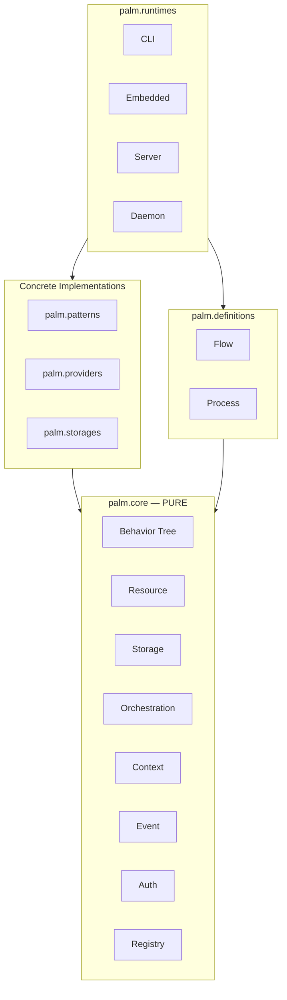

# ARCHITECTURE.md

## Overview

Palm is a layered orchestration engine. The **core** is pure and self-contained; concrete implementations and runtimes build on top without polluting core boundaries.

## Layer Diagram

## Core Engines

| Engine | Responsibility |
|--------|----------------|
| Behavior Tree | Execute `BasePattern` trees with shared blackboard |
| Resource | Resolve and lifecycle-manage `BaseProvider` instances |
| Storage | Resolve and lifecycle-manage `BaseBackend` instances |
| Orchestration | Create and track `Job` units with independent blackboards |
| Context | Stack-scoped execution metadata |
| Event | Synchronous publish/subscribe observability |
| Auth | Principal and authorization stubs |

**Rule:** `palm/core/` imports only from `palm/core/`.

## Registries

`palm/core/registry.py` exposes:

- `pattern_registry` — wizard, dag, etl
- `provider_registry` — rest, graphql, postgres
- `storage_registry` — memory, postgres, mongodb, filesystem

Concrete modules register implementations at import time.

## Runtimes

| Runtime | Status |
|---------|--------|
| `embedded` | Wires core engines in-process |
| `cli` | Entry point (`palm` command) — placeholder UI |
| `server` | Not implemented |
| `daemon` | Not implemented |

## Archive

Pre-0.4.0 implementation lives under `archive/` (legacy CLI, old behavior tree, orchestration tests, wizards). Reference only.

## Design Goals

- **Core purity** — testable engines with zero domain coupling
- **Registry-based extension** — open for new patterns/providers/backends
- **Runtime flexibility** — same engines in CLI, embedded, or future server modes

---

Last updated: June 2026 (0.4.0-dev restructure)