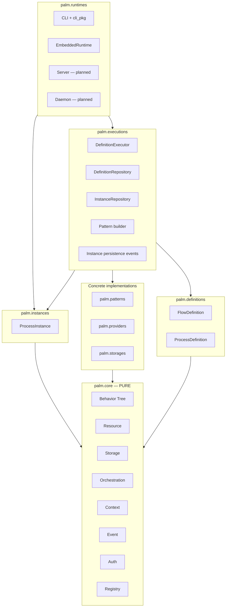

# ARCHITECTURE.md

## Overview

Palm is a layered orchestration engine. The **core** is pure and self-contained; concrete implementations, definitions, executions, and runtimes build on top without polluting core boundaries.

Version **0.5.0-dev** continues the 0.4.0 layered architecture with **executions** (submit/resume/build), **instances** (durable snapshots), transactional **wizards**, and the modern CLI.

## Layer diagram

## Core engines

| Engine | Responsibility |
|--------|----------------|
| Behavior Tree | Execute `BasePattern` trees with shared blackboard state |
| Resource | Resolve and lifecycle-manage `BaseProvider` instances |
| Storage | Resolve and lifecycle-manage `BaseBackend` instances |
| Orchestration | Create and track `Job` units with lifecycle transitions |
| Context | Stack-scoped execution metadata |
| Event | Synchronous publish/subscribe observability |
| Auth | Principal and authorization stubs |

**Rule:** `palm/core/` imports only from `palm/core/`.

## Registries

`palm/core/registry.py` exposes:

- `pattern_registry` — wizard, dag, etl
- `provider_registry` — rest, graphql, postgres
- `storage_registry` — memory, postgres, mongodb, filesystem

Concrete modules register implementations at import time.

## Definitions

`FlowDefinition` binds a **pattern** name and **options** (e.g. wizard steps, `include_commit`). `ProcessDefinition` groups one or more flows for batch submission.

Definitions are stored via `DefinitionRepository` (in-memory cache + optional `StorageEngine` persistence).

## Executions

| Component | Role |
|-----------|------|
| `DefinitionExecutor` | `submit_flow`, `submit_process`, `resume_process`, `persist_job` |
| `builder` | Resolve `FlowDefinition` → `WizardPattern` / DAG / ETL with option parsing |
| `DefinitionRepository` | CRUD for flows and processes |
| `InstanceRepository` | CRUD for `ProcessInstance` records |
| `instance_events` | Wire orchestration events → instance snapshots |

The executor stays outside **core** so orchestration remains unaware of wizard options or definition shapes.

## Instances

`ProcessInstance` is a durable snapshot: `instance_id`, `job_id`, `status`, `state_snapshot`, flow metadata, wizard step slug, and status history.

**Resume flow:**

1. Load instance from storage
2. Rebuild pattern from stored `flow_definition`
3. Restore blackboard from `state_snapshot`
4. Register a new job and continue via `provide_input` / orchestration resume

`EmbeddedRuntime.resume_process(instance_id)` is the public API; the CLI calls it from `process resume`.

## Transactional wizards

Wizard flows support:

- Per-step **validation** (declarative rules in definitions)
- **Backtracking** (`allow_backtrack`, protected summary/commit steps)
- **Resource action** steps (`step_kind: action`, `resource_provider`, `resource_id`)
- Auto **summary** and **commit** steps (`include_summary`, `include_commit`, `commit_hook`)
- Named **commit handlers** on `default_commit_registry()`

Commit runs inside the wizard tree; failure surfaces as job failure without silent partial state.

## Runtimes

| Runtime | Status |
|---------|--------|
| `embedded` | In-process wiring; `submit_*`, `provide_input`, `resume_process` |
| `cli` | `palm` command, REPL, Rich display, `doctor`, example auto-load |
| `server` | Not implemented |
| `daemon` | Not implemented |

### CLI package (`runtimes/cli_pkg/`)

| Module | Role |
|--------|------|
| `bootstrap` | Start runtime, hydrate storage, load `examples/definitions/` |
| `context` | Active instance, instance→job resolution |
| `actions` | Shared submit / input / backtrack / resume |
| `display` | Rich panels and tables |
| `doctor` | Full diagnostic report |
| `commands/registry` | Extensible command phrases |
| `repl` | Interactive shell |

## Archive

Pre-0.4.0 implementation lives under `archive/` (legacy CLI, old behavior tree, orchestration tests, wizards). Reference only — do not import from new code.

## Design goals

- **Core purity** — testable engines with zero domain coupling
- **Registry-based extension** — open for new patterns, providers, backends
- **Durable instances** — wizard and process state survives restarts when storage persists
- **Runtime flexibility** — same engines in embedded tests, CLI, or future server modes

---

Last updated: June 2026 (0.5.0-dev)