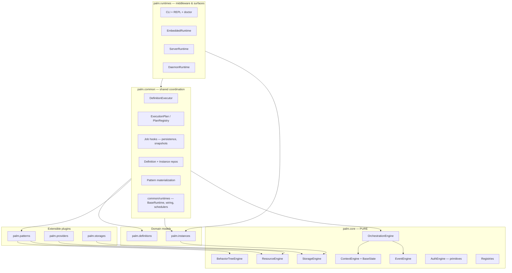
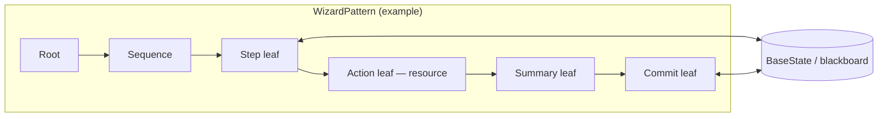
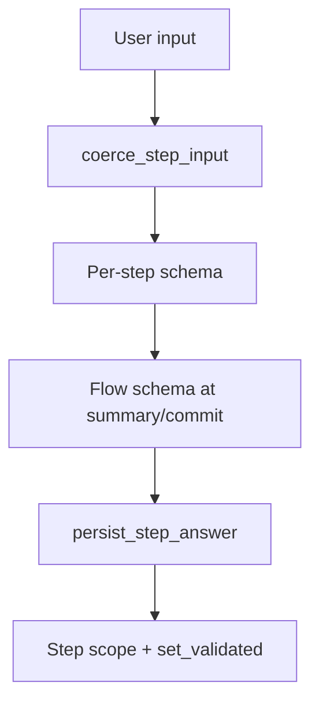
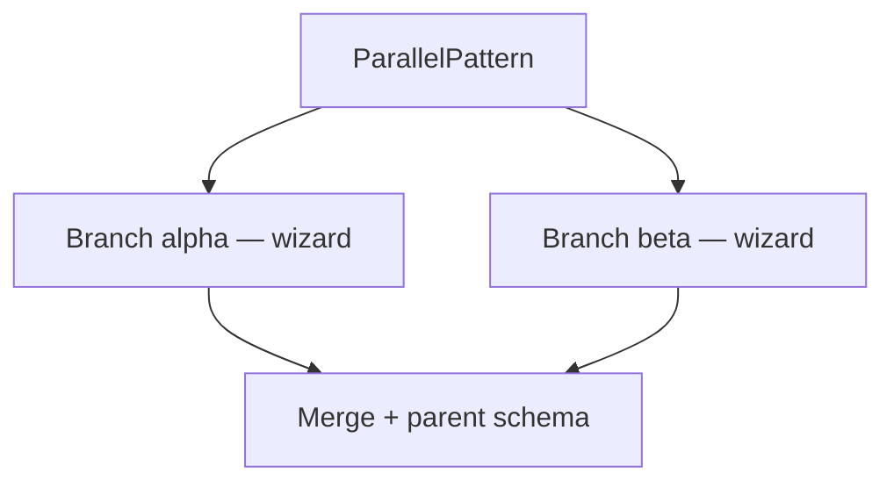
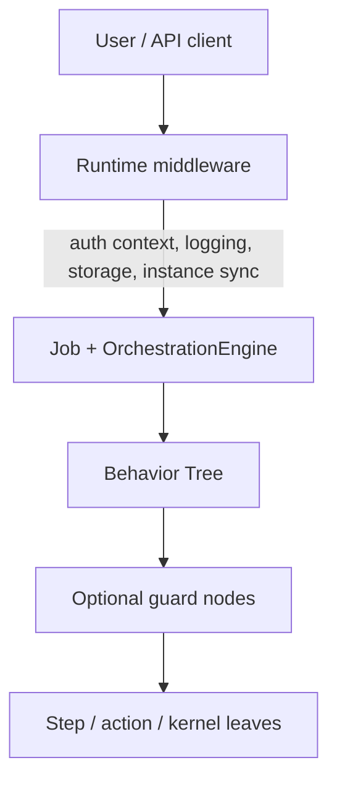
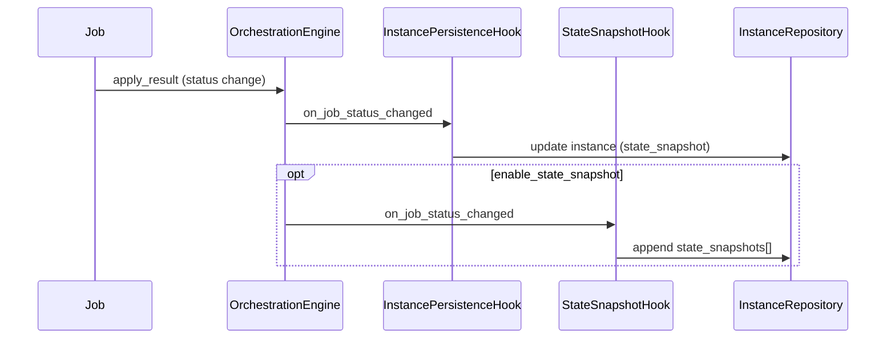

# ARCHITECTURE.md

**Palm Engine** · 0.8.15 · June 2026 · PyPI: `palmengine`

High-level technical architecture for Palm: layers, engines, control flow, middleware, and extension. For product scope and roadmap, see [SCOPE.md](SCOPE.md).

---

## Design stance

Palm is a **layered orchestration engine** with a **pure core** and **registry-based extension**. Behavior Trees provide the execution model: workflows are trees of nodes, state lives on a pluggable blackboard, and jobs move through an explicit lifecycle.

Three ideas recur everywhere:

1. **Core purity** — `palm/core/` never imports patterns, providers, storages, definitions, or runtimes.
2. **Definitions as contract** — `FlowDefinition` / `ProcessDefinition` describe *what* to run; `palm.common` builds and submits *how*.
3. **Hybrid middleware** — cross-cutting concerns (auth, observability, persistence) live primarily at the **runtime**; optional **BT guard nodes** handle step-level policy without polluting step definitions.

---

## Layer diagram



**Dependency rule:** arrows point inward toward core. Core never points outward.

### `palm.common` layout

Shared, non-plugin coordination lives under `palm.common/`:

| Subpackage | Responsibility |
|------------|----------------|
| `common/executions/` | `DefinitionExecutor`, flow/process submission prep |
| `common/plans/` | `ExecutionPlan`, `ProcessPlan`, `PlanRegistry` |
| `common/hooks/` | Orchestration hooks (`InstancePersistenceHook`, `StateSnapshotHook`) |
| `common/persistence/` | Definition and instance repositories, resume/sync |
| `common/storage/` | `StorageFactory` — lazy backend load, settings-driven options |
| `common/managers/` | `InstanceManager` — cache, active tracking, summaries, reconciliation |
| `common/patterns/` | Materialize definitions via `pattern_registry` (not new patterns) |
| `common/runtimes/` | `BaseRuntime`, `RuntimeHost`, scheduler resolution, runtime middleware hooks |

Import shared coordination from **`palm.common`** (and its subpackages). Pattern-specific APIs (e.g. wizard commit handlers) live in the owning pattern app under `palm.patterns`.

Runtime **infrastructure** (engine wiring, schedulers, auth/observability hooks) lives in **`palm.common.runtimes`**. Concrete surfaces (CLI, embedded, daemon, server) live in **`palm.runtimes.<name>`** subpackages.

### `palm.app` — application entrypoint

:class:`~palm.app.PalmApp` is the top-level orchestrator:

| Component | Role |
|-----------|------|
| `PalmSettings` | Central config (`PALM_*` env vars, `.env`) |
| `bootstrap()` | Load plugin apps (patterns, providers, storages) |
| `create_runtime()` | Register embedded, daemon, or server runtimes |
| Shared `StorageEngine` | Durable definitions/instances across runtimes |
| `load_definitions()` | Hydrate catalogs for all registered runtimes |
| `shutdown()` | Stop runtimes and release owned storage |

**Extensible plugins** stay in `palm.patterns`, `palm.providers`, and `palm.storages` — each is a Django-style app subpackage with its own `registry.py`. Add the app name to `INSTALLED_PATTERNS` / `INSTALLED_PROVIDERS` / `INSTALLED_STORAGES`; never modify core to add a plugin.

---

## Control flow: Behavior Trees first

All patterns ultimately execute through the behavior tree engine. A **pattern** (wizard, DAG, ETL) is a `BasePattern` that owns or builds a tree of nodes.



| Concept | Role |
|---------|------|
| **Node** | Unit of work — interactive leaf, action, guard, sequence |
| **Tick** | Advance tree; returns running, waiting, success, or failure |
| **State** | Pluggable `BaseState` (e.g. blackboard) holding answers, prompts, flags |
| **Job** | Orchestration wrapper around an executable pattern + isolated state |

Wizard steps are **nodes**, not callbacks scattered through a framework. Future **guard decorators** and **KernelLeaf** nodes follow the same model.

---

## Core engines

| Engine | Responsibility |
|--------|----------------|
| **BehaviorTreeEngine** | Tick trees, shared pattern state |
| **OrchestrationEngine** | Job lifecycle: pending, running, waiting for input, terminal |
| **ContextEngine** | Stack-scoped execution metadata (job, instance ids) |
| **StorageEngine** | Active backend selection and key/value persistence |
| **ResourceEngine** | Provider resolution and fetch lifecycle |
| **EventEngine** | Synchronous observability bus |
| **AuthEngine** | Minimal auth primitives (enforcement at runtime / BT) |

**Invariant:** `palm/core/` imports only from `palm/core/`.

### Pluggable state

`BaseState` in `core/context` decouples engines from a specific state implementation. Production wizards use a blackboard-style state; tests may substitute lightweight fakes. Job state and tree state can be coordinated without hard-coding dict semantics in core.

### State schemas & scoping (0.8)

Execution state can carry optional **schemas** and **named scopes** without leaving core:

| Concept | API | Role |
|---------|-----|------|
| **Flow schema** | `FlowDefinition.state_schema` / `state_schema_ref` | Validates full answers at summary/commit |
| **Per-scope schema** | `bind_scope_schema(name, schema)` | Validates values while a scope is active |
| **Scope stack** | `enter_scope` / `exit_scope` | Nested execution contexts (wizard steps, sessions) |
| **Effective schema** | `effective_schema()` | Innermost bound schema on the active stack |
| **Validated writes** | `set_validated(key, value)` | Root key write + schema check |

**Schema engine:** `DictStateSchema` implements a JSON Schema-inspired subset (`type`, `enum`, `minimum`/`maximum`, nested `object`/`array`, `default`) with zero external validation dependencies. All logic stays in `palm.core`.

**Wizard integration:** each input step enters a scope named by its slug. Per-step `state_schema` binds to that scope; flow schema validates the aggregated answers. CLI text input is coerced to schema types before validation (`coerce_step_input`).

**Snapshots:** `snapshot_state()` embeds `__palm:meta` with `scope_stack`, `scope_schemas`, and `effective_schema`. `state_from_snapshot()` restores scope context for resume — not just flat key/value data.

**Observability:** `palm.common.state.observe_state()` attaches an `EventEngineStateObserver`. Scope and schema events emit by default; per-value events are opt-in to avoid tick noise.



---

## Registries

Extension is explicit and import-time registered:

| Registry | Location | Examples |
|----------|----------|----------|
| `pattern_registry` | `core/registry.py` | wizard, parallel, dag, etl |
| `provider_registry` | `core/registry.py` | rest, graphql, postgres |
| `storage_registry` | `core/registry.py` | memory, filesystem, postgres, mongodb |
| Pattern builder map | `patterns/_registry.py` | per-pattern `build()` functions |
| `CommitRegistry` | `patterns/wizard/handler.py` | named commit handlers |
| `PlanRegistry` | `common/plans/registry.py` | deferred execution plans |
| `RuntimeRegistry` | `app/registry.py` | named `PalmApp` runtimes |

New capabilities are added by new modules under `patterns/`, `providers/`, or `storages/`—not by editing orchestration internals.

### Storage layer (0.7)

Persistence is coordinated by `StorageEngine` in core; concrete backends live in `palm.storages/`.

| Component | Role |
|-----------|------|
| `StorageEngine` | Select active backend, CRUD through `get` / `set` / `delete` |
| `StorageFactory` | Lazy-import backends, build `backend_options` from `PalmSettings`, initialize engines |
| `FilesystemStorageBackend` | Production JSON files under `data_dir` with atomic writes |
| `DefinitionRepository` / `InstanceRepository` | Namespace keys (`palm:definitions:*`, `palm:instances:*`) + index keys |

**Filesystem key layout:** colon-separated keys map to nested JSON paths — e.g. `palm:instances:inst-abc` → `<data_dir>/palm/instances/inst-abc.json`. Writes use a temp file in the target directory followed by `os.replace()` for crash safety. Corrupted or missing files return `None` on read (logged); permission failures raise `StoragePermissionError`.

**Lazy loading:** `memory` and `filesystem` register at import (`CORE_STORAGES`). `postgres` and `mongodb` register on first `StorageFactory.ensure_registered()` — optional uv extras gate future driver dependencies.

**v0.6 compatibility:** legacy flat files (`<data_dir>/palm:instances:…` without `.json`) are still readable when they contain valid JSON; new writes always use the nested layout.

### Instance coordination (0.7)

`InstanceManager` sits above `InstanceRepository` as the single lifecycle coordinator shared by `PalmApp` runtimes:

| Concern | Approach |
|---------|----------|
| **Cache** | `OrderedDict` LRU (`max_loaded_instances`); active instances are never evicted |
| **Active tracking** | `mark_active` / `release_active`; terminal statuses auto-release; `max_concurrent_active` limit |
| **List performance** | `list_summaries()` reads raw storage records — CLI `instance list` avoids full deserialization |
| **Reconciliation** | On startup (configurable): `RUNNING` → `WAITING_FOR_INPUT`; orphan index entries removed |
| **Thread safety** | `RLock` around cache, active set, and eviction |
| **Hooks** | `InstancePersistenceHook` and `StateSnapshotHook` delegate through the manager |

### Thread-safety contract

Registries are **read from multiple threads** after bootstrap (queued schedulers, daemon workers, multi-runtime `PalmApp` setups, CLI + background runtimes). All registry-like maps use **`threading.RLock`** (reentrant) to protect mutations and consistent reads:

- `Registry.register()` / `get()` / `names()` / `clear()`
- Pattern `register_builder()` / `get_builder()` / `registered_builders()`
- `CommitRegistry`, `PlanRegistry`, `RuntimeRegistry`

**Design choices:**

- **RLock** — cheap reentrant guard; registration during bootstrap may nest (e.g. plugin import chains).
- **Idempotent re-registration** — registering the same `(name, implementation)` pair is a no-op; changing the implementation still overwrites.
- **Handler invocation outside the lock** — `CommitRegistry.run()` resolves the handler under lock, then calls it unlocked to avoid deadlocks during user code.
- **Read-heavy after bootstrap** — lock hold time is minimal (dict get/set); no read-copy-update needed at current scale.

**Operational guidance:** register plugins during `PalmApp.bootstrap()` / module autoload, not from hot job-drive paths. Runtime code should only **read** registries during job execution.

---

## Definitions

| Type | Purpose |
|------|---------|
| `FlowDefinition` | One runnable flow: pattern name + options (e.g. wizard steps, commit hook) |
| `ProcessDefinition` | Ordered group of flows submitted together |

Definitions serialize to storage records. They are the **stable contract** between authors, CLI, and executor.

---

## Executions layer

Executions sit between runtimes and core: they understand definitions and patterns; core does not.

| Component | Role |
|-----------|------|
| `DefinitionExecutor` | `prepare_*_plan`, `submit_plan(s)`, `submit_flow`, `resume_process` |
| `ExecutionPlan` / `ProcessPlan` | Orchestration-ready handoff; prepare vs submit |
| `PlanRegistry` | Deferred plan staging (server / batch) |
| `builder` | `FlowDefinition` → `WizardPattern` / DAG / ETL |
| `DefinitionRepository` | In-memory cache + storage-backed CRUD |
| `InstanceRepository` | Durable `ProcessInstance` CRUD |
| `InstancePersistenceHook` | Job lifecycle → latest instance state (resume authority) |
| `StateSnapshotHook` | Optional status transitions → bounded snapshot history (audit/replay) |

Keeping the executor outside core preserves a single orchestration model while allowing rich wizard options and resume logic to evolve independently.

---

## Instances & resume

`ProcessInstance` captures durable orchestration state:

- Stable `instance_id`, active `job_id`, status
- **`state_snapshot`** — authoritative latest blackboard (used for resume)
- **`state_snapshots[]`** — optional ring buffer of point-in-time captures (audit, debugging, future replay)
- Flow metadata, wizard step slug, status history

| Field | Written by | Purpose |
|-------|------------|---------|
| `state_snapshot` | `InstancePersistenceHook` on every status change | Resume after restart |
| `state_snapshots[]` | `StateSnapshotHook` at configured transitions | Historical audit trail |

**Resume path** (uses `state_snapshot` only):

1. Load instance from `InstanceRepository`
2. Rebuild pattern from stored `flow_definition`
3. Restore blackboard from `state_snapshot`
4. Register job; continue via `provide_input` or orchestration resume

`EmbeddedRuntime.resume_process()`, `PalmApp.resume_process()`, and CLI `process resume` expose this path. Historical `state_snapshots[]` entries are **not** used for resume today—they are for inspection and future time-travel replay.

---

## State schemas & scoping

Palm validates execution state with a lightweight, dependency-free **JSON Schema subset** in `palm.core.context.state_schema` (`DictStateSchema`). Flow and step definitions attach schemas at submission time; wizards bind per-step schemas to **named scopes**.

| Layer | Configured on | Validated when |
|-------|---------------|----------------|
| Built-in field rules | `field_type`, `required`, `choices` | Each input |
| Declarative rules | `validation` array on step | Each input |
| Per-step schema | `state_schema` on step dict | Each input (active scope) |
| Flow schema | `state_schema` on `FlowDefinition` | Summary, commit, collection finish |

**Scoped blackboard** (`BaseState`):

- `enter_scope` / `exit_scope` — stack of named contexts
- `set_scoped` / `get_scoped` — values isolated per scope
- `bind_scope_schema` — schema active while scope is on stack
- `effective_schema()` — innermost schema wins

Snapshots embed `__palm:meta` with `scope_stack`, `scope_schemas`, and `effective_schema` so resume restores scope context—not only flat answers.

**CLI coercion:** string REPL input is coerced to schema types (e.g. `"27"` → `27`) before validation. Choice fields resolve index, exact, and unique partial matches to canonical enum values.

Reference flow: `schema-onboard` (`examples/definitions/schema_wizard.py`).

---

## Parallel pattern

The **parallel** pattern runs multiple child flows (wizard branches) concurrently against one parent blackboard:



| Concern | Approach |
|---------|----------|
| Isolation | Per-branch blackboard snapshots; input routed to active branch |
| Scopes | Branch slug prefix in wizard step slugs and CLI (`@parallel:alpha`) |
| Merge | `all`, `any`, or `first` strategy on branch completion |
| Validation | Parent flow schema validates merged answers |

Example: `parallel-demo` (`examples/definitions/parallel_demo.py`).

---

## Transactional wizards

The wizard pattern is Palm’s most complete expression of **human-first, transactional** orchestration:

- Declarative **validation** on input steps (built-in, rule-based, per-step schema, flow schema)
- **Step scopes** with schema binding and scope-aware prompt bundles
- **Collection steps** — repeatable item lists with per-item field scopes (see below)
- **CLI coercion** — string input converted to schema types before validation
- **Choice resolution** — numbered/partial selection for `field_type: choice`
- **Backtracking** with protected summary/commit steps
- **Resource action** steps via `ResourceEngine`
- Auto **summary** and **commit** with named handlers
- Commit failure → job failure (no silent partial commit)

Commit handlers run inside the tree; results are visible on job state.

### Collection step kind

`step_kind: collection` builds repeatable structured lists inside one wizard step:

| Phase | Operator action |
|-------|-----------------|
| `menu` | Add, edit, remove, or continue (compact menu) |
| `select_item` | Pick item by number or partial `label_field` match |
| `field` | Walk `item_fields` with per-field schemas and scopes |
| `remove_confirm` | Confirm deletion |

Scope path example: `todos > item-2 > title`. Session keys (`collection_phase`, `collection_draft`, …) persist in snapshots for resume.

Configuration: `collection_key`, `item_fields`, `min_items`, optional `label_field` (defaults to first required text field or `title`/`name`).

Reference flow: `todo-builder` (`examples/definitions/todo_builder.py`).

---

## Middleware architecture

Palm uses a **hybrid** model:



| Concern | Preferred home |
|---------|----------------|
| Session / principal | Runtime |
| Instance persistence | Runtime + `InstancePersistenceHook` |
| State snapshot history | Runtime + `StateSnapshotHook` (optional, settings-driven) |
| Structured logging / tracing | Runtime (future: EventEngine subscribers) |
| Step may run? / quota / feature flag | BT guard node |
| User prompt & validation | Wizard step leaf (definition-driven) |

Avoid encoding middleware chains inside step JSON. Keep steps declarative; compose policy in the tree and runtime.

### Job hooks (orchestration middleware)

Hooks implement the `JobHook` protocol and register on `OrchestrationEngine` at runtime start. `BaseRuntime.start()` wires the default chain; `PalmSettings` controls optional hooks.



| Hook | Default | Role |
|------|---------|------|
| `InstancePersistenceHook` | Always on | Maintain latest `ProcessInstance` for resume |
| `StateSnapshotHook` | Off (`enable_state_snapshot=False`) | Append historical `StateSnapshot` records |
| `AuthMiddleware` | When `auth_enforce=True` | Gate job drive by principal/roles |
| `DriveObservabilityHook` | When `observability=True` | Log drive slices |

**`StateSnapshotHook` design:**

- Lives in `palm/common/hooks/state_snapshot.py` (not core—respects layer boundaries).
- Fires on `on_job_status_changed` after `apply_result` has committed the new status.
- Captures `BlackboardState` via `snapshot_state()` plus wizard position metadata.
- Appends to `ProcessInstance.state_snapshots[]`; trims to `max_snapshots_per_instance` (ring buffer).
- **Non-blocking** — all failures are swallowed; job execution never depends on snapshot I/O.
- Registered **after** `InstancePersistenceHook` so the instance record exists before history attaches.

**Configuration** (`PalmSettings`, env prefix `PALM_`):

| Setting | Default | Meaning |
|---------|---------|---------|
| `enable_state_snapshot` | `False` | Master switch |
| `snapshot_on_status` | `WAITING_FOR_INPUT`, `SUCCEEDED`, `FAILED` | Statuses that trigger a capture |
| `max_snapshots_per_instance` | `10` | Ring buffer size per instance |

Wiring path: `PalmSettings` → `runtime_start_options()` → `palm.common.runtimes.BaseRuntime.start()` → hook list on `OrchestrationEngine`.

**Trade-offs:**

- **Storage:** each snapshot duplicates blackboard dicts; bounded by ring buffer but still proportional to state size × capture count.
- **Performance:** one serialize + repository read/write per matching transition when enabled; zero cost when disabled (hook not registered).
- **Operational:** narrow `snapshot_on_status` in high-throughput deployments; use durable storage backends when snapshots must survive restarts.

**Inspection:** `PalmApp.list_instance_snapshots(instance_id)` and CLI `palm instance snapshots <id>`.

---

## Runtimes

### Layout

```
palm/common/runtimes/     # shared infrastructure (single source of truth)
├── base.py               # BaseRuntime — engine wiring, submission surface
├── host.py               # RuntimeHost protocol (executions layer contract)
├── wiring.py             # Scheduler policy resolution
├── hooks/                # AuthMiddleware, DriveObservabilityHook
└── schedulers/           # InlineScheduler, QueuedScheduler

palm/runtimes/            # concrete surfaces (thin packages)
├── embedded/runtime.py   # EmbeddedRuntime — inline default
├── daemon/runtime.py     # DaemonRuntime — queued background
├── server/               # ServerRuntime + HTTP API
└── cli/                  # CLI entry (cli.py) + pkg/ (REPL, doctor, commands)
```

**Import conventions:**

- Shared runtime infrastructure → `palm.common.runtimes` (and subpackages)
- Concrete runtimes → `palm.runtimes.embedded`, `.daemon`, `.server`
- CLI internals → `palm.runtimes.cli.pkg`
- CLI entry point → `palm.runtimes.cli:main` (`pyproject.toml`)

| Runtime | Status | Role |
|---------|--------|------|
| **BaseRuntime** (`common/runtimes`) | Shipped | Shared engine wiring, hooks, auth, plan registry |
| **EmbeddedRuntime** | Shipped | Inline scheduler; libraries, tests, CLI |
| **DaemonRuntime** | Shipped | Queued scheduler; long-lived background process |
| **ServerRuntime** | Shipped | Queued scheduler + HTTP (`/v1/jobs`, `/v1/plans/*`) |
| **CLI / REPL** | Shipped | Operator UX, `palm doctor`, examples auto-load |
| **WebSocket** | Planned | Streaming wizard context and job events |

All runtimes build on `palm.common.runtimes.BaseRuntime` and the `palm.common` execution API — no duplicated orchestration logic.

### Type strategy (beta)

Static typing is enforced project-wide via **mypy strict** (`just typecheck` / `just full-check`). Layer boundaries double as type boundaries: `RuntimeHost` and `DefinitionExecutor` protocols keep runtimes decoupled from pattern internals. During beta we fix type debt as we touch code — prefer narrowing (`isinstance`, typed helpers) over ignores. See [DEVELOPMENT.md](DEVELOPMENT.md#type-checking) for contributor guidelines.

---

## Future: compute & data (architectural direction)

Not yet in the main package, but aligned with the BT model:

- **KernelLeaf** — GPU-resident kernels, fixed VRAM buffers, batch ticks
- **Resource staging** — Parquet or large artifacts as provider-backed resources flowing through context into kernel nodes
- Stronger coupling between **ResourceEngine** and pattern action/commit paths

Prototypes under `archive/experimental/gpubatches/` explore batch GPU execution; they inform design but are not part of the supported architecture until promoted with tests and documentation.

---

## Archive & experiments

| Path | Role |
|------|------|
| `archive/` | Pre-0.4.0 legacy — reference only |
| `archive/experimental/gpubatches/` | GPU batch R&D — experimental |

New production code must not import from `archive/`.

---

## Design goals (summary)

- **Core purity** — testable engines, zero domain coupling
- **BT-native control flow** — steps, guards, and kernels are nodes
- **Registry extension** — patterns, providers, storages without forked core
- **Durable truth** — definitions + instances survive restarts
- **Runtime middleware** — auth and ops at the edge; guards in the tree when needed
- **One engine, many surfaces** — embedded, CLI, server, and daemon share `palm.common`

---

## Related documents

- [SCOPE.md](SCOPE.md) — vision, in/out of scope, roadmap
- [README.md](README.md) — quick start and CLI
- [DEVELOPMENT.md](DEVELOPMENT.md) — contributor guide
- [AGENTS.md](AGENTS.md) — contribution rules