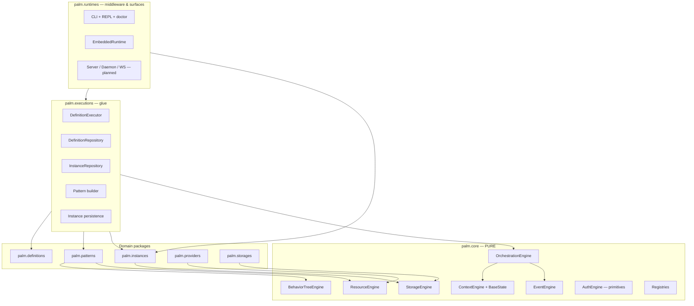
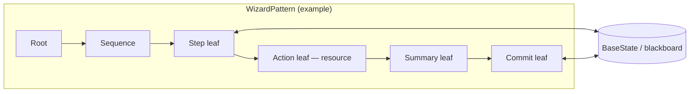
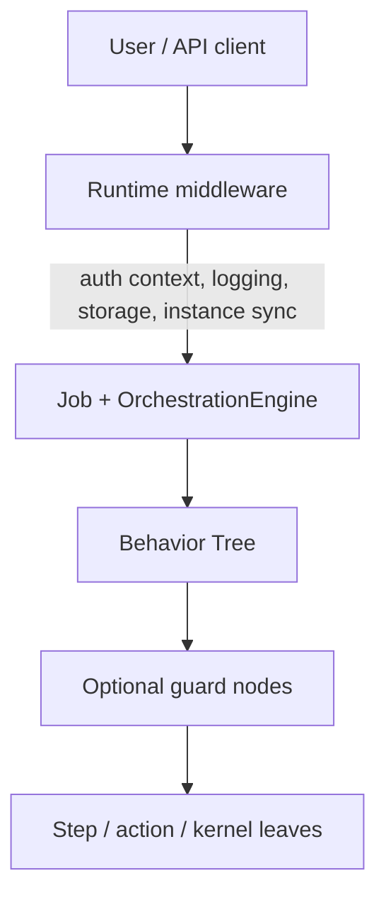

# ARCHITECTURE.md

**Palm Engine** · 0.5.0-dev · June 2026

High-level technical architecture for Palm: layers, engines, control flow, middleware, and extension. For product scope and roadmap, see [SCOPE.md](SCOPE.md).

---

## Design stance

Palm is a **layered orchestration engine** with a **pure core** and **registry-based extension**. Behavior Trees provide the execution model: workflows are trees of nodes, state lives on a pluggable blackboard, and jobs move through an explicit lifecycle.

Three ideas recur everywhere:

1. **Core purity** — `palm/core/` never imports patterns, providers, storages, definitions, or runtimes.
2. **Definitions as contract** — `FlowDefinition` / `ProcessDefinition` describe *what* to run; executions build and submit *how*.
3. **Hybrid middleware** — cross-cutting concerns (auth, observability, persistence) live primarily at the **runtime**; optional **BT guard nodes** handle step-level policy without polluting step definitions.

---

## Layer diagram

**Dependency rule:** arrows point inward toward core. Core never points outward.

---

## Control flow: Behavior Trees first

All patterns ultimately execute through the behavior tree engine. A **pattern** (wizard, DAG, ETL) is a `BasePattern` that owns or builds a tree of nodes.

| Concept | Role |
|---------|------|
| **Node** | Unit of work — interactive leaf, action, guard, sequence |
| **Tick** | Advance tree; returns running, waiting, success, or failure |
| **State** | Pluggable `BaseState` (e.g. blackboard) holding answers, prompts, flags |
| **Job** | Orchestration wrapper around an executable pattern + isolated state |

Wizard steps are **nodes**, not callbacks scattered through a framework. Future **guard decorators** and **KernelLeaf** nodes follow the same model.

---

## Core engines

| Engine | Responsibility |
|--------|----------------|
| **BehaviorTreeEngine** | Tick trees, shared pattern state |
| **OrchestrationEngine** | Job lifecycle: pending, running, waiting for input, terminal |
| **ContextEngine** | Stack-scoped execution metadata (job, instance ids) |
| **StorageEngine** | Active backend selection and key/value persistence |
| **ResourceEngine** | Provider resolution and fetch lifecycle |
| **EventEngine** | Synchronous observability bus |
| **AuthEngine** | Minimal auth primitives (enforcement at runtime / BT) |

**Invariant:** `palm/core/` imports only from `palm/core/`.

### Pluggable state

`BaseState` in `core/context` decouples engines from a specific state implementation. Production wizards use a blackboard-style state; tests may substitute lightweight fakes. Job state and tree state can be coordinated without hard-coding dict semantics in core.

---

## Registries

Extension is explicit and import-time registered:

| Registry | Examples |
|----------|----------|
| `pattern_registry` | wizard, dag, etl |
| `provider_registry` | rest, graphql, postgres |
| `storage_registry` | memory, filesystem, postgres, mongodb |

New capabilities are added by new modules under `patterns/`, `providers/`, or `storages/`—not by editing orchestration internals.

---

## Definitions

| Type | Purpose |
|------|---------|
| `FlowDefinition` | One runnable flow: pattern name + options (e.g. wizard steps, commit hook) |
| `ProcessDefinition` | Ordered group of flows submitted together |

Definitions serialize to storage records. They are the **stable contract** between authors, CLI, and executor.

---

## Executions layer

Executions sit between runtimes and core: they understand definitions and patterns; core does not.

| Component | Role |
|-----------|------|
| `DefinitionExecutor` | `submit_flow`, `submit_process`, `resume_process`, `persist_job` |
| `builder` | `FlowDefinition` → `WizardPattern` / DAG / ETL |
| `DefinitionRepository` | In-memory cache + storage-backed CRUD |
| `InstanceRepository` | Durable `ProcessInstance` CRUD |
| `instance_events` | Orchestration events → instance snapshots |

Keeping the executor outside core preserves a single orchestration model while allowing rich wizard options and resume logic to evolve independently.

---

## Instances & resume

`ProcessInstance` captures durable orchestration state:

- Stable `instance_id`, active `job_id`, status, `state_snapshot`
- Flow metadata, wizard step slug, status history

**Resume path:**

1. Load instance from `InstanceRepository`
2. Rebuild pattern from stored `flow_definition`
3. Restore blackboard from `state_snapshot`
4. Register job; continue via `provide_input` or orchestration resume

`EmbeddedRuntime.resume_process()` and CLI `process resume` expose this path.

---

## Transactional wizards

The wizard pattern is Palm’s most complete expression of **human-first, transactional** orchestration:

- Declarative **validation** on input steps
- **Backtracking** with protected summary/commit steps
- **Resource action** steps via `ResourceEngine`
- Auto **summary** and **commit** with named handlers
- Commit failure → job failure (no silent partial commit)

Commit handlers run inside the tree; results are visible on job state.

---

## Middleware architecture

Palm uses a **hybrid** model:

| Concern | Preferred home |
|---------|----------------|
| Session / principal | Runtime |
| Instance persistence | Runtime + executions events |
| Structured logging / tracing | Runtime (future: EventEngine subscribers) |
| Step may run? / quota / feature flag | BT guard node |
| User prompt & validation | Wizard step leaf (definition-driven) |

Avoid encoding middleware chains inside step JSON. Keep steps declarative; compose policy in the tree and runtime.

---

## Runtimes

| Runtime | Status | Role |
|---------|--------|------|
| **EmbeddedRuntime** | Shipped | In-process hub: `submit_*`, `provide_input`, `resume_process` |
| **CLI / REPL** | Shipped | Operator UX, `palm doctor`, examples auto-load |
| **Server** | Planned | HTTP submit/status/input |
| **Daemon** | Planned | Background workers for long-running instances |
| **WebSocket** | Planned | Streaming wizard context and job events |

`EmbeddedRuntime` wires engines once; other runtimes are expected to reuse the same executions API rather than duplicate orchestration logic.

---

## Future: compute & data (architectural direction)

Not yet in the main package, but aligned with the BT model:

- **KernelLeaf** — GPU-resident kernels, fixed VRAM buffers, batch ticks
- **Resource staging** — Parquet or large artifacts as provider-backed resources flowing through context into kernel nodes
- Stronger coupling between **ResourceEngine** and pattern action/commit paths

Prototypes under `archive/experimental/gpubatches/` explore batch GPU execution; they inform design but are not part of the supported architecture until promoted with tests and documentation.

---

## Archive & experiments

| Path | Role |
|------|------|
| `archive/` | Pre-0.4.0 legacy — reference only |
| `archive/experimental/gpubatches/` | GPU batch R&D — experimental |

New production code must not import from `archive/`.

---

## Design goals (summary)

- **Core purity** — testable engines, zero domain coupling
- **BT-native control flow** — steps, guards, and kernels are nodes
- **Registry extension** — patterns, providers, storages without forked core
- **Durable truth** — definitions + instances survive restarts
- **Runtime middleware** — auth and ops at the edge; guards in the tree when needed
- **One engine, many surfaces** — embedded, CLI, future server/daemon share executions

---

## Related documents

- [SCOPE.md](SCOPE.md) — vision, in/out of scope, roadmap
- [README.md](README.md) — quick start and CLI
- [DEVELOPMENT.md](DEVELOPMENT.md) — contributor guide
- [AGENTS.md](AGENTS.md) — contribution rules