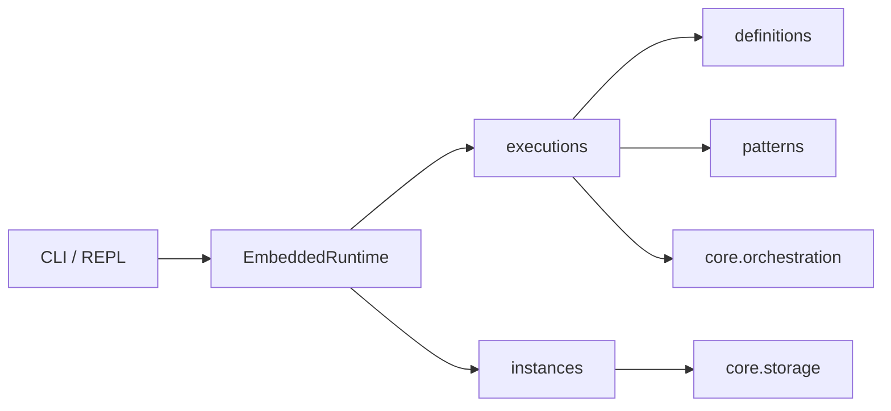

# Palm Engine

**Palm** is a lightweight orchestration engine for multi-step transactional workflows — interactive wizards with validation and commit hooks, DAG pipelines, and ETL processes.

Version **0.5.0-dev** builds on the 0.4.0 architecture with durable **process instances**, transactional wizards, and a modern **CLI** on `EmbeddedRuntime`. See [CHANGELOG.md](CHANGELOG.md).

---

## Quick Start

```bash
# Install dependencies and the CLI extras (Rich + REPL)
uv sync --group dev --extra cli
uv pip install -e .

# Version and health
palm version --full
palm doctor

# End-to-end scripted demo (submit → input → resume → commit)
uv run python examples/full_demo.py

# Interactive REPL (default when you run `palm` with no subcommand)
palm repl

# Start the onboarding wizard from examples/
palm wizard start onboard
palm input Ada
palm input ada@example.com
palm input developer
palm input yes    # summary ack
palm input yes    # commit
```

Install CLI-only in another environment:

```bash
uv sync --extra cli
```

---

## Persistent wizard resume

Process instances are snapshots of orchestrated work (wizard answers, step, status). They persist through the active storage backend so you can stop the CLI and resume later.

```bash
# Terminal 1 — start and answer one step
palm wizard start onboard
palm input Ada
# Note the instance id in the wizard panel subtitle, or run:
palm instance list

# Terminal 2 (or after restarting the REPL) — resume
palm process resume <instance_id>
palm input ada@example.com
# … continue through summary and commit
```

Use a shared storage backend when you need instances to survive across separate `palm` invocations with the same data directory (see `DEVELOPMENT.md`).

---

## Example flows

Example definitions live under [`examples/definitions/`](examples/definitions/) and auto-register when the CLI starts.

| Example | Command | Highlights |
|---------|---------|------------|
| **Onboarding** | `wizard start onboard` | Email/name validation, summary + commit (`persist_profile`) |
| **Data ingestion** | `wizard start ingest-wizard` | Regex validation, REST **resource** action step, `register_dataset` commit; process also includes an ETL flow |
| **Approval** | `wizard start approval` | Amount regex, approver choice, `record_approval` commit |
| **Quick demo** | `wizard start quick` | Minimal two-step wizard for fast experiments |

```bash
palm process list          # all registered processes and flows
palm process submit data-ingestion   # wizard + ETL flows
palm wizard list
```

See [`examples/README.md`](examples/README.md) for file-level detail.

---

## CLI overview

| Command | Description |
|---------|-------------|
| `palm` / `palm repl` | Interactive REPL |
| `palm doctor` | Full diagnostics (health, plugins, definitions, instances) |
| `palm status` | Short engine summary |
| `palm status --full` | Same as `palm doctor` |
| `palm status <instance_id>` | Job + wizard status for one instance |
| `palm process list` | Flow and process catalog |
| `palm process submit <name\|id>` | Start a process |
| `palm process resume <instance_id>` | Resume a persisted instance |
| `palm instance list` | List process instances |
| `palm wizard start <flow>` | Submit a wizard flow |
| `palm input …` / `palm back …` | Drive an active wizard |

Legacy REPL aliases (`sessions`, `wizard input`, `definitions`) remain during the transition.

---

## Project structure

```
src/palm/
├── core/                  # Pure engines (no external palm imports)
├── patterns/              # wizard, dag, etl
├── providers/             # rest, graphql, postgres
├── storages/              # memory, postgres, mongodb, filesystem
├── definitions/           # FlowDefinition, ProcessDefinition
├── executions/            # DefinitionExecutor, repositories, builder
├── instances/             # ProcessInstance durable snapshots
├── runtimes/
│   ├── embedded.py        # EmbeddedRuntime high-level API
│   ├── cli.py             # `palm` entry point
│   └── cli_pkg/           # REPL, commands, doctor, Rich display
└── utils/

examples/definitions/      # Runnable example flows (auto-loaded by CLI)
archive/                     # Legacy pre-0.4.0 (reference only)
tests/
```

---

## Architecture

| Layer | Purpose |
|-------|---------|
| **Core** | Abstract engines, registries, job lifecycle — imports only from `palm.core` |
| **Patterns / providers / storages** | Concrete implementations registered at import time |
| **Definitions** | Declarative flow and process specs |
| **Executions** | Build patterns from definitions, submit/resume jobs, sync instances |
| **Instances** | Durable `ProcessInstance` records for resume and audit |
| **Runtimes** | Embedded (library/tests), CLI (today), server/daemon (planned) |



See [ARCHITECTURE.md](ARCHITECTURE.md) and [AGENTS.md](AGENTS.md).

---

## Development

```bash
just dev              # sync, pre-commit, format
just check            # lint + types + tests
just palm-doctor      # CLI health check
just palm-repl        # open REPL
pytest
```

See [DEVELOPMENT.md](DEVELOPMENT.md).

---

## Philosophy

**🌴 Palm grows where the sun meets the sea.**

We believe orchestration should be:
- **Simple at the core, powerful at the edges** — a clean Behavior Tree foundation with rich, transactional patterns on top.
- **Human-first** — interactive wizards, easy resume, beautiful CLI, and clear feedback when waiting for input.
- **Truth-seeking & High-agency** — explicit contracts, pluggable state, persistent instances, and no hidden magic.
- **Built for the long run** — transactional commits, validation, resource integration, and durable process instances that survive restarts.
- **Developer-friendly** — great docs, examples, `palm doctor`, and a modular structure that scales from one-person projects to serious production workflows.

Palm is not just another workflow engine.  
It is a **philosophical son** (*filius philosophorum*) — balancing structure with flexibility, precision with humanity, and automation with mindful human participation.

**Crafted with ❤️ in Brazil, powered by xAI.**


---

## Migration from 0.3.x

Legacy CLI, wizards, and old engine code live under **`archive/`**. New work targets `src/palm/core/`, `executions/`, `instances/`, and `runtimes/` — never import from `archive/`.

---

## License

MIT