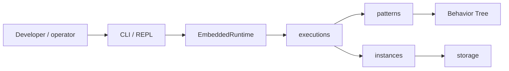
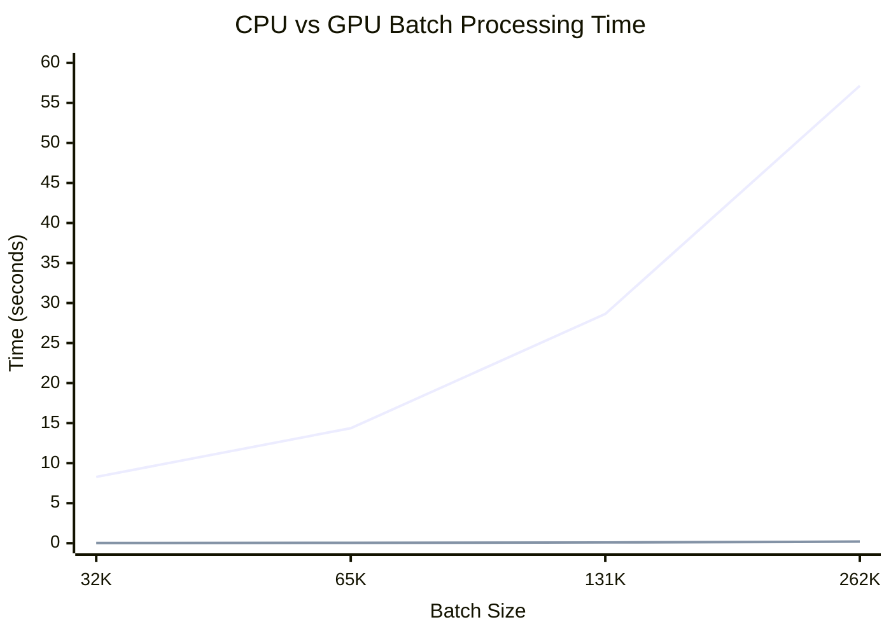

# Palm Engine 🌴

**Palm** is a lightweight, Python-first orchestration engine built on a clean **Behavior Tree** foundation. It coordinates interactive wizards, data pipelines, and—over time—compute-heavy workloads with explicit contracts, durable state, and human-first tooling.

**Current release line:** `0.5.0-dev` · See [CHANGELOG.md](CHANGELOG.md) · [SCOPE.md](SCOPE.md) for roadmap

---

## Vision

Palm aims to be **simple at the core and powerful at the edges**:

- **Human-first** — interactive wizards, Rich CLI feedback, backtracking, resume after interruption
- **Truth-seeking** — pluggable state, persistent process instances, transactional commits
- **Extensible** — patterns, providers, and storages register at the edge; core stays pure
- **Ambitious but honest** — from onboarding wizards to multi-flow data pipelines and planned GPU kernel nodes

Behavior Trees are the control-flow foundation. Steps are nodes. Cross-cutting concerns (auth, guards, observability) belong in **runtimes** and optional **BT guard nodes**—not buried in step definitions.

---

## What works today (0.5.0-dev)

| Area | Capabilities |
|------|----------------|
| **Core** | Behavior tree, orchestration, context, storage, resource, event engines — strict purity |
| **Patterns** | Transactional **wizard** (validation, summary, commit, resources); DAG and ETL stubs |
| **Executions** | `DefinitionExecutor`, definition builder, submit/resume, instance sync |
| **Persistence** | `DefinitionRepository`, `InstanceRepository`, resume across restarts |
| **Runtime** | `EmbeddedRuntime` API; **CLI + REPL** with `palm doctor`, process/instance commands |
| **DX** | Example definitions, `full_demo.py`, docs, `just` quality recipes |



---

## Quick start

```bash
uv sync --group dev --extra cli
uv pip install -e .

palm version --full      # version + registered plugins
palm doctor              # health, definitions, instances
uv run python examples/full_demo.py   # submit → input → restart → resume → commit

palm repl                # interactive shell (default: `palm`)
palm wizard start onboard
```

CLI-only install: `uv sync --extra cli`

---

## Persistent wizard resume

Process instances snapshot orchestrated work—wizard answers, step, status—and persist through storage so sessions survive restarts.

```bash
palm wizard start onboard
palm input Ada
palm instance list                    # note instance id

# Later, or in a new terminal:
palm process resume <instance_id>
palm input ada@example.com
# … continue through summary and commit
```

Shared `StorageEngine` across runtime lifetimes is required for cross-process resume (see [DEVELOPMENT.md](DEVELOPMENT.md)).

---

## Example flows

Definitions under [`examples/definitions/`](examples/definitions/) auto-register at CLI startup.

| Example | Command | Highlights |
|---------|---------|------------|
| **Onboarding** | `wizard start onboard` | Validation, summary + commit |
| **Data ingestion** | `wizard start ingest-wizard` | Resource action step, ETL companion flow |
| **Approval** | `wizard start approval` | Multi-field validation, commit handler |
| **Quick demo** | `wizard start quick` | Minimal wizard for resume experiments |

```bash
palm process list
palm process submit data-ingestion
```

Details: [examples/README.md](examples/README.md)

---

## CLI overview

| Command | Description |
|---------|-------------|
| `palm` / `palm repl` | Interactive REPL |
| `palm doctor` | Diagnostics: health, plugins, definitions, instances |
| `palm version --full` | Version, Python, registered patterns/providers/storages |
| `palm process list` \| `submit` \| `resume` | Definition catalog and lifecycle |
| `palm instance list` | Persisted instances |
| `palm wizard start <flow>` | Submit a wizard flow |
| `palm input` / `palm back` | Drive or rewind an active wizard |

Run `palm --help` for the full list.

---

## Project structure

```
src/palm/
├── core/           # Pure engines (BT, orchestration, context, storage, …)
├── executions/     # Executor, repositories, builder
├── instances/      # ProcessInstance snapshots
├── definitions/    # FlowDefinition, ProcessDefinition
├── patterns/       # wizard, dag, etl
├── providers/      # rest, graphql, postgres
├── storages/       # memory, filesystem, postgres, mongodb
└── runtimes/       # EmbeddedRuntime, CLI

examples/           # definitions/ + full_demo.py
SCOPE.md            # vision, scope, roadmap
ARCHITECTURE.md     # layers, middleware, BT model
archive/            # legacy + experimental (not imported)
```

---

## Where Palm is headed

High-level direction (not all shipped yet). Full detail in [SCOPE.md](SCOPE.md).

| Theme | Direction |
|-------|-----------|
| **Runtimes** | Server, daemon, WebSocket surfaces sharing `EmbeddedRuntime` semantics |
| **Middleware** | Runtime-level auth/observability; optional BT guard nodes for step policy |
| **Resources** | Deeper `ResourceEngine` integration in patterns and commit handlers |
| **Compute** | `KernelLeaf` GPU nodes, resident kernels, dataset staging (Parquet → context → kernel → artifact) |
| **Observability** | Structured events, long-running job management |

GPU batch prototypes live in `archive/experimental/gpubatches/` as early R&D—not part of the supported API until promoted.



---

## Architecture & contribution

| Document | Contents |
|----------|----------|
| [SCOPE.md](SCOPE.md) | Vision, in/out of scope, roadmap, experimental areas |
| [ARCHITECTURE.md](ARCHITECTURE.md) | Layers, BT control flow, middleware model, engines |
| [DEVELOPMENT.md](DEVELOPMENT.md) | Setup, tests, adding patterns/backends |
| [AGENTS.md](AGENTS.md) | Rules for contributors and AI agents |

```bash
just dev          # setup
just check        # lint + types + tests
just palm-doctor  # CLI health
just demo-full    # end-to-end script
```

---

## Philosophy

**🌴 Palm grows where the sun meets the sea.**

Orchestration should balance structure with flexibility—automation with mindful human participation. Palm keeps the core small and truthful, puts people first in interactive flows, and grows capability through registries and nodes rather than monolithic middleware.

---

## Migration from 0.3.x

Legacy code lives under **`archive/`**. New work targets `core/`, `executions/`, `instances/`, and `runtimes/` — never import from `archive/`.

---

## License

MIT