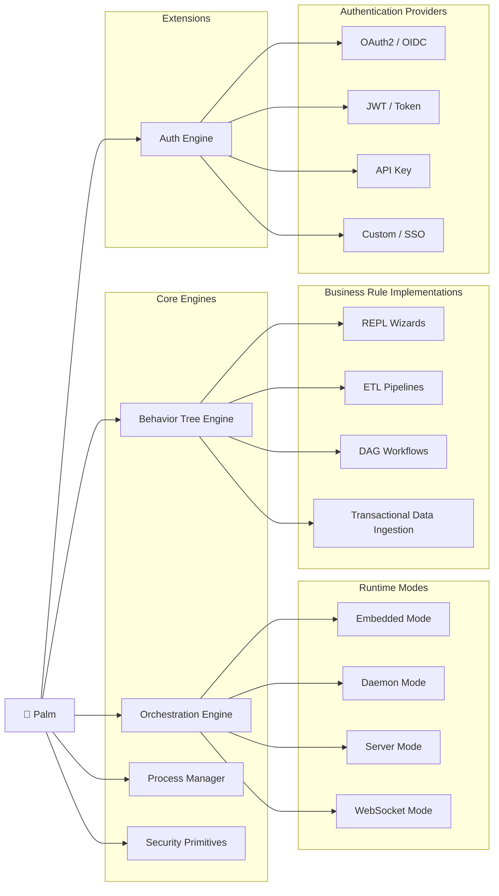

# 🌴 Palm — Orchestration Engine

**Palm** is a lightweight yet powerful orchestration engine specialized in **multi-step transactional workflows** that feature **rich interactive wizards**.

Wizards in Palm are stateful, concurrent, hierarchical DAGs that behave like lightweight Behavior Trees. They support:

- User-driven advancement ("ticks")
- Lazy asynchronous execution (run until they need input, then pause)
- Persistent sessions with TTL
- Full backtracking by step slug
- Rich contextual prompts (`RichContext`) before every interaction
- Explicit non-backtrackable **Introduction** step
- Final transactional **commit** boundary

---

## Architecture Principles

- **Strict Core / UI separation** — the `palm.core` package has zero UI concerns
- Core is daemon/server ready
- Primary interface today: excellent **Solid Admin REPL** (prompt-toolkit + Rich)
- Designed for future first-class Textual TUI and WebSocket clients
- Everything is fully type-hinted (Python 3.11+)
- Pydantic v2 models everywhere

---

## Project Structure

```
palm/
├── src/palm/                 # Main package
│   ├── core/
│   │   ├── wizard/           # The heart: engine, definitions, RichContext
│   │   ├── workflow/         # Non-interactive DAG scaffolding
│   │   ├── orchestrator.py
│   │   └── process_manager.py
│   ├── models/               # Pydantic domain models
│   ├── persistence/          # SQLite + SQLAlchemy
│   ├── cli/solid/            # Production-grade Admin REPL
│   └── ...
├── wizards/                  # Your wizard definitions live here
├── data/                     # SQLite databases
├── pyproject.toml
└── main.py
```



---

## Quick Start

```bash
# 1. Create virtualenv & install
python -m venv .venv
source .venv/bin/activate
pip install -e ".[dev]"

# 2. Run the Solid Admin CLI
python main.py
# or
palm
```

Inside the REPL:

```text
palm> wizard list
palm> wizard start create_ape_profile
palm> wizard input <session> confirm
palm> wizard input <session> "Ada Lovelace"
palm> wizard input <session> 36
palm> back <session> ask_name
palm> ps
palm> exit
```

---

## Key Concepts

| Concept           | Description |
|-------------------|-------------|
| `WizardDefinition` | Immutable declarative description of steps |
| `WizardSession`    | Persistent mutable runtime state |
| `RichContext`      | Everything a UI needs to render the current pause point |
| `StepType`         | introduction, user_input, choice, summary, commit, action... |
| Backtracking       | `back <session> <slug>` — rewinds history and collected data |
| Commit             | The transactional boundary. Only one way forward. |

---

## Creating Your Own Wizard

See [wizards/examples/create_ape_profile.py](wizards/examples/create_ape_profile.py) for a complete reference implementation.

1. Define `StepDefinition`s
2. Assemble them into a `WizardDefinition` (first step **must** be `introduction`)
3. Register it with the engine: `engine.register(my_wizard())`
4. Optionally register a commit handler

---

## Development Guide (0.1.1)

### How to Create and Register a New Wizard

```python
from palm.core.wizard.definition import WizardDefinition
from palm.models.step import StepDefinition
from palm.models.common import StepType

def my_wizard() -> WizardDefinition:
    steps = [
        StepDefinition(
            slug="introduction",
            type=StepType.INTRODUCTION,
            title="Welcome",
            prompt="Type 'confirm' to begin",
            is_backtrackable=False,
        ),
        StepDefinition(
            slug="ask_email",
            type=StepType.USER_INPUT,
            title="Email",
            prompt="What is your email?",
            validation_rules=[{"type": "required"}, {"type": "email"}],
        ),
        # ... more steps ...
        StepDefinition(slug="commit", type=StepType.COMMIT, title="Finish"),
    ]
    return WizardDefinition(
        id="my_wizard",
        name="My Wizard",
        description="Does something useful",
        steps=steps,
        on_commit_hook="my_commit_handler",   # optional
    )
```

### Registering Wizards + Commit Handlers (Recommended Pattern)

```python
from palm.core.wizard.engine import WizardEngine

def my_commit_handler(session):
    # ... perform durable transaction ...
    return {"status": "ok", "profile_id": "..."}

engine = WizardEngine()
wiz = my_wizard()

engine.register(
    wiz,
    commit_handlers={"my_commit_handler": my_commit_handler}
)
```

The Solid CLI will automatically pick up wizards placed in `wizards/examples/` that follow the `create_*_wizard` + `COMMIT_HANDLERS` convention.

### Adding Custom Validators

```python
from palm.core.wizard.validators import register_validator

def validate_not_taken(value, params):
    if value in get_existing_usernames():
        return "Username already taken"
    return None

register_validator("unique_username", validate_not_taken)
```

Then reference it from a step:

```python
ValidationRule(type="custom", params={"name": "unique_username"})
```

### Core vs CLI Architecture

- **Core** (`palm/core`, `palm/models`, `palm/persistence`): Pure logic. No Rich, no prompt_toolkit.
- **RichContext** is the *only* data structure that should flow from engine → UI.
- The CLI (`palm/cli/solid`) is allowed to be opinionated and user-experience focused.

### Key Contracts

- `WizardEngine.register()` + `process_input()` + `backtrack()` + `commit()`
- Every pause point returns a `RichContext` (0.1.1 has `suggested_input` + `available_actions`)
- Sessions are persisted automatically; the engine is stateless between calls.

---


## Tech Stack

- **Python 3.11+**
- Pydantic v2 (all models)
- Rich + prompt-toolkit (CLI)
- SQLAlchemy 2.0 + SQLite (persistence)
- multiprocessing (ProcessManager)

---

## Development

```bash
# Install in editable mode with dev tools
pip install -e ".[dev]"

# Format + lint
ruff check .
ruff format .

# Type check
mypy src

# Run tests
pytest -q

# Launch the polished Solid Admin CLI
python main.py
# or
palm
```

---

## Roadmap (Post-Skeleton)

- [ ] Full hierarchical step support (sub-wizards)
- [ ] Proper Behavior Tree node types (Sequence, Selector, Parallel)
- [ ] Async engine variant
- [ ] Textual TUI
- [ ] WebSocket / FastAPI transport layer
- [ ] Distributed session store (Redis)
- [ ] Observability (OpenTelemetry)

---

**Palm** — because every great journey starts with a single guided step.

Built with care for maintainability and extensibility.
