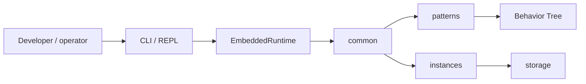
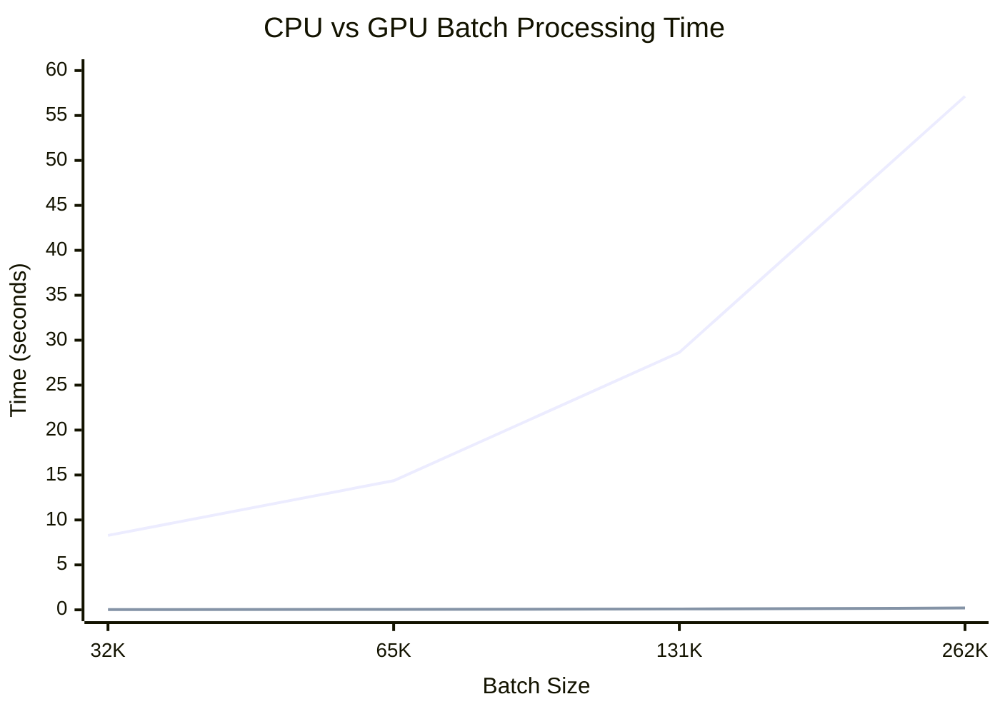

# Palm Engine 🌴

**Palm** is a lightweight, Python-first orchestration engine built on a clean **Behavior Tree** foundation. It coordinates interactive wizards, data pipelines, and—over time—compute-heavy workloads with explicit contracts, durable state, and human-first tooling.

**Current release line:** `0.7.0` · See [CHANGELOG.md](CHANGELOG.md) · [MIGRATION-0.6.md](MIGRATION-0.6.md) · [SCOPE.md](SCOPE.md) for roadmap

---

## Vision

Palm aims to be **simple at the core and powerful at the edges**:

- **Human-first** — interactive wizards, Rich CLI feedback, backtracking, resume after interruption
- **Truth-seeking** — pluggable state, persistent process instances, transactional commits
- **Extensible** — patterns, providers, and storages register at the edge; core stays pure
- **Ambitious but honest** — from onboarding wizards to multi-flow data pipelines and planned GPU kernel nodes

Behavior Trees are the control-flow foundation. Steps are nodes. Cross-cutting concerns (auth, guards, observability) belong in **runtimes** and optional **BT guard nodes**—not buried in step definitions.

---

## What works today (0.7.0)

| Area | Capabilities |
|------|----------------|
| **Core** | Behavior tree, orchestration (`apply_result` authority), context, storage, resource, event, auth |
| **Patterns** | Transactional **wizard** (validation, summary, commit, resources); DAG and ETL stubs |
| **Executions** | `ExecutionPlan` / `ProcessPlan`, `DefinitionExecutor`, prepare/submit batch API |
| **Persistence** | Production **filesystem** backend, `StorageFactory`, `InstanceManager`, durable resume across restarts |
| **State snapshots** | Optional `StateSnapshotHook` — bounded blackboard history for audit/debug (off by default) |
| **Runtimes** | `EmbeddedRuntime`, `DaemonRuntime`, `ServerRuntime` (HTTP), **CLI + REPL** |
| **Middleware** | `JobHook`, `AuthMiddleware`, drive observability, instance persistence, state snapshots |
| **DX** | Example definitions, `full_demo.py`, docs, `just` quality recipes |



---

## Quick start

```bash
uv sync --group dev --extra cli
uv pip install -e .

palm version --full      # version + registered plugins
palm doctor              # health, definitions, instances
uv run python examples/full_demo.py   # submit → input → restart → resume → commit

palm repl                # interactive shell (default: `palm`)
palm wizard start onboard
```

CLI-only install: `uv sync --extra cli`

**CLI persistence:** the CLI is a thin client of `PalmApp`. By default it uses **in-memory** storage (fast, non-durable). Set durable storage via flags or environment:

```bash
# Recommended for local work — persists instances under ./data/
export PALM_STORAGE_BACKEND=filesystem
export PALM_DATA_DIR=./data

# Or per invocation:
palm --storage-backend filesystem --data-dir ./data wizard start onboard
```

`palm doctor` and REPL startup show whether state will survive restarts. Instance
commands (`list`, `status`, `snapshots`, `resume`) all resolve through the same
`PalmApp.instance_manager` — ids shown in `instance list` work with prefix matching.

---

## Persistent wizard resume

Process instances snapshot orchestrated work—wizard answers, step, status—and persist through storage so sessions survive restarts.

```bash
palm wizard start onboard
palm input Ada
palm instance list                    # note instance id

# Later, or in a new terminal:
palm process resume <instance_id>
palm input ada@example.com
# … continue through summary and commit
```

Shared `StorageEngine` across runtime lifetimes is required for cross-process resume (see [DEVELOPMENT.md](DEVELOPMENT.md)).

**Durable filesystem storage (recommended for local dev and single-node deploys):**

```bash
export PALM_STORAGE_BACKEND=filesystem
export PALM_DATA_DIR=./data   # optional; defaults to ./data

palm wizard start onboard
palm input Ada
# Restart the CLI — instances and definitions persist under ./data/
palm process resume <instance_id>
```

---

## State snapshots (optional)

Palm can record **point-in-time blackboard captures** at selected job status transitions—useful for audit trails, debugging wizard flows, and future time-travel replay. Snapshots are stored on each `ProcessInstance` as a bounded ring buffer (`state_snapshots[]`). The feature is **off by default**.

**Enable via environment:**

```bash
export PALM_ENABLE_STATE_SNAPSHOT=true
export PALM_SNAPSHOT_ON_STATUS='["WAITING_FOR_INPUT","SUCCEEDED","FAILED"]'
export PALM_MAX_SNAPSHOTS_PER_INSTANCE=10

palm wizard start onboard
palm input Ada
palm instance snapshots <instance_id>   # inspect captured history
```

**Enable in code:**

```python
from palm.app import PalmApp, PalmSettings

settings = PalmSettings(
    enable_state_snapshot=True,
    snapshot_on_status=["WAITING_FOR_INPUT", "SUCCEEDED"],
    max_snapshots_per_instance=5,
)
with PalmApp(settings) as app:
    app.create_runtime("embedded", autostart=True)
    job = app.submit_flow("onboard")
    snapshots = app.list_instance_snapshots(job.metadata["instance_id"])
```

Resume still uses the latest `state_snapshot` field (maintained by `InstancePersistenceHook`). Historical entries are for inspection—not replay yet. See [ARCHITECTURE.md](ARCHITECTURE.md) for middleware design and trade-offs.

---

## Example flows

Definitions under [`examples/definitions/`](examples/definitions/) auto-register at CLI startup.

| Example | Command | Highlights |
|---------|---------|------------|
| **Onboarding** | `wizard start onboard` | Validation, summary + commit |
| **Data ingestion** | `wizard start ingest-wizard` | Resource action step, ETL companion flow |
| **Approval** | `wizard start approval` | Multi-field validation, commit handler |
| **Quick demo** | `wizard start quick` | Minimal wizard for resume experiments |

```bash
palm process list
palm process submit data-ingestion
```

Details: [examples/README.md](examples/README.md)

---

## CLI overview

| Command | Description |
|---------|-------------|
| `palm` / `palm repl` | Interactive REPL |
| `palm doctor` | Diagnostics: health, plugins, definitions, instances |
| `palm version --full` | Version, Python, registered patterns/providers/storages |
| `palm process list` \| `submit` \| `resume` | Definition catalog and lifecycle |
| `palm instance list` | Persisted instances |
| `palm instance snapshots <id>` | State snapshot history for an instance (when enabled) |
| `palm wizard start <flow>` | Submit a wizard flow |
| `palm input` / `palm back` | Drive or rewind an active wizard |

Run `palm --help` for the full list.

---

## Project structure

```
src/palm/
├── app/            # PalmApp orchestrator, settings, multi-runtime bootstrap
├── core/           # Pure engines (BT, orchestration, context, storage, …)
├── common/         # Shared coordination (plans, hooks, persistence, managers, StorageFactory)
├── instances/      # ProcessInstance + StateSnapshot models
├── definitions/    # FlowDefinition, ProcessDefinition
├── patterns/       # wizard, dag, etl (extensible)
├── providers/      # rest, graphql, postgres (extensible)
├── storages/       # memory, filesystem, postgres, mongodb (extensible)
└── runtimes/       # BaseRuntime, Embedded/Daemon/Server, CLI

examples/           # definitions/ + full_demo.py
SCOPE.md            # vision, scope, roadmap
ARCHITECTURE.md     # layers, middleware, BT model
archive/            # legacy + experimental (not imported)
```

---

## Where Palm is headed

High-level direction (not all shipped yet). Full detail in [SCOPE.md](SCOPE.md).

| Theme | Direction |
|-------|-----------|
| **Runtimes** | WebSocket surface, persistent plan registry, richer server auth |
| **Middleware** | Runtime-level auth/observability; optional BT guard nodes for step policy |
| **Resources** | Deeper `ResourceEngine` integration in patterns and commit handlers |
| **Compute** | `KernelLeaf` GPU nodes, resident kernels, dataset staging (Parquet → context → kernel → artifact) |
| **Observability** | Structured events, long-running job management |

GPU batch prototypes live in `archive/experimental/gpubatches/` as early R&D—not part of the supported API until promoted.



---

## Architecture & contribution

| Document | Contents |
|----------|----------|
| [SCOPE.md](SCOPE.md) | Vision, in/out of scope, roadmap, experimental areas |
| [ARCHITECTURE.md](ARCHITECTURE.md) | Layers, BT control flow, middleware model, engines |
| [DEVELOPMENT.md](DEVELOPMENT.md) | Setup, tests, adding patterns/backends |
| [AGENTS.md](AGENTS.md) | Rules for contributors and AI agents |

```bash
just dev          # setup
just check        # lint + types + tests
just palm-doctor  # CLI health
just demo-full    # end-to-end script
```

---

## Philosophy

**🌴 Palm grows where the sun meets the sea.**

Orchestration should balance structure with flexibility—automation with mindful human participation. Palm keeps the core small and truthful, puts people first in interactive flows, and grows capability through registries and nodes rather than monolithic middleware.

---

## Migration

- **0.5.x → 0.6.0** — see [MIGRATION-0.6.md](MIGRATION-0.6.md) for removed aliases (`ExecutionBackend`, `EmbeddedMode`, etc.)
- **0.3.x legacy** — code under **`archive/`** is reference-only; never import from `archive/` in new work

---

## License

MIT