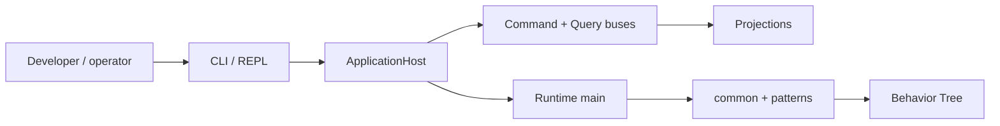
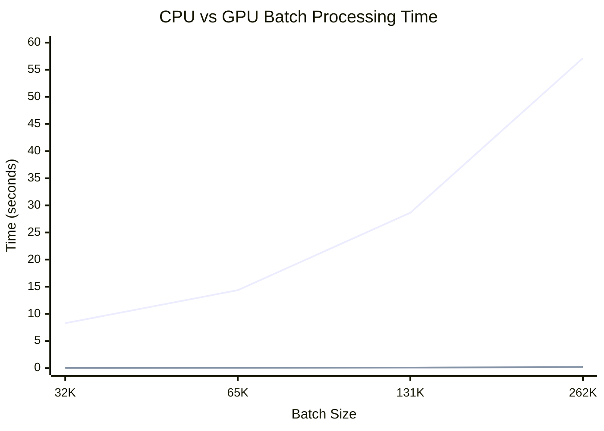

# Palm Engine 🌴

**Palm** is a lightweight, Python-first orchestration engine built on a clean **Behavior Tree** foundation. It coordinates interactive wizards, data pipelines, and—over time—compute-heavy workloads with explicit contracts, durable state, and human-first tooling.

**Current release:** `0.68.0` · **Open minor:** none · present [STATUS.md](STATUS.md) · map [PALM.md](docs/PALM.md) · [CHANGELOG.md](CHANGELOG.md) · [ARCHITECTURE.md](ARCHITECTURE.md) · [docs/MCP.md](docs/MCP.md)

### Experimental — no long-term support

Palm is **pre-1.0** and **experimental**. APIs, packages, and behaviors may break between minors. There is **no LTS**, no stability guarantee, and no promise of backward compatibility until a future 1.0 decision by **José Gabriel Gruber**.

Use Palm to explore, dogfood, and build. Pin versions deliberately. Read [STATUS.md](STATUS.md), [docs/VERSIONING.md](docs/VERSIONING.md), and [MIGRATION](docs/migrations/) notes when you upgrade. Structure and honesty matter more than comfort paths while the organism is still growing.

Stamp `0.68.0`. No open minor. Prior closed: [0.70](docs/vision/closed/VISION-0.70.md) Authoring · [0.69](docs/vision/closed/VISION-0.69.md) Navigator · [0.68](docs/vision/closed/VISION-0.68.md) costume. Residual duals [SD-023](TECH-DEBT.md#sd-023).  
**Website:** [palmengine.org](https://palmengine.org) — [`website/`](website/) · build `just website-build` → **`website/dist`** (Cloudflare assets dir).

---

## Installation

Palm is published on PyPI as **`palmengine`**. After install, you **import** `palm` and run the **`palm`** CLI — same names as in source development.

| What | Name |
|------|------|
| PyPI package | `palmengine` |
| `pip install` | `pip install palmengine[cli]` |
| Python import | `import palm` |
| CLI command | `palm` |

```bash
# End users — CLI + REPL
pip install palmengine[cli]
palm version --full
palm doctor

# Library only (no Rich / REPL)
pip install palmengine

# From source (contributors)
git clone https://github.com/JGabrielGruber/palmengine.git && cd palmengine
uv sync --group dev --extra cli
uv pip install -e ".[cli]"
```

| Extra | What |
|-------|------|
| `[cli]` | CLI + REPL |
| `[mcp]` | FastMCP (`palm-mcp`) |
| `[test]` | test deps |
| `[dev]` | contributor |
| `[all]` | cli + test subset (not every extra) |
| `[postgres]` / `[mongodb]` | empty; name reserved |

---

## Vision

Palm aims to be **simple at the core and powerful at the edges**:

- **Human-first** — interactive wizards, Assist, MCP, backtracking, resume after interruption
- **Truth-seeking** — durable instances, one start path, one continue path, named debt
- **Extensible** — patterns, providers, storages, runners register at the edge; core stays pure
- **Alive as a system** — boot, planes, supervisor, vitality, capacity (in-process multi-claimer)
- **Two axes of scale** — **vertical** home and meaning; **horizontal** place registry (bodies across hosts)
- **Horizon path** — [assembly](docs/vision/VISION-ASSEMBLY.md) → [tunnels](docs/vision/VISION-TUNNELS.md) → [Grove](docs/vision/VISION-GROVE.md)
- **Fit for living work** — datasets, training flows, TinyML and model bodies as places under one genome

Behavior Trees are the control-flow foundation for **business**. Organism topology (assembly, home, places) is a different care — do not confuse the two. Org/realm speech means **recursive support**, not a second product. Cross-cutting concerns belong in system seats and thin surfaces — not buried in step JSON.

**Read next:** [docs/PALM.md](docs/PALM.md) (§8 scale) · [STATUS.md](STATUS.md) · [docs/vision/](docs/vision/README.md) · [PHILOSOPHY.md](PHILOSOPHY.md)

---

## What works today

| Area | Capabilities |
|------|----------------|
| **Resources** | `ResourceDefinition`, `ResourceEngine.invoke()`, `ResourceLeaf`, `ResourceCatalog`; wizard `step_kind: resource` |
| **`palm` provider** | Palm calling Palm — local `submit_flow` / `invoke_resource` or remote HTTP; recursion guardrails |
| **ApplicationHost** | Top-level orchestrator — role profiles (`all_in_one`, `master`, `worker`, `server`), startup recovery |
| **CQRS** | Command/query buses; host projections (`instance_index`, `job_status_board`, `resource_invocations`); wizard projection registered by `WizardApp` |
| **Reliability** | Transactional outbox, compensation handlers (including resource undo). Webhook organ does not POST |
| **Core** | Behavior tree, orchestration, context, storage, resource, event, auth, **TransformEngine** |
| **State** | `DictStateSchema`, scoped state, schema-aware snapshots (`__palm:meta`) |
| **Transforms** | **24 built-in rules** — field shaping, JSONPath, dates, conditionals, serialization, `enrich_resource` (`parquet_load` is intention-only) |
| **Patterns** | **PatternApp** manifests + `bindings/`/`flow/` layout; **Wizard**, **parallel**, **pipeline**, **dag** (installed); **etl** intention-only — see [docs/PATTERN-APPS.md](docs/PATTERN-APPS.md) · [docs/STUBS.md](docs/STUBS.md) |
| **Persistence** | Filesystem backend, `InstanceManager`, durable resume across restarts |
| **Runtimes** | `EmbeddedRuntime`, `DaemonRuntime`, `ServerRuntime` (HTTP), **CLI + REPL** (host-backed) |
| **Palm Explorer** | SSR hub at `/explorer` — flows, jobs, instances, **wizard workspace** (HTMX + collection editor), **resources**; `/` redirects here |
| **Flow REST (0.16)** | Continue: `/v1/api/flows/{flow_id}/instance/{instance_id}/…` · create: `POST …/flows/{flow_id}/create` · Explorer: `/explorer/instances/<instance_id>` |
| **Definitions REST (0.16)** | `/v1/api/definitions/…` — catalog reads + CRUD writes |
| **Definition revisions (0.24)** | Append-only flow revisions, `flow_revision` pin, impact query, instance migrate — [MIGRATION-0.24.md](docs/migrations/MIGRATION-0.24.md) |
| **Design Service (0.25+)** | Propose → impact → commit · **one-shot** `palm_design_publish_*` / `palm_assist(params={body})` — [VISION-0.25.md](docs/vision/closed/VISION-0.25.md) |
| **Local resources (0.28–0.29)** | `kv` / `file` / tiered backends; coconut-npc cross-session profile |
| **MCP (0.16–0.31)** | `palm-mcp` · **`palm_assist` meta-tool** · `PALM_MCP_SURFACE=assist` slim catalog · `palm://agent/card` progressive docs — [docs/MCP.md](docs/MCP.md) · [VISION-0.31.md](docs/vision/closed/VISION-0.31.md) |
| **Dashboard** | `palm status` — projection-backed Rich overview; `--full`, `-r` live refresh |
| **DX** | Rich examples, `palm doctor`, REPL `resource *` / `assist *`, `just` quality recipes |


```mermaid
flowchart LR
    User[Developer / operator] --> CLI[CLI / REPL]
    CLI --> Host[ApplicationHost]
    Host --> CQRS[Command + Query buses]
    Host --> RT[Runtime main]
    CQRS --> Proj[Projections]
    RT --> CM[common + patterns]
    CM --> BT[Behavior Tree]
```

**Recommended entrypoint:** `ApplicationHost` wraps `PalmKernel` (infrastructure) and wires CQRS, projections, outbox, and compensation. The CLI uses it automatically via `create_cli_host()`.

---

## Quick start

```bash
pip install palmengine[cli]

palm                     # interactive REPL (default)
palm repl                # same as bare palm
palm status              # live projection dashboard (command, not default)
palm doctor              # full health report
palm version --full      # version + registered plugins
palm flow start onboard  # recommended — works for all patterns
# shortcut: palm start onboard
```

**From source:** `uv sync --group dev --extra cli && uv pip install -e ".[cli]"` then the same `palm` commands.

**Library quick start (ApplicationHost):**

```python
from palm.app import ApplicationHost, DeploymentProfile

with ApplicationHost(profile=DeploymentProfile.all_in_one()) as host:
    job = host.submit_flow("onboard")
    rows = host.list_instance_views(include_terminal=False)
    print(job.status.value, len(rows))
```

Demo script: `uv run python examples/full_demo.py` (host + resume across restart).

### Agent development (MCP 0.16)

Coding agents (Cursor, Grok, Claude) can operate Palm wizards headlessly via MCP — no curl, no JSON blobs.

```bash
uv sync --extra mcp
PALM_MCP_IN_PROCESS=1 uv run --extra mcp palm-mcp   # local default — no REST server
# Remote: just palm-server + PALM_MCP_IN_PROCESS=0
```

Connect your IDE to the `palm-mcp` stdio server (`pip install "palmengine[mcp]"`). Read the **[Agent development guide](docs/MCP.md#agent-development-guide)** for workflows, conventions, and the full tool list.

**Operator loop:** definitions → create session → inspect → input → wait on children → resume.

**Key conventions:** prefer `instance_id` for continue (not system `session_id`); pass plain `input` strings (`yes`, choice slugs, text); read `palm://agent/guide` (`docs/mcp.txt`) and `palm://agent/skill` first. Portable skill: [`docs/skills/palm/`](docs/skills/palm/).

**Docker (host server + Explorer):**

```bash
just docker-up          # build + start on :8080, ./data + ./logs volumes
open http://localhost:8080/explorer
just docker-logs        # noisy logs — by design
```

Full stack guide: **[docs/DOCKER.md](docs/DOCKER.md)** — volumes, HTTP MCP against the container, env vars, troubleshooting.

**Server + Palm Explorer (local Python):**

```bash
# Start HTTP server (default port 8080)
palm host server
# or: just palm-server

# Open the living hub — flows, jobs, instances, schemas
open http://localhost:8080/explorer   # or just http://localhost:8080/ (redirects)
```

REST reference: `GET /v1/docs` · OpenAPI: `GET /v1/openapi.json` · Health: `GET /health`

### Try in Explorer

The instance detail page is a **live wizard workspace** — progress bar, prompt card, answers, timeline, and backtrack. Collection steps get a rich multi-item editor (add / edit / remove) with HTMX partial updates.

```bash
# 1. Start server
palm host server
# or: just palm-server

# 2. Submit todo-builder (collection demo)
curl -s -X POST http://localhost:8080/v1/api/flows/todo-builder/create \
  -H 'Content-Type: application/json' \
  -d '{"flow_name": "todo-builder"}'
# → copy instance_id from JSON

# 3. Open workspace
open http://localhost:8080/explorer/instances/<instance_id>
```

Use **Add New** on the collection overview, fill fields, edit or remove items, then **Continue to summary**. Full guide: [EXPLORER-WIZARD.md](docs/wiki/guides/explorer-wizard.md).

**Try the new examples:**

```bash
palm flow start schema-onboard   # layered state schemas + scopes
palm flow start todo-builder     # dynamic todo list (collection step)
palm flow start parallel-demo    # parallel wizard branches
palm flow start transform-example  # wizard transform steps
palm flow start transform-shaping  # pipeline calculate / lookup / conditional
palm flow start transform-formats  # json_load → csv_dump ETL-style pipeline
```

### Transforms

Declarative data shaping via registered rules — usable in **pipelines**, **wizard** steps (`step_kind: transform`), or `TransformLeaf` nodes.

```python
from palm.common.transforms import TransformExecutor, autoload

autoload()
executor = TransformExecutor()
result = executor.apply(
    "string_format",
    "ada",
    template="Hello, {value}!",
    case="title",
)
# → "Hello, Ada!"
```

```yaml
# Wizard step (in flow options.steps)
step_kind: transform
source_key: name
target_key: greeting
rule: string_format
options:
  template: "Hello, {value}!"
  case: title
```

Run `palm doctor` for the full rule catalog with descriptions. Extend with `register_transform("my_rule", MyRule)` at bootstrap.

**CLI persistence:** the CLI bootstraps `ApplicationHost` (`all_in_one` profile). By default it uses **in-memory** storage (fast, non-durable). Set durable storage via flags or environment:

```bash
# Recommended for local work — persists instances under ./data/
export PALM_STORAGE_BACKEND=filesystem
export PALM_DATA_DIR=./data

# Or per invocation:
palm --storage-backend filesystem --data-dir ./data flow start onboard
```

`palm doctor` and REPL startup show whether state will survive restarts.

**Instance commands** (`list`, `status`, `snapshots`) read through the host **query bus** and projections. Writes (`flow start`, `input`, `resume`) go through the **command bus**. Short ids from `instance list` work with prefix matching.

**Global CLI flags** (override env only when explicitly passed):

| Flag | Env | Purpose |
|------|-----|---------|
| `-b` / `--storage-backend` | `PALM_STORAGE_BACKEND` | Storage backend (`memory`, `filesystem`, …) |
| `-d` / `--data-dir` | `PALM_DATA_DIR` | Data directory for durable backends |
| `--config` | — | Optional `.env`-style config file |
| `-S` / `--enable-state-snapshot` | `PALM_ENABLE_STATE_SNAPSHOT` | Capture state snapshot history |
| `--max-loaded-instances` | `PALM_MAX_LOADED_INSTANCES` | InstanceManager LRU size |
| `--max-concurrent-active` | `PALM_MAX_CONCURRENT_ACTIVE` | Active instance cap |
| `--scheduler` | `PALM_DEFAULT_SCHEDULER` | `inline` or `queued` |
| `--format` | — | `table` (default) or `json` for scripting |

Settings precedence: `PALM_*` environment → `--config` file → CLI flags.

```bash
palm instance list                          # active (non-terminal) instances
palm instance list --all --format json      # all instances, JSON for scripts
palm instance list --status WAITING_FOR_INPUT --flow quick
palm instance prune --dry-run               # preview terminal instance cleanup
palm --format json instance status <id>     # machine-readable status
```

The REPL uses smart tab-completion for commands, flow/process names, and instance ids
(active by default; `--all` includes terminal instances).

---

## Persistent wizard resume

Process instances snapshot orchestrated work—wizard answers, step, status—and persist through storage so sessions survive restarts.

```bash
palm flow start onboard
palm input Ada
palm instance list                    # note instance id

# Later, or in a new terminal:
palm instance resume <instance_id>
palm input ada@example.com
# … continue through summary and commit
```

Shared `StorageEngine` across runtime lifetimes is required for cross-process resume (see [DEVELOPMENT.md](DEVELOPMENT.md)).

**Durable filesystem storage (recommended for local dev and single-node deploys):**

```bash
export PALM_STORAGE_BACKEND=filesystem
export PALM_DATA_DIR=./data   # optional; defaults to ./data

palm flow start onboard
palm input Ada
# Restart the CLI — instances and definitions persist under ./data/
palm instance resume <instance_id>
```

---

## State snapshots (optional)

Palm can record **point-in-time blackboard captures** at selected job status transitions—useful for audit trails, debugging wizard flows, and future time-travel replay. Snapshots are stored on each `ProcessInstance` as a bounded ring buffer (`state_snapshots[]`). The feature is **off by default**.

**Enable via environment:**

```bash
export PALM_ENABLE_STATE_SNAPSHOT=true
export PALM_SNAPSHOT_ON_STATUS='["WAITING_FOR_INPUT","SUCCEEDED","FAILED"]'
export PALM_MAX_SNAPSHOTS_PER_INSTANCE=10

palm flow start onboard
palm input Ada
palm instance snapshots <instance_id>   # inspect captured history
```

**Enable in code:**

```python
from palm.app import ApplicationHost, DeploymentProfile, PalmSettings

settings = PalmSettings(
    enable_state_snapshot=True,
    snapshot_on_status=["WAITING_FOR_INPUT", "SUCCEEDED"],
    max_snapshots_per_instance=5,
)
with ApplicationHost(settings, profile=DeploymentProfile.all_in_one()) as host:
    job = host.submit_flow("onboard")
    snapshots = host.list_instance_snapshots(job.metadata["instance_id"])
```

Resume still uses the latest `state_snapshot` field (maintained by `InstancePersistenceHook`). Historical entries are for inspection—not replay yet. See [ARCHITECTURE.md](ARCHITECTURE.md) for middleware design and trade-offs.

---

## Example flows

Definitions under [`examples/definitions/`](examples/definitions/) auto-register at CLI startup.

| Example | Command | Highlights |
|---------|---------|------------|
| **Onboarding** | `flow start onboard` | Validation, summary + commit |
| **Schema wizard** | `flow start schema-onboard` | Flow + per-step schemas, scoped resume |
| **Todo builder** | `flow start todo-builder` | Collection step, dynamic lists, schemas |
| **Parallel demo** | `flow start parallel-demo` | Concurrent branches, merge, branch scopes |
| **Data ingestion** | `flow start ingest-wizard` | Resource action step, ETL companion flow |
| **Approval** | `flow start approval` | Multi-field validation, commit handler |
| **Quick demo** | `flow start quick` | Minimal wizard for resume experiments |

```bash
palm process list
palm process submit data-ingestion
palm doctor    # shows flows with state schemas
```

Details: [examples/README.md](examples/README.md)

---

## Living Explorer Hub

When `ServerRuntime` is running, **Palm Explorer** is the browser-first control surface for operators and integrators:

| Path | Purpose |
|------|---------|
| `/explorer` | Overview — registered flows, active jobs, instance counts |
| `/explorer/flows` | Flow catalog with **Start this flow** actions |
| `/explorer/flows/submit` | Schema-driven flow submission (registered or test wizard) |
| `/explorer/jobs` | Job board with wizard input forms |
| `/explorer/instances` | Durable process instance browser |
| `/explorer/schemas` | State schema introspection |

Legacy `/wiki/*` and `/docs` redirect to `/explorer`. Implementation: `palm/runtimes/server/surfaces/ssr/explorer/`.

---

## CLI overview

| Command | Description |
|---------|-------------|
| `palm` / `palm repl` | Interactive REPL (host-backed; default) |
| `palm status` | Live dashboard — instances, wizards, jobs, host events (command, not default) |
| `palm status --full` | Detailed dashboard (active rows, traces) |
| `palm status -r` | Live refresh every 2s (Ctrl+C to stop) |
| `palm doctor` | Full health report: plugins, persistence, definitions |
| `palm version --full` | Version, Python, registered patterns/providers/storages |
| `palm process list` \| `submit` | Definition catalog and process submit |
| `palm instance list` | Instances via CQRS projection |
| `palm instance resume <id>` | Resume a persisted instance |
| `palm instance snapshots <id>` | State snapshot history (when enabled) |
| `palm flow start <flow>` | Start any flow — **recommended** |
| `palm start <flow>` | Shortcut for `flow start` |
| `resource *` / `assist *` | REPL-only — `palm repl` then `resource list` / `describe` / `invoke` |
| `palm input` / `palm back` | Drive or rewind an active flow |
| `palm host all-in-one` | Run ApplicationHost (blocking, signals) |
| `palm host master` \| `worker` \| `server` | Role-based deployment |

Run `palm --help` for the full list.

---

## Project structure

```
src/palm/
├── app/            # ApplicationHost, PalmKernel (infra), settings, host roles
├── core/           # Pure engines (BT, orchestration, context, storage, …)
├── common/         # CQRS, outbox, compensation, hooks, persistence, managers
├── instances/      # ProcessInstance + StateSnapshot models
├── definitions/    # FlowDefinition, ProcessDefinition
├── patterns/       # wizard, dag, etl (extensible)
├── providers/      # rest, graphql, postgres (extensible)
├── storages/       # memory, filesystem, postgres, mongodb (extensible)
└── runtimes/       # Embedded/Daemon/Server, CLI (host-backed)

examples/           # definitions/ + full_demo.py (ApplicationHost)
SCOPE.md            # vision, scope, roadmap
ARCHITECTURE.md     # layers, ApplicationHost, CQRS, reliability
docs/migrations/    # upgrade guides (MIGRATION-0.X.md)
docs/releases/      # point-release checklists (RELEASE-0.X.Y.md)
archive/            # legacy + experimental (not imported)
```

---

## Resource best practices

1. **Define once, reference everywhere** — register `ResourceDefinition` in the repository; use `resource_ref` in wizards, `ResourceLeaf` in behavior trees, and `enrich_resource` in transforms.
2. **Prefer declarative params** — bind with `{{ state.key }}`; promote wizard answers before resource steps (`promote_binding_keys()`).
3. **Compose with the `palm` provider** — delegate sub-flows locally or via `remote_url`; rely on built-in depth/cycle guardrails.
4. **Observe `resource.*` events** — completed/failed payloads include correlation (`invoke_depth`, `invoke_chain`, `parent_job_id`).
5. **Cache reads, not writes** — keep `resource_cache_definitions` on; enable `resource_cache_results` only for idempotent `fetch` actions.
6. **Discover before invoke** — `palm doctor`, REPL `resource list` / `describe`, and Explorer `/explorer/resources` show actions and schemas.

```bash
palm repl
# then: resource list / describe fetch-customer / invoke fetch-customer customer_id=42
```

Full guide: [docs/vision/closed/VISION-0.12.md](docs/vision/closed/VISION-0.12.md) · [MIGRATION-0.12.md](docs/migrations/MIGRATION-0.12.md)

---

## Where Palm is headed

High-level direction (not all shipped yet). Full detail in [SCOPE.md](SCOPE.md).

| Theme | Direction |
|-------|-----------|
| **Runtimes** | WebSocket Assist channel + Portal backend ([VISION-0.32](docs/vision/closed/VISION-0.32.md)), persistent plan registry, richer server auth |
| **Middleware** | Runtime-level auth/observability; optional BT guard nodes for step policy |
| **Compute** | `KernelLeaf` GPU nodes, resident kernels, dataset staging (Parquet → context → kernel → artifact) |
| **Observability** | Structured events, long-running job management |

GPU batch prototypes live in `archive/experimental/gpubatches/` as early R&D—not part of the supported API until promoted.


```mermaid
---
title: CPU vs GPU Execution Time
---
xychart
    title "CPU vs GPU Batch Processing Time"
    x-axis "Batch Size" ["32K", "65K", "131K", "262K"]
    y-axis "Time (seconds)" 0 --> 60
    line "CPU" [8.28, 14.37, 28.64, 57.14]
    line "GPU" [0.026, 0.051, 0.100, 0.200]
```

---

## Architecture & contribution

| Document | Contents |
|----------|----------|
| [SCOPE.md](SCOPE.md) | Purpose, horizon, experimental honesty (not a frozen old roadmap) |
| [docs/vision/closed/VISION-0.64.md](docs/vision/closed/VISION-0.64.md) | **Closed** — first capability `work_drain` |
| [docs/vision/VISION-ASSEMBLY.md](docs/vision/VISION-ASSEMBLY.md) | Seed essay — roles · ports · citizenship |
| [PHILOSOPHY.md](PHILOSOPHY.md) | Spirit — grown, not built; glory and shackles |
| [ARCHITECTURE.md](ARCHITECTURE.md) | Layers, BT control flow, middleware model, engines |
| [DEVELOPMENT.md](DEVELOPMENT.md) | Setup, tests, adding patterns/backends |
| [AGENTS.md](AGENTS.md) | Rules for contributors and AI agents |

```bash
just dev          # setup
just check        # lint + types + tests
just palm-doctor  # CLI health
just demo-full    # end-to-end script
```

---

## Philosophy

**🌴 Palm grows where the sun meets the sea.**

Orchestration should balance structure with flexibility—automation with mindful human participation. Palm keeps the core small and truthful, puts people first in interactive flows, and grows capability through registries and nodes rather than monolithic middleware.

Two habits keep that promise honest as Palm grows:

- **Register downward.** Shared state lives in the low layers; capabilities register *into* it from above — a new pattern, provider, or storage is a new module that registers itself, never an edit to the core. Extension is addition, not surgery.
- **Coherence is a fitness function.** Palm's layering and import graph aren't just conventions — they're *checked* (`guard_core`, `guard_deferred`, wired into `just ci`) and only ever ratchet tighter. The architecture defends its own shape, which is what lets it be refactored fearlessly.

For the spirit beneath the surface — what Palm *is*, not just what it does — see **[PHILOSOPHY.md](PHILOSOPHY.md)**.

---

## Migration

- **0.11.x → 0.12 Compositional Power** — see [MIGRATION-0.12.md](docs/migrations/MIGRATION-0.12.md) for wizard `step_kind: resource` and removed `action` steps
- **0.9.x → 0.10 architecture** — see [MIGRATION-0.10.md](docs/migrations/MIGRATION-0.10.md) for `ApplicationHost`, CQRS, and removed `bootstrap_cli` / `cli/pkg` paths
- **0.5.x → 0.6.0** — see [MIGRATION-0.6.md](docs/migrations/MIGRATION-0.6.md) for removed aliases (`ExecutionBackend`, `EmbeddedMode`, etc.)
- **0.3.x legacy** — code under **`archive/`** is reference-only; never import from `archive/` in new work

---

## License

MIT