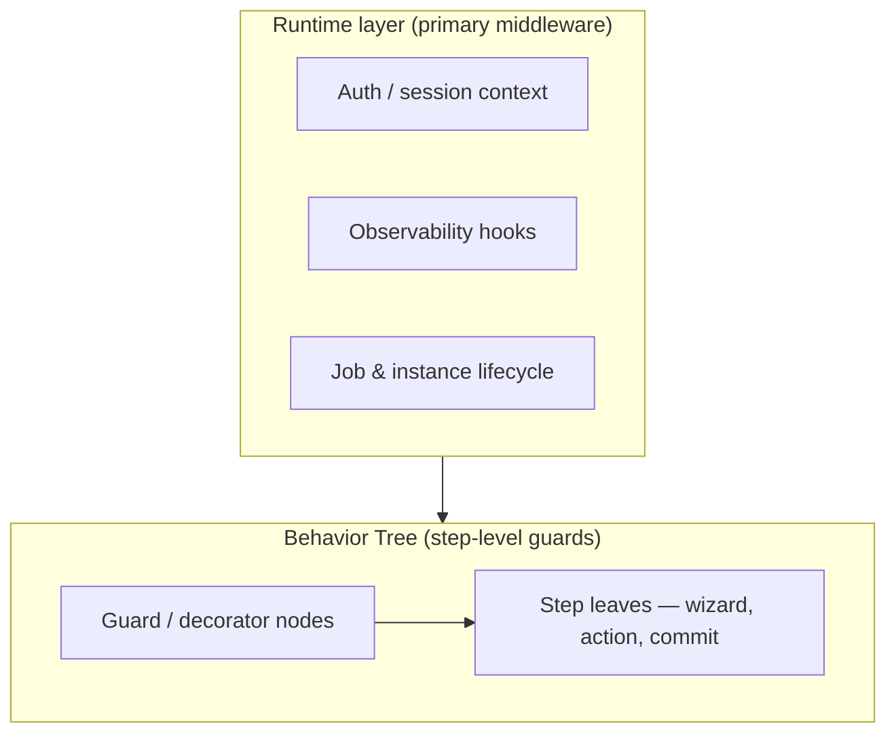
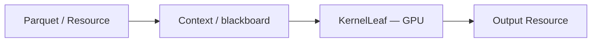

# Palm Engine — Project Scope & Roadmap

**Version:** 0.12.0 (shipping) · **Last updated:** June 2026

This document describes what Palm is for, what it does today, and where it is headed. For layer-by-layer technical detail, see [ARCHITECTURE.md](ARCHITECTURE.md). For day-to-day usage, see [README.md](README.md).

---

## Vision

Palm Engine is a **lightweight, Python-first orchestration engine** built on a clean **Behavior Tree (BT)** foundation. It is designed to coordinate human-in-the-loop workflows, data pipelines, and—over time—compute-heavy workloads such as ML and GPU batch processing.

Palm should feel approachable on day one and remain honest as complexity grows: explicit contracts, durable state, and extension through registries—not hidden magic.

---

## Philosophy

| Principle | What it means in practice |
|-----------|---------------------------|
| **Simple at the core, powerful at the edges** | `palm.core` stays pure and small; `palm.common`, patterns, and runtimes carry coordination and integration logic. |
| **Human-first** | Interactive wizards, Rich CLI feedback, backtracking, and resume after interruption. |
| **Truth-seeking & high-agency** | Pluggable `BaseState`, visible job lifecycle, persistent instances, transactional commits. |
| **Durable & transactional** | Definitions and process instances persist; commits succeed or fail explicitly. |
| **Scale of ambition** | From a two-step onboarding wizard to multi-flow data/ML pipelines on shared resources. |

Behavior Trees are the **control-flow foundation**: steps are nodes, composition is explicit, and cross-cutting behavior belongs in the tree or runtime—not buried in ad hoc step options.

---

## In scope (today — 0.6.0)

### Orchestration & control flow

- Behavior-tree execution with pluggable blackboard state (`BaseState`)
- Job lifecycle via `OrchestrationEngine` (pending → running → waiting → terminal)
- Registered patterns: **wizard**, **DAG**, **ETL** (wizard is the most capable today)

### Definitions & persistence

- Declarative `FlowDefinition` and `ProcessDefinition` with serialization
- `DefinitionRepository` — register and persist flow/process catalogs
- `InstanceRepository` — durable `ProcessInstance` snapshots with status history
- Optional **state snapshot history** (`StateSnapshotHook`) — bounded blackboard captures for audit and debugging (off by default)
- Resume across runtime restarts when storage is shared

### Common coordination layer (`palm.common`)

- `DefinitionExecutor` — submit flows/processes, resume instances, persist jobs
- `common/plans/` — `ExecutionPlan`, `ProcessPlan`, `PlanRegistry` (prepare → stage → submit)
- `common/patterns/` — materialize definitions into concrete patterns via registry
- `common/hooks/` + `common/persistence/` — `InstancePersistenceHook` (resume) and optional `StateSnapshotHook` (audit history)

### Interactive wizards (flagship pattern)

- Declarative validation, choice/confirm fields, backtracking
- Summary and commit steps with named commit handlers
- Resource action steps (e.g. REST provider fetch before commit)
- Transactional finalize: commit failure fails the job visibly

### Runtimes & developer experience

- **EmbeddedRuntime** — in-process API for libraries and tests
- **DaemonRuntime** — long-lived background process with queued scheduler
- **ServerRuntime** — HTTP API (`/v1/jobs`, `/v1/plans/*`) with optional auth
- **CLI + REPL** — `palm doctor`, process/instance commands, definition-driven flows
- **RuntimeHost** / **BaseRuntime** — shared wiring, hooks, and lifecycle across runtimes
- Example definitions and `examples/full_demo.py` end-to-end script
- Documentation, changelog, migration guide, and `just` recipes for quality gates

### Extension surfaces

- `pattern_registry`, `provider_registry`, `storage_registry`
- Commit handler registry, validation rules, storage backends (memory, filesystem, Postgres, MongoDB)

---

## Out of scope (for now)

- **WebSocket** runtime and live job/wizard streaming (planned)
- Full **GPU / KernelLeaf** execution in the main tree (experimental prototypes only)
- A complete **auth product** — core exposes primitives; enforcement is runtime/BT concern
- Legacy code under `archive/` — reference and experiments, not imported by new work

---

## Middleware model (hybrid)

Palm deliberately separates **what a step does** from **who may run it** and **how the runtime wraps execution**.

| Layer | Responsibility |
|-------|----------------|
| **Runtime** | Authentication context, logging, tracing, storage selection, instance persistence, optional state snapshot history, CLI/session policy |
| **BT nodes** | Optional per-step guards (authorization checks, rate limits, preconditions) expressed as dedicated nodes or decorators—not inline middleware in step JSON |

Step definitions stay focused on **user-facing intent** (prompt, validation, resource id). Policy and infrastructure wrap execution at the edges.

---

## Roadmap

### Current release — 0.12 “Compositional Power”

**Theme:** Resources as first-class, declarative citizens — compositional orchestration at scale.

Full vision: [docs/VISION-0.12.md](docs/VISION-0.12.md) · Migration: [MIGRATION-0.12.md](MIGRATION-0.12.md) · ADR: [docs/adr/001-compositional-power-resources.md](docs/adr/001-compositional-power-resources.md)

| Pillar | Shipped |
|--------|---------|
| **`ResourceDefinition`** | Declarative, repository-backed resource contracts |
| **`ResourceEngine` + `BaseProvider`** | Invoke lifecycle — actions, schemas, structured results, events |
| **`palm` provider** | Palm calling Palm — local or remote HTTP with recursion guardrails |
| **`ResourceLeaf`** | Core BT node; wizard `step_kind: resource` |
| **Cross-cutting** | `enrich_resource`, compensation, CQRS projection, Explorer hub |

Also includes **ApplicationHost**, CQRS, reliability primitives, **Palm Explorer** (flows, jobs, instances, resources), rich wizards, and multiple runtimes.

### Near term (post-0.12)

- WebSocket runtime for live wizard and job streaming
- Expand runtime middleware (auth policies, observability exporters) without core pollution
- Pipeline/DAG resource stage builders (deferred from 0.12 Phase 3)
- Harden transactional wizard and instance resume across storage backends

### Medium term (post-0.12)

- **Improved observability** — structured events, richer audit dashboards, long-running job management UI
- **Long-running process management** — cancel, pause, progress reporting across runtimes
- Richer **DAG** and **ETL** patterns with native resource stages
- Optional **BT guard nodes** catalog (auth guard, validation decorator, retry)

### Long term — compute & data

Palm is intended to support serious data and ML workloads without abandoning the BT model:

Planned direction (not yet in main scope):

- **`KernelLeaf` nodes** — resident GPU kernels, fixed VRAM buffers, batch execution
- **Resource nodes** — large dataset staging (e.g. Parquet → context → kernel → output artifact); builds on 0.12 `ResourceDefinition` + `ResourceLeaf`
- **KernelLeaf** integration with compositional sub-flows via `palm` provider

Early experiments live in `archive/experimental/gpubatches/`. They inform the roadmap but are **not** part of the supported API until promoted into `patterns/` or `providers/` with tests and docs.

### Runtimes

| Runtime | Status | Direction |
|---------|--------|-----------|
| Embedded | **Shipped** | Library and test hub |
| CLI / REPL | **Shipped** | Human-first operator surface |
| Server (HTTP) | **Shipped** | Remote submit, status, deferred plans |
| Daemon | **Shipped** | Background instance workers |
| WebSocket | Planned | Live wizard and job streaming |

---

## Experimental areas

| Location | Contents | Status |
|----------|----------|--------|
| `archive/experimental/gpubatches/` | GPU batch processing prototypes (v1–v11, benchmarks) | Early R&D — do not depend on |
| `archive/` (legacy) | Pre-0.4.0 CLI, wizards, engines | Historical reference only |

Experimental code may be read for ideas; it must not be imported from `src/palm/` production paths.

---

## Success criteria

Palm is succeeding when:

1. A new developer can run `palm doctor`, start a wizard, and resume after restart without reading core source.
2. Core purity checks pass and new features extend via registries, not core edits.
3. Definitions remain the contract between authors, storage, and execution.
4. Human steps and automated steps share one BT execution model.
5. The path from wizard → resource invoke → sub-flow → DAG → GPU kernel feels like one engine, not three products.

---

## Related documents

- [README.md](README.md) — quick start, CLI, examples
- [ARCHITECTURE.md](ARCHITECTURE.md) — layers, engines, data flow
- [DEVELOPMENT.md](DEVELOPMENT.md) — contributor workflow
- [CHANGELOG.md](CHANGELOG.md) — release history
- [docs/VISION-0.12.md](docs/VISION-0.12.md) — 0.12 Compositional Power vision
- [AGENTS.md](AGENTS.md) — rules for AI and human contributors