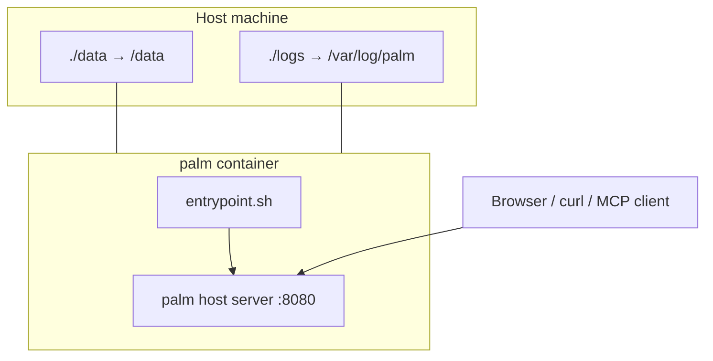

# Palm Docker Stack

Run Palm as a **long-lived host server** with filesystem storage, Explorer UI, REST API, and optional HTTP MCP — without installing Python on the host.

**Version:** 0.46.2 · **Compose file:** [`docker-compose.yml`](../docker-compose.yml) · **Image:** [`Dockerfile`](../Dockerfile)

---

## What you get

| Surface | URL (default) | Notes |
|---------|---------------|-------|
| **Explorer** | `http://localhost:8080/explorer` | Wizard workspace, instances, resources |
| **Health** | `http://localhost:8080/health` | Used by container healthcheck |
| **REST API** | `http://localhost:8080/v1/api/…` | Flows, definitions, assist, system |
| **HTTP MCP** | `http://localhost:8080/mcp` | Streamable HTTP (when `[mcp]` extra installed — default in image) |
| **SSE MCP** | `http://localhost:8080/mcp/sse` | Legacy SSE clients |

The container runs `palm host server` via [`docker/entrypoint.sh`](../docker/entrypoint.sh). Logs are tee'd to a file **and** stdout (noisy by design — project life visible in `./logs`).

---

## Quick start

```bash
# Build and start (detached)
just docker-build
just docker-up

# Or directly
docker compose up -d --build

# Follow logs (file + stdout)
just docker-logs
# tail on host:
tail -f logs/palm.log

# Stop
just docker-down
```

Open **http://localhost:8080/explorer** — root `/` redirects there.

Example definitions are loaded when `PALM_LOAD_EXAMPLE_DEFINITIONS=true` (default in compose).

---

## Stack layout



| Path (container) | Purpose |
|------------------|---------|
| `/data` | Durable instances, snapshots (`PALM_DATA_DIR`) |
| `/var/log/palm/palm.log` | Append-only server log (`PALM_LOG_FILE`) |
| `/app/docs/` | Bundled agent docs (`mcp.txt`, `skills/palm/`) for MCP resources |

---

## Environment variables

Set in `docker-compose.yml` or override via `.env` (see [`.env.example`](../.env.example)).

| Variable | Compose default | Purpose |
|----------|-----------------|--------|
| `PALM_PUBLISH_PORT` | `8080` | Host port mapped to container 8080 |
| `PALM_STORAGE_BACKEND` | `filesystem` | Durable storage backend |
| `PALM_DATA_DIR` | `/data` | Instance persistence directory |
| `PALM_SERVER_HOST` | `0.0.0.0` | Bind address inside container |
| `PALM_SERVER_PORT` | `8080` | Listen port |
| `PALM_LOAD_EXAMPLE_DEFINITIONS` | `true` | Register example flows on boot |
| `PALM_LOG_FILE` | `/var/log/palm/palm.log` | Log file path |
| `PALM_LLMS_TXT` | `docs/mcp.txt` | `palm://agent/guide` content |
| `PALM_SKILL_DIR` | `docs/skills/palm` | `palm://agent/skill` + references |

### Agent MCP against Docker

**Option A — HTTP MCP (remote Palm in container):**

```bash
# Terminal: stack running on :8080
PALM_MCP_IN_PROCESS=0 PALM_BASE_URL=http://127.0.0.1:8080 uv run --extra mcp palm-mcp
```

**Option B — curl / REST** (see [`docs/MCP.md`](MCP.md)):

```bash
curl -s http://127.0.0.1:8080/health
curl -s http://127.0.0.1:8080/v1/api/flows/todo-builder/create \
  -H 'Content-Type: application/json' -d '{"flow_name":"todo-builder"}'
```

**Option C — in-process MCP** (local dev, no Docker): `PALM_MCP_IN_PROCESS=1` — see [docs/MCP.md](MCP.md).

Read agent resources from the running server (if your MCP client supports HTTP resources) or from the repo's `docs/` tree.

---

## Volumes and persistence

```yaml
volumes:
  - ./data:/data
  - ./logs:/var/log/palm
```

- **`./data`** — survives `docker compose down`. Delete to reset all instances.
- **`./logs`** — `palm.log` grows over time; safe to truncate or archive. Kept intentionally verbose.

To reset everything:

```bash
just docker-down
rm -rf data/* logs/*
just docker-up
```

---

## Healthcheck

Compose and the Dockerfile both probe `GET /health` every 30s. Container status `healthy` means the HTTP server responds; it does not guarantee all registries loaded (use `palm doctor` via CLI against REST or Explorer).

---

## Building the image manually

```bash
docker build -t palmengine:local .
docker run --rm -p 8080:8080 \
  -v "$(pwd)/data:/data" \
  -v "$(pwd)/logs:/var/log/palm" \
  -e PALM_LOAD_EXAMPLE_DEFINITIONS=true \
  palmengine:local
```

The image installs `[cli]` and `[mcp]` extras. `docs/` and `examples/definitions/` are copied in at build time.

---

## Production notes

- Put a reverse proxy (TLS, auth) in front of `:8080` before exposing publicly.
- Back up `./data` on a schedule — it holds durable workflow state.
- Tune `restart: unless-stopped` in compose for your orchestrator (Kubernetes, etc. needs a different manifest).
- For Postgres/Mongo storage backends, set `PALM_STORAGE_BACKEND` and driver env vars — filesystem is the default documented path.

---

## Troubleshooting

| Symptom | Check |
|---------|-------|
| Port in use | Change `PALM_PUBLISH_PORT` in `.env` |
| Empty Explorer | `PALM_LOAD_EXAMPLE_DEFINITIONS=true`; inspect `docker compose logs` |
| MCP client can't connect | Use `PALM_MCP_IN_PROCESS=0` + `PALM_BASE_URL=http://127.0.0.1:8080` |
| Stale instances | Clear `./data` after `docker-down` |
| Log noise | Expected — check `./logs/palm.log` and `just docker-logs` |

---

## Related docs

| Doc | Purpose |
|-----|---------|
| [docs/MCP.md](MCP.md) | Agent operator loop, tool inventory |
| [docs/mcp.txt](mcp.txt) | `palm://agent/guide` |
| [docs/skills/palm/](skills/palm/) | Portable agent skill |
| [DEVELOPMENT.md](../DEVELOPMENT.md) | Contributor setup |
| [EXPLORER-WIZARD.md](../EXPLORER-WIZARD.md) | Explorer UI guide |