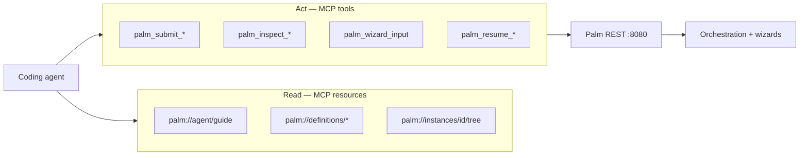

# Palm MCP — Operator Adapter (0.14)

**Status:** Phases 1–6 shipped · [FastMCP](https://pypi.org/project/fastmcp/) · 26 tools · 4 prompts · 10 resources

Palm MCP is a thin operator adapter for coding agents (Cursor, Grok, Claude, etc.). It proxies to the Palm REST API — **start `palm server` first**, then connect via stdio or native HTTP.

| Doc | Audience |
|-----|----------|
| This file | Full tool inventory + phase history |
| [`docs/llms.txt`](llms.txt) | Compact agent context (load via `palm://agent/guide`) |
| [`DEVELOPMENT.md`](../DEVELOPMENT.md) | Contributor setup + MCP workflow |
| [`AGENTS.md`](../AGENTS.md) | Architecture rules for agents editing Palm |

---

## Agent development guide

Use MCP to develop and operate Palm flows **without curl recipes or pasted JSON blobs**. The adapter mirrors how human operators work in Explorer and the CLI.

### Mental model



**Operator loop:** definitions → submit → inspect → input → wait on children → resume.

### Setup (one time per machine)

```bash
uv sync --extra mcp
uv pip install -e ".[mcp]"          # from source
# pip install "palmengine[mcp]"     # from PyPI
```

**Terminal 1 — REST backend (required):**

```bash
just palm-server                    # http://127.0.0.1:8080
# or: palm server
```

**Terminal 2 — verify MCP (optional):**

```bash
just mcp-inspector                  # MCP Inspector UI
```

**IDE integration:**

| Environment | Config |
|-------------|--------|
| Grok (this repo) | [`.grok/config.toml`](../.grok/config.toml) — `uv run --extra mcp palm-mcp` |
| Cursor / Claude Desktop | Add stdio server: command `palm-mcp`, or `uv run --extra mcp palm-mcp` in repo root |
| HTTP clients | `POST /mcp` on running server (see [Transports](#transports)) |

**Env vars:**

| Variable | Default | Purpose |
|----------|---------|---------|
| `PALM_BASE_URL` | `http://127.0.0.1:8080` | REST target for stdio adapter |
| `PALM_SUBJECT` | `dev` | `X-Palm-Subject` when auth is enforced |
| `PALM_LLMS_TXT` | bundled `llms.txt` in package (override path optional) | `palm://agent/guide` content |

### Conventions agents must follow

1. **Instance-first** — Wizards are keyed by `instance_id`. Use `job_id` only when you lack an instance handle (`palm_inspect_job`, `palm_provide_job_input`). `palm_list_waiting` returns real `instance_id` values (never aliases `job_id`).

2. **Plain-string input** — Prefer `palm_wizard_input(instance_id, input="yes")` or `input="Ada"` or `input="capture_knowledge"`. Do **not** wrap answers in JSON objects. Coercion matches Explorer (`yes` → boolean on confirm steps).

3. **Compact by default** — `palm_inspect_instance` / `palm_inspect_job` return slim snapshots. Use `format="verbose"` only when debugging schema or full answers.

4. **Read vs write** — Use **resources** for catalogs and guides; use **tools** for submit, input, resume, cancel. Read `palm://openapi` before inventing REST paths.

5. **Compositional nesting** — Parent wizards waiting on child flows are normal. Check `waiting_for_child` in inspect, read `palm://instances/{id}/tree`, then `palm_resume_child_wait` or inspect the child instance.

6. **Collection steps** — Branch on `collection_phase` from inspect (or `operator_hint` on compact responses):
   - `menu` → `palm_wizard_collection_action` (`add`, `edit`, `remove`, `done`, …) **or** `palm_wizard_input` with choice label/number (`Continue to summary`, `3`, …)
   - `field` / `select_item` / `remove_confirm` → `palm_wizard_input(instance_id, input="…")` (plain string)
   - Never pass `value` with `action="add"` — `add` is menu-only; field text via `palm_wizard_input`.

7. **Submit entry** — Use `palm_submit_wizard(flow_name=…)` for interactive operator-driven flows. `palm_submit_process` submits **one job per flow**; it is **rejected** when the process declares `entry_flow` or `metadata.mcp.entries` (catalog processes). Read `palm://definitions/processes/{name}` for `submit_hint` / `mcp_default_entry`. Pass `mode='all_flows'` only for true pipelines.

8. **Batch stepping** — Use `palm_wizard_drive(instance_id, inputs=[…])` to apply multiple answers in one MCP call (stops on `waiting_for_child`, terminal status, or input exhaustion). Prefer batch flows at the app layer (e.g. KnowKey `knowkey_capture_knowledge_batch`) when available.

9. **Session map** — Prefer `palm_compose_status(instance_id)` over repeated `palm_inspect_instance` when navigating compositional stacks; includes `operator_hint`, `collection_phase`, and invoke tree.

10. **Sequential driving** — Drive one instance at a time; parallel `palm_wizard_input` calls on the same `instance_id` race. Call `palm_resume_child_wait` only while `waiting_for_child` is true (otherwise it returns current state with `resume_child_wait: skipped_not_waiting`).

### Daily workflows

#### Bootstrapping a session

```
1. palm_doctor                          # registries, storage, job counts
2. Read palm://agent/guide              # project context
3. palm://definitions/flows           # what can be submitted
```

#### Driving a wizard to completion

```
1. palm_submit_wizard(flow_name="todo-builder")
   → note instance_id + job_id
2. palm_compose_status(instance_id)      # invoke stack + operator_hint (or inspect_instance)
3. palm_wizard_input(instance_id, input="<plain answer>")
   — or palm_wizard_drive(instance_id, inputs=["yes", "value", …]) for multi-step bursts
4. Repeat 2–3 until status is terminal or waiting_for_child
5. If waiting_for_child:
     palm_resume_child_wait(instance_id)
     or palm_inspect_instance(child.instance_id)
```

Use prompt `drive-wizard-to-step` with a target step slug for guided advancement.

#### Debugging a stuck wizard

```
1. palm_inspect_instance(instance_id, include=["validation", "children"])
2. palm://instances/{id}/tree         # compositional parent/child stack
3. palm_compose_status(instance_id)    # invoke tree + answers_keys in one call
4. palm_trace_events(job_id)           # recent events
5. palm_explain_step(flow_id, step_slug)
```

Use prompt `debug-wizard-block` for a structured checklist.

#### Developing a new flow

```
1. palm://definitions/flows           # existing catalog
2. palm_validate_flow(flow_name=…)     # dry-run build without submit
3. palm_submit_flow(flow_name=…)      # run it
4. palm_diff_snapshots(instance_id, from_snapshot, to_snapshot)  # state changes
```

#### Reading vs invoking resources

| Kind | Examples | Access |
|------|----------|--------|
| MCP read resources | `palm://definitions/flows`, `palm://agent/guide` | `FetchMcpResource` / `read_resource` |
| REST resource definitions | `knowkey.search_nodes`, `fetch-customer` | `palm_invoke_resource` or `POST /v1/resources/invoke` |

```
1. palm://definitions/resources/{ref}  # params schema (read)
2. palm_invoke_resource(resource_ref, action, params={…})  # definition name, not palm://
```

### Tool tiers (quick reference)

| Tier | Tools | When |
|------|-------|------|
| **1 — Operator loop** | `palm_list_waiting`, `palm_inspect_instance`, `palm_wizard_input`, `palm_wizard_drive`, `palm_resume_child_wait`, `palm_resume_wizard_tick`, `palm_wizard_backtrack` | Daily wizard driving |
| **2 — Lifecycle** | `palm_submit_flow`, `palm_submit_wizard`, `palm_submit_process`, `palm_provide_job_input`, `palm_cancel_job`, `palm_invoke_resource` | Start/stop work |
| **3 — Debug** | `palm_trace_events`, `palm_diff_snapshots`, `palm_explain_step`, `palm_validate_flow`, `palm_doctor`, `palm_fetch_job`, `palm_compose_status` | Investigation |
| **Pattern** | `palm_wizard_collection_action`, `palm_wizard_commit_preview`, `palm_parallel_branch_status`, `palm_pipeline_step_trace` | Pattern-specific steps |

**Prompts:** `debug-wizard-block`, `drive-wizard-to-step`, `explain-compositional-stack`, `operator-handoff`

### Transports

| Transport | Entry | Notes |
|-----------|-------|-------|
| **stdio** | `palm-mcp` | Default for Cursor/Grok; proxies to `PALM_BASE_URL` |
| **streamable-http** | `POST /mcp` | On running `palm server`; `Accept: application/json, text/event-stream` |
| **sse** | `GET /mcp/sse`, `POST /mcp/messages` | Legacy SSE clients |

Discovery: `GET /v1/surfaces/mcp` → `status: active`, transport endpoints, env hints.

Install: `pip install "palmengine[mcp]"` · CLI: `palm-mcp`

---

## Phase history

### Phase 1 — Shipped

### REST endpoints (added for MCP)

| Method | Path | Purpose |
|--------|------|---------|
| `POST` | `/v1/wizards/{id}/resume-child-wait` | Poll nested child, advance parent |
| `POST` | `/v1/wizards/{id}/resume-wizard-tick` | Re-drive waiting wizard / resource step |
| `GET` | `/v1/instances/{id}/tree` | Compositional invoke stack |

### MCP tools

| Tool | REST |
|------|------|
| `palm_list_waiting` | `GET /v1/jobs?status=WAITING_FOR_INPUT` |
| `palm_inspect_instance` | `GET /v1/wizards/{id}` → compact |
| `palm_wizard_input` | `POST /v1/wizards/{id}/input` |
| `palm_resume_child_wait` | `POST /v1/wizards/{id}/resume-child-wait` |

### MCP resources

| URI | Source |
|-----|--------|
| `palm://agent/guide` | `docs/llms.txt` |
| `palm://server/health` | `GET /health` |
| `palm://instances/{id}/tree` | `GET /v1/instances/{id}/tree` |

### Shared helpers (`palm/common/operator/`)

- `compact_wizard_inspect()` — agent-friendly wizard snapshot
- `compact_job_inspect()` — job context snapshot
- `build_invoke_tree()` — parent/child stack

## Phase 2a — Shipped (operator loop completion)

| Tool | REST |
|------|------|
| `palm_resume_wizard_tick` | `POST /v1/wizards/{id}/resume-wizard-tick` |
| `palm_wizard_backtrack` | `POST /v1/wizards/{id}/backtrack` |
| `palm_inspect_job` | `GET /v1/jobs/{id}/context` → compact |
| `palm_provide_job_input` | `POST /v1/jobs/{id}/input` |
| `palm_submit_wizard` | `POST /v1/wizards` |
| `palm_submit_flow` | `POST /v1/jobs` |

## Phase 2b — Shipped (definition catalogs)

### REST enhancements

| Method | Path | Notes |
|--------|------|-------|
| `GET` | `/v1/resources` | Resource catalog (paginated) |
| `GET` | `/v1/resources/{ref}` | Describe by name or id |
| `GET` | `/v1/flows/{id}?verbose=0` | Slim summary with `step_slugs` (default `verbose=1` = full) |
| `GET` | `/v1/flows` | List includes `step_slugs` for wizard flows |

### MCP resources

| URI | REST |
|-----|------|
| `palm://definitions/flows` | `GET /v1/flows` |
| `palm://definitions/flows/{id}` | `GET /v1/flows/{id}?verbose=0` |
| `palm://definitions/processes` | `GET /v1/processes` |
| `palm://definitions/processes/{id}` | `GET /v1/processes/{id}` |
| `palm://definitions/resources` | `GET /v1/resources` |
| `palm://definitions/resources/{ref}` | `GET /v1/resources/{ref}` |
| `palm://openapi` | `GET /v1/openapi.json` |

## Phase 3 — Shipped (pattern contributors + prompts)

### Registry

Patterns register MCP tools via `register_mcp_contributor()` in `palm/patterns/_registry.py` (same model as CQRS contributors). The stdio server autoloads `INSTALLED_PATTERNS` and applies contributors at startup.

### Pattern-specific tools

| Pattern | Tool | Purpose |
|---------|------|---------|
| **wizard** | `palm_wizard_collection_action` | `add` / `edit` / `remove` / `done` / `cancel` / `confirm_remove` with optional `item_index` |
| **wizard** | `palm_wizard_commit_preview` | Answers + `commit_hook` payload before confirm |
| **parallel** | `palm_parallel_branch_status` | Branch slugs, active branch, merge preview |
| **pipeline** | `palm_pipeline_step_trace` | Transform chain from flow definition |

### MCP prompts

| Prompt | Use |
|--------|-----|
| `debug-wizard-block` | Find validation, child-wait, or collection blockers |
| `drive-wizard-to-step` | Advance instance toward a target step |
| `explain-compositional-stack` | Summarize invoke tree and next action |
| `operator-handoff` | Human-readable summary with Explorer links |

### Shared helpers (extended)

- `resolve_wizard_collection_action()` — maps collection UI actions to wizard input values
- `wizard_commit_preview()` — commit handler preview from wizard read model

## Phase 4 — Shipped (debug + lifecycle)

### REST endpoints (added for MCP)

| Method | Path | Purpose |
|--------|------|---------|
| `POST` | `/v1/jobs/{job_id}/cancel` | Cancel non-terminal jobs |
| `POST` | `/v1/flows/validate` | Dry-run flow build without submit |
| `GET` | `/v1/doctor` | JSON engine health (registries, storage, jobs) |

### Tier 3 + lifecycle MCP tools

| Tool | REST / source |
|------|---------------|
| `palm_cancel_job` | `POST /v1/jobs/{id}/cancel` |
| `palm_submit_process` | `POST /v1/plans/prepare` + `POST /v1/plans/submit` |
| `palm_trace_events` | `GET /v1/jobs/{id}/context` → `recent_events` |
| `palm_diff_snapshots` | `GET /v1/instances/{id}/snapshots/{a\|b}` |
| `palm_explain_step` | `GET /v1/flows/{id}?verbose=1` |
| `palm_validate_flow` | `POST /v1/flows/validate` |
| `palm_doctor` | `GET /v1/doctor` |
| `palm_fetch_job` | `GET /v1/jobs/{id}/context` (commit `result`, events) |

### Shared helpers (extended)

- `diff_snapshot_states()` — blackboard key diff between snapshots
- `explain_flow_step()` — step metadata from flow definition
- `build_doctor_report()` — JSON doctor for REST/MCP

## Phase 5 — Shipped (native HTTP + resource invoke)

### Native HTTP transport

When the `mcp` extra is installed, `palm server` exposes **streamable HTTP** MCP at `POST /mcp` (same tool surface as stdio, loopback REST). Discovery reports `status: active` and `endpoint: /mcp`.

| Transport | Entry |
|-----------|-------|
| stdio | `palm-mcp` (proxies to `PALM_BASE_URL`) |
| streamable-http | `POST /mcp` on the running server (`Accept: application/json, text/event-stream`) |

### New MCP tools

| Tool | Purpose |
|------|---------|
| `palm_invoke_resource` | `POST /v1/resources/invoke` — any resource ref, action, params, state |
| `palm_compose_status` | Compositional session summary (invoke tree + compact wizard inspect) |

### App-level contributor registry

Applications register optional MCP tools via `register_app_mcp_contributor()` in `palm/app/mcp_registry.py` (same model as pattern contributors). Downstream apps (e.g. KnowKey) can expose `knowkey_compose_status` without modifying core Palm.

## Phase 6 — Shipped (module split + input coercion + SSE)

### Package split

Core MCP registration is split for maintainability:

| Module | Role |
|--------|------|
| `server.py` | `create_mcp_server()` orchestrator |
| `tools.py` | Tier 1–2 operator tools |
| `resources.py` | Definition catalogs and agent guide |

### Plain-string wizard input

`palm_wizard_input` and `palm_provide_job_input` accept a plain **`input`** string (preferred over `value`). Coercion matches Explorer forms: `yes` → boolean for confirm steps, choice slugs pass through, text stays text—agents do not need JSON wrappers.

Shared helper: `resolve_mcp_wizard_input()` in `palm/common/operator/input_coercion.py`.

### SSE transport tuning

Native HTTP exposes both transports when the `mcp` extra is installed:

| Transport | Endpoints |
|-----------|-----------|
| streamable-http | `POST /mcp` |
| sse | `GET /mcp/sse`, `POST /mcp/messages` |

`GET /v1/surfaces/mcp` documents both under `http.streamable_http` and `http.sse`.

### List enrichment (0.14)

`GET /v1/jobs` enriches rows with `instance_id`, `pattern`, `flow`, and `step` from job metadata and the instance manager. `palm_list_waiting` never reports `job_id` as `instance_id`.