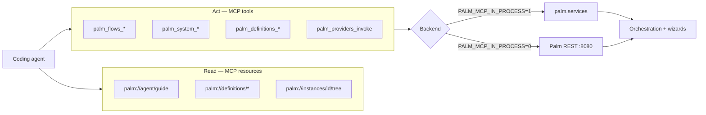

# Palm MCP — Operator Adapter (0.16 per-domain tools)

**Status:** 0.16+ per-domain tools · **0.31.1 surface profiles** · [FastMCP](https://pypi.org/project/fastmcp/) · ~39 tools (full) · resources + prompts

Palm MCP is a thin operator adapter for coding agents (Cursor, Grok, Claude, etc.). By default it runs **in-process** via `PalmInProcessBackend` — tools call `palm/services/` (`definitions`, `execution/flows`, `execution/providers`, `system`, `assist`, `design`) on a bootstrapped `ServerContext` with **no HTTP round-trip**. Service-domain CQRS types (definitions impact/migrate, design propose/commit) register via `ServiceCqrsContributor` so standalone MCP parity matches `ApplicationHost` ([ADR-009](adr/009-service-cqrs-contributors.md)). Set `PALM_MCP_IN_PROCESS=0` for REST proxy mode (`palm server` required).

### MCP surface (0.31.1) — progressive disclosure

| `PALM_MCP_SURFACE` | Tools registered | Use when |
|--------------------|------------------|----------|
| **`full`** (default) | All domain + pattern/app tools | Power users, existing configs |
| **`assist`** | **`palm_assist` only** | Weak LLMs / token-sensitive hosts |
| **`core`** | assist + system (doctor, waiting, …) | Middle ground |
| **`experimental`** | Same as full (reserved) | Future experiments |

Resources and prompts still register on all surfaces. Measure catalog size:

```bash
just mcp-inventory              # full
just mcp-inventory surface=assist
uv run --extra mcp python scripts/mcp_catalog_inventory.py --surface assist --json
```

**Progressive docs (0.31.3)** — load `palm://agent/card` before `palm://agent/guide` / skill references.

**Assist-only happy paths (0.31.2)** — with `PALM_MCP_SURFACE=assist`, use aliases on `palm_assist`:

| Need | Alias / params |
|------|----------------|
| Doctor | `alias="assist/doctor"` |
| List flows | `alias="assist/catalog/flows"` |
| List waiting | `alias="assist/catalog/waiting"` |
| Resume resource step | `alias="flows/session-resume"`, `params={session_id, flow_id}` |
| Publish flow | `alias="design/publish"`, `params={body: …}` |
| Run flow | `params={flow_id: "…"}` |

Vision: [VISION-0.31.md](VISION-0.31.md).

Migration from 0.15 tool names: [MIGRATION-0.16.md](../MIGRATION-0.16.md)

| Doc | Audience |
|-----|----------|
| This file | Full tool inventory + phase history |
| [`docs/mcp.txt`](mcp.txt) | **MCP operator guide** (default `palm://agent/guide` via `PALM_LLMS_TXT`) |
| [`docs/llms.txt`](llms.txt) | Broader project context (architecture, extension patterns) |
| [`docs/skills/palm/SKILL.md`](skills/palm/SKILL.md) | Portable agent skill — session driving + MCP description patterns |
| [`DEVELOPMENT.md`](../DEVELOPMENT.md) | Contributor setup + MCP workflow |
| [`AGENTS.md`](../AGENTS.md) | Architecture rules for agents editing Palm |

---

## Agent development guide

Use MCP to develop and operate Palm flows **without curl recipes or pasted JSON blobs**. The adapter mirrors how human operators work in Explorer and the CLI.

### Mental model



**Operator loop:** definitions → create session → inspect → input → wait on children → resume.

### Dual backend

| Mode | Env | Backend | When to use |
|------|-----|---------|-------------|
| **In-process** (default) | `PALM_MCP_IN_PROCESS=1` | `PalmInProcessBackend` → `palm.services` | Local agent dev; no `palm server` required |
| **REST proxy** | `PALM_MCP_IN_PROCESS=0` + `PALM_BASE_URL` | `PalmRestClient` → HTTP `:8080` | Remote Palm, cross-process, CI against live server |

Tests: `tests/test_mcp_in_process.py` · `tests/test_mcp_design_in_process.py` (design impact/commit) · `tests/test_definitions_cqrs_standalone.py` (bus parity) · `tests/test_mcp_tools.py` (REST mocks).

### Setup (one time per machine)

```bash
uv sync --extra mcp
uv pip install -e ".[mcp]"          # from source
# pip install "palmengine[mcp]"     # from PyPI
```

**Local in-process (default — no REST server):**

```bash
uv sync --extra mcp
PALM_MCP_IN_PROCESS=1 uv run --extra mcp palm-mcp   # stdio → services
```

**Remote REST proxy (0.14 mode):**

```bash
just palm-server                    # terminal 1 — http://127.0.0.1:8080
PALM_MCP_IN_PROCESS=0 palm-mcp      # terminal 2 — HTTP round-trip
```

**Verify MCP (optional):**

```bash
just mcp-inspector                  # MCP Inspector UI
```

**IDE integration:**

| Environment | Config |
|-------------|--------|
| Grok (this repo) | [`.grok/config.toml`](../.grok/config.toml) — in-process default, `docs/mcp.txt` for agent guide |
| Cursor / Claude Desktop | Add stdio server: `uv run --extra mcp palm-mcp` with `PALM_MCP_IN_PROCESS=1` |
| HTTP clients | `POST /mcp` on running server — uses hosting `ServerContext` in-process (see [Transports](#transports)) |

**Env vars:**

| Variable | Default | Purpose |
|----------|---------|---------|
| `PALM_MCP_IN_PROCESS` | `0` (env); `1` in `.grok/config.toml` | `1` = `PalmInProcessBackend` (services, no HTTP); `0` = `PalmRestClient` |
| `PALM_BASE_URL` | `http://127.0.0.1:8080` | REST target when in-process is off |
| `PALM_SUBJECT` | `dev` | `X-Palm-Subject` when auth is enforced |
| `PALM_LLMS_TXT` | bundled `mcp.txt` in package (override path optional) | `palm://agent/guide` content |
| `PALM_SKILL_DIR` | bundled `skills/palm/` in package (override path optional) | `palm://agent/skill` and `palm://agent/references/*` |

### Conventions agents must follow

1. **Session-first** — Flow sessions use `session_id` (same durable id as `instance_id` in views). Use `job_id` only when you lack a session handle (`palm_system_inspect_job`, `palm_system_job_input`). `palm_system_list_waiting` returns real `instance_id` values (never aliases `job_id`).

2. **Plain-string input** — Prefer `palm_flows_session_input(session_id, input="yes")` or `input="Ada"`. Do **not** wrap answers in JSON objects. Coercion matches Explorer (`yes` → boolean on confirm steps).

3. **Two view modes (0.20–0.21)** — **Assistant** (human compose: `question`, `choices`, `hint`, `actions`) on assist surfaces; **Powertool** (agent snapshot: `operator_hint`, `step_kind`) on `palm_flows_*` / `palm_system_*` by default. `palm_assist` defaults `format="assistant"` on assist paths; flows/system paths stay powertool unless `params.format=assistant`. **0.21.5 opt-in:** `palm_flows_session(format="assistant")` and flows REST `?format=assistant` for human labels on business sessions. Use `format="verbose"` only when debugging full inspect dicts.

4. **Read vs write** — Use **resources** for catalogs and guides; use **tools** for create, input, resume, cancel. Service REST lives under `/v1/api/…`.

5. **Compositional nesting** — Parent wizards waiting on child flows are normal. Check `waiting_for_child` in inspect, read `palm://instances/{id}/tree`, then `palm_flows_session_resume_child_wait` or inspect the child session.

6. **Collection steps** — Branch on `collection_phase` from inspect (or `operator_hint` on compact responses):
   - `menu` → `palm_wizard_collection_action` (`add`, `edit`, `remove`, `done`, …) **or** `palm_flows_session_input` with choice label/number
   - **0.21.8 one-shot:** `palm_wizard_collection_action(action=add, value="title")` or `palm_flows_session_input(input="add", value="title")` at menu phase
   - **0.21.9 assistant:** pass `format="assistant"` on `palm_flows_session_input` / `palm_wizard_collection_action` for `question` + `actions` on mutations
   - **0.21.10 unified assist:** `palm_assist(params={session_id, flow_id, value})` drives flows input without explicit `path`; aliases `flows/session-input`, `flows/session`
   - **0.21.11 edit shortcut:** `palm_assist(params={session_id, flow_id, edit: {item_index: 0, priority: "low"}})` chains menu → select → fields; fuzzy menu tokens (`add`/`edit`/`done`/`continue`) coerce to choice labels
   - `field` / `select_item` / `remove_confirm` → `palm_flows_session_input(session_id, input="…")` (plain string)

7. **Submit entry** — Use `palm_flows_create_session(flow_id=…)` for interactive operator-driven flows. `palm_processes_submit` submits **one job per flow**; it is **rejected** when the process declares `entry_flow` or `metadata.mcp.entries`. Read `palm://definitions/processes/{name}` for `submit_hint` / `mcp_default_entry`.

8. **Batch stepping** — Use `palm_flows_session_drive(session_id, inputs=[…])` to apply multiple answers in one MCP call.

9. **Session map** — Prefer `palm_flows_compose_status(session_id)` when navigating compositional stacks.

10. **Sequential driving** — Drive one session at a time. Call `palm_flows_session_resume_child_wait` only while `waiting_for_child` is true (otherwise returns `resume_child_wait: skipped_not_waiting`).

### Mutation guard (0.22.1+)

Inspect responses (assistant and powertool) include a **`mutation`** block: `mutations_allowed`, `confirm_step`, `agent_hint`. Agents must not send `value`/`input` when `mutations_allowed` is false. See [`docs/mcp.txt`](mcp.txt) §11 and `archive/conversation_export.xml`.

### Tool descriptions (contributors)

MCP tool docstrings should lead with `call_connected_tool(tool_name="palm___…", …)` so weak LLMs invoke tools correctly. Use `palm.runtimes.mcp.descriptions.tool_description()` when adding or updating tools. Pattern reference: [`docs/skills/palm/references/mcp-patterns.md`](skills/palm/references/mcp-patterns.md) · canonical operator guide: [`docs/mcp.txt`](mcp.txt).

### Assist domain (0.18 REST · 0.19 MCP · 0.20 views)

**0.18** adds `palm/services/assist/` — conversational operator guidance with typed handoff. **0.19** ships stable **`palm_assist`**. **0.20** splits **assistant** (human compose, default on assist) vs **powertool** (agent compact, default on flows/system).

| `palm_assist` | Purpose |
|---------------|---------|
| `palm_assist()` (no args) | **0.21.7** — starts `operator-entry` (human-first default for weak LLMs) |
| `params={"session_id": id, "value": "…"}` | **0.21.7** — inferred `assist/session/…/input` when path/alias omitted |
| `alias="operator-entry/start"` | Start operator entry — returns **first turn** (`question`, `choices`) |
| `format="assistant"` | Default on assist paths (human envelope) |
| `format="powertool"` | Opt-in 0.19 compact shape on assist |
| `path=["assist","session",id,"input"], params={"value":"yes"}` | Plain-string input |
| `alias="operator-entry/handoff", params={"session_id":id}` | Typed handoff payload |
| `path=["flows","todo-builder","create"]` | Delegate to flows — **powertool** response |
| `params={session_id, flow_id, value}` | **0.21.10** — inferred `flows/…/session/…/input` |
| `params={session_id, flow_id, collection_action: "add", value: "title"}` | **0.21.10** — collection one-shot via assist |
| `params={session_id, flow_id, edit: {item_index: 0, …}}` | **0.21.11** — collection field edit shortcut |
| `alias="flows/session-input"` | **0.21.10** — registered flows input alias (`flow_id` + `session_id` in `params`) |

Read `palm://assist/routes` for the full command-path catalog and aliases. Per-domain tools (`palm_flows_*`, …) remain valid. See [MIGRATION-0.21.md](../MIGRATION-0.21.md) · [MIGRATION-0.20.md](../MIGRATION-0.20.md) · [MIGRATION-0.19.md](../MIGRATION-0.19.md).

| Assist REST | Purpose |
|-------------|---------|
| `GET /v1/api/assist/scenarios` | List registered scenarios |
| `POST /v1/api/assist/scenarios/operator-entry/start` | Start — assistant first turn (default) |
| `GET /v1/api/assist/session/{id}?format=assistant` | Inspect assist session |
| `GET /v1/api/assist/catalog/flows` | Runnable flows from assist catalog |
| `POST /v1/api/assist/session/{session_id}/handoff` | Typed handoff payload |

Assist scenarios are normal wizard flows (`palm-operator-entry`). Resource steps use existing `step_kind: resource` → `ResourceLeaf`.

### Human surfaces (0.21)

| Surface | Entry | Notes |
|---------|-------|-------|
| **CLI REPL** | `assist start operator-entry` | `render_assistant_panel`; plain REPL input → `assist input` |
| **Explorer** | `/explorer/assist` | HTMX workspace on `#assist-workspace`; handoff CTA |
| **Flows opt-in** | `palm_flows_session(format="assistant")` | Powertool default unchanged |

Assistant turns include an optional `actions` block (0.21.4) — structured next steps with `path` / `alias` for `palm_assist` dispatch.

### Daily workflows

#### Bootstrapping a session

```
1. palm_system_doctor                   # registries, storage, job counts
2. Read palm://agent/guide              # project context
3. palm://definitions/flows             # what can be submitted
```

#### Driving a wizard to completion

```
1. palm_flows_create_session(flow_id="todo-builder")
   → note session_id + job_id
2. palm_flows_compose_status(session_id)  # invoke stack + operator_hint
3. palm_flows_session_input(session_id, input="<plain answer>")
   — or palm_flows_session_drive(session_id, inputs=["yes", "value", …]) for multi-step bursts
4. Repeat 2–3 until status is terminal or waiting_for_child
5. If waiting_for_child:
     palm_flows_session_resume_child_wait(session_id)
     or palm_flows_session(child.instance_id)
```

Use prompt `drive-wizard-to-step` with a target step slug for guided advancement.

#### Debugging a stuck wizard

```
1. palm_flows_session(session_id, include=["validation", "children"])
   — or palm_flows_session(session_id, format="assistant") for human labels (0.21.5)
2. palm://instances/{id}/tree         # compositional parent/child stack
3. palm_flows_compose_status(session_id)
4. palm_system_trace_events(job_id)
5. palm_definitions_explain_step(flow_id, step_slug)
```

Use prompt `debug-wizard-block` for a structured checklist.

#### Developing a new flow

```
1. palm://definitions/flows           # existing catalog
2. palm_definitions_validate_flow(flow_name=…)  # dry-run build without submit
3. palm_flows_create_session(flow_id=…)         # run it
4. palm_system_diff_snapshots(session_id, from_snapshot, to_snapshot)
```

#### Upgrading live instances (0.24+)

After publishing a new flow revision (`update_flow` appends; see [MIGRATION-0.24.md](../MIGRATION-0.24.md)):

```
1. palm_definitions_analyze_impact(flow_id, target_revision=N)
2. palm_definitions_migrate_instance(instance_id, target_revision=N, dry_run=True)
3. palm_definitions_migrate_instance(instance_id, target_revision=N)
```

Example wizard: `migrate-instance-demo`. Instances pin `flow_revision` at submit — they do not auto-upgrade.

#### Reading vs invoking resources

| Kind | Examples | Access |
|------|----------|--------|
| MCP read resources | `palm://definitions/flows`, `palm://agent/guide` | `FetchMcpResource` / `read_resource` |
| REST resource definitions | `knowkey.search_nodes`, `fetch-customer` | `palm_providers_invoke` or `POST /v1/api/providers/{provider}/{resource_ref}/invoke` |

```
1. palm://definitions/resources/{ref}  # params schema (read)
2. palm_invoke_resource(resource_ref, action, params={…})  # definition name, not palm://
```

### Tool tiers (quick reference)

| Tier | Tools | When |
|------|-------|------|
| **1 — Operator loop** | `palm_system_list_waiting`, `palm_flows_session`, `palm_flows_session_input`, `palm_flows_session_drive`, `palm_flows_session_resume_child_wait`, `palm_flows_session_resume`, `palm_flows_session_backtrack` | Daily wizard driving |
| **2 — Lifecycle** | `palm_flows_create_session`, `palm_processes_submit`, `palm_system_job_input`, `palm_system_cancel_job`, `palm_providers_invoke` | Start/stop work |
| **3 — Debug** | `palm_system_trace_events`, `palm_system_diff_snapshots`, `palm_definitions_explain_step`, `palm_definitions_validate_flow`, `palm_definitions_analyze_impact`, `palm_definitions_migrate_instance`, `palm_system_doctor`, `palm_system_fetch_job`, `palm_flows_compose_status` | Investigation |
| **Pattern** | `palm_wizard_collection_action`, `palm_wizard_commit_preview`, `palm_parallel_branch_status`, `palm_pipeline_step_trace` | Pattern-specific steps |

**Prompts:** `debug-wizard-block`, `drive-wizard-to-step`, `explain-compositional-stack`, `operator-handoff`

### Transports

| Transport | Entry | Notes |
|-----------|-------|-------|
| **stdio** | `palm-mcp` | Default for Cursor/Grok; in-process services when `PALM_MCP_IN_PROCESS=1` |
| **stdio (remote)** | `palm-mcp` + `PALM_MCP_IN_PROCESS=0` | HTTP proxy to `PALM_BASE_URL` (0.14 behavior) |
| **streamable-http** | `POST /mcp` | On running `palm server`; reuses server `ServerContext` (in-process) |
| **sse** | `GET /mcp/sse`, `POST /mcp/messages` | Legacy SSE clients |

Discovery: `GET /v1/surfaces/mcp` → `status: active`, transport endpoints, env hints.

Install: `pip install "palmengine[mcp]"` · CLI: `palm-mcp`

---

## 0.16 tool inventory (current)

| Domain | Tools |
|--------|-------|
| **Flows** | `palm_flows_list`, `palm_flows_describe`, `palm_flows_create_session`, `palm_flows_session`, `palm_flows_session_input`, `palm_flows_session_drive`, `palm_flows_session_resume`, `palm_flows_session_resume_child_wait`, `palm_flows_session_backtrack`, `palm_flows_compose_status` |
| **System** | `palm_system_list_waiting`, `palm_system_inspect_job`, `palm_system_job_input`, `palm_system_doctor`, `palm_system_cancel_job`, `palm_system_fetch_job`, `palm_system_trace_events`, `palm_system_diff_snapshots`, `palm_processes_submit` |
| **Definitions** | `palm_definitions_validate_flow`, `palm_definitions_explain_step`, `palm_definitions_analyze_impact`, `palm_definitions_migrate_instance` |
| **Design (0.25)** | `palm_design_propose_flow`, `palm_design_validate`, `palm_design_impact`, `palm_design_commit`, `palm_design_list_proposals`, `palm_design_get_proposal`, `palm_design_discard` — weak-LLM playbook: `palm://agent/references/design-flows` |
| **Providers** | `palm_providers_invoke` |
| **Pattern** | `palm_wizard_collection_action`, `palm_wizard_commit_preview`, `palm_parallel_branch_status`, `palm_pipeline_step_trace` |

---

## Phase history (0.14–0.15 — superseded by 0.16 tool names)

> Historical reference. Use [MIGRATION-0.16.md](../MIGRATION-0.16.md) for the mapping to current tools.

### Phase 1 — Shipped

### REST endpoints (added for MCP)

| Method | Path | Purpose |
|--------|------|---------|
| `POST` | `/v1/wizards/{id}/resume-child-wait` | Poll nested child, advance parent |
| `POST` | `/v1/wizards/{id}/resume-wizard-tick` | Re-drive waiting wizard / resource step |
| `GET` | `/v1/instances/{id}/tree` | Compositional invoke stack |

### MCP tools

| Tool | REST |
|------|------|
| `palm_list_waiting` | `GET /v1/jobs?status=WAITING_FOR_INPUT` |
| `palm_inspect_instance` | `GET /v1/wizards/{id}` → compact |
| `palm_wizard_input` | `POST /v1/wizards/{id}/input` |
| `palm_resume_child_wait` | `POST /v1/wizards/{id}/resume-child-wait` |

### MCP resources

| URI | Source |
|-----|--------|
| `palm://agent/guide` | `docs/mcp.txt` (override via `PALM_LLMS_TXT`; project context in `docs/llms.txt`) |
| `palm://agent/skill` | `docs/skills/palm/SKILL.md` (override via `PALM_SKILL_DIR`) |
| `palm://agent/references/agent-guide` | `docs/skills/palm/references/agent-guide.md` |
| `palm://agent/references/mcp-patterns` | `docs/skills/palm/references/mcp-patterns.md` |
| `palm://agent/references/session-management` | `docs/skills/palm/references/session-management.md` |
| `palm://agent/references/common-flows` | `docs/skills/palm/references/common-flows.md` |
| `palm://agent/references/design-flows` | `docs/skills/palm/references/design-flows.md` — create/improve/run flows (§15 companion) |
| `palm://server/health` | `GET /health` |
| `palm://instances/{id}/tree` | `GET /v1/instances/{id}/tree` |

### Shared helpers (`palm/common/operator/`)

- `compact_wizard_inspect()` — agent-friendly wizard snapshot
- `compact_job_inspect()` — job context snapshot
- `build_invoke_tree()` — parent/child stack

## Phase 2a — Shipped (operator loop completion)

| Tool | REST |
|------|------|
| `palm_resume_wizard_tick` | `POST /v1/wizards/{id}/resume-wizard-tick` |
| `palm_wizard_backtrack` | `POST /v1/wizards/{id}/backtrack` |
| `palm_inspect_job` | `GET /v1/jobs/{id}/context` → compact |
| `palm_provide_job_input` | `POST /v1/jobs/{id}/input` |
| `palm_submit_wizard` | `POST /v1/wizards` |
| `palm_submit_flow` | `POST /v1/jobs` |

## Phase 2b — Shipped (definition catalogs)

### REST enhancements

| Method | Path | Notes |
|--------|------|-------|
| `GET` | `/v1/resources` | Resource catalog (paginated) |
| `GET` | `/v1/resources/{ref}` | Describe by name or id |
| `GET` | `/v1/flows/{id}?verbose=0` | Slim summary with `step_slugs` (default `verbose=1` = full) |
| `GET` | `/v1/flows` | List includes `step_slugs` for wizard flows |

### MCP resources

| URI | REST |
|-----|------|
| `palm://definitions/flows` | `GET /v1/flows` |
| `palm://definitions/flows/{id}` | `GET /v1/flows/{id}?verbose=0` |
| `palm://definitions/processes` | `GET /v1/processes` |
| `palm://definitions/processes/{id}` | `GET /v1/processes/{id}` |
| `palm://definitions/resources` | `GET /v1/resources` |
| `palm://definitions/resources/{ref}` | `GET /v1/resources/{ref}` |
| `palm://openapi` | `GET /v1/openapi.json` |

## Phase 3 — Shipped (pattern contributors + prompts)

### Registry

Patterns register MCP tools via `register_mcp_contributor()` in `palm/patterns/_registry.py` (same model as CQRS contributors). The stdio server autoloads `INSTALLED_PATTERNS` and applies contributors at startup.

### Pattern-specific tools

| Pattern | Tool | Purpose |
|---------|------|---------|
| **wizard** | `palm_wizard_collection_action` | `add` / `edit` / `remove` / `done` / `cancel` / `confirm_remove` with optional `item_index` |
| **wizard** | `palm_wizard_commit_preview` | Answers + `commit_hook` payload before confirm |
| **parallel** | `palm_parallel_branch_status` | Branch slugs, active branch, merge preview |
| **pipeline** | `palm_pipeline_step_trace` | Transform chain from flow definition |

### MCP prompts

| Prompt | Use |
|--------|-----|
| `debug-wizard-block` | Find validation, child-wait, or collection blockers |
| `drive-wizard-to-step` | Advance instance toward a target step |
| `explain-compositional-stack` | Summarize invoke tree and next action |
| `operator-handoff` | Human-readable summary with Explorer links |

### Shared helpers (extended)

- `resolve_wizard_collection_action()` — maps collection UI actions to wizard input values
- `wizard_commit_preview()` — commit handler preview from wizard read model

## Phase 4 — Shipped (debug + lifecycle)

### REST endpoints (added for MCP)

| Method | Path | Purpose |
|--------|------|---------|
| `POST` | `/v1/jobs/{job_id}/cancel` | Cancel non-terminal jobs |
| `POST` | `/v1/flows/validate` | Dry-run flow build without submit |
| `GET` | `/v1/doctor` | JSON engine health (registries, storage, jobs) |

### Tier 3 + lifecycle MCP tools

| Tool | REST / source |
|------|---------------|
| `palm_cancel_job` | `POST /v1/jobs/{id}/cancel` |
| `palm_submit_process` | `POST /v1/plans/prepare` + `POST /v1/plans/submit` |
| `palm_trace_events` | `GET /v1/jobs/{id}/context` → `recent_events` |
| `palm_diff_snapshots` | `GET /v1/instances/{id}/snapshots/{a\|b}` |
| `palm_explain_step` | `GET /v1/flows/{id}?verbose=1` |
| `palm_validate_flow` | `POST /v1/flows/validate` |
| `palm_doctor` | `GET /v1/doctor` |
| `palm_fetch_job` | `GET /v1/jobs/{id}/context` (commit `result`, events) |

### Shared helpers (extended)

- `diff_snapshot_states()` — blackboard key diff between snapshots
- `explain_flow_step()` — step metadata from flow definition
- `build_doctor_report()` — JSON doctor for REST/MCP

## Phase 5 — Shipped (native HTTP + resource invoke)

### Native HTTP transport

When the `mcp` extra is installed, `palm server` exposes **streamable HTTP** MCP at `POST /mcp` (same tool surface as stdio, loopback REST). Discovery reports `status: active` and `endpoint: /mcp`.

| Transport | Entry |
|-----------|-------|
| stdio | `palm-mcp` (proxies to `PALM_BASE_URL`) |
| streamable-http | `POST /mcp` on the running server (`Accept: application/json, text/event-stream`) |

### New MCP tools

| Tool | Purpose |
|------|---------|
| `palm_invoke_resource` | `POST /v1/resources/invoke` — any resource ref, action, params, state |
| `palm_compose_status` | Compositional session summary (invoke tree + compact wizard inspect) |

### App-level contributor registry

Applications register optional MCP tools via `register_app_mcp_contributor()` in `palm/app/mcp_registry.py` (same model as pattern contributors). Downstream apps (e.g. KnowKey) can expose `knowkey_compose_status` without modifying core Palm.

## Phase 6 — Shipped (module split + input coercion + SSE)

### Package split

Core MCP registration is split for maintainability:

| Module | Role |
|--------|------|
| `server.py` | `create_mcp_server()` orchestrator |
| `tools.py` | Tier 1–2 operator tools |
| `resources.py` | Definition catalogs and agent guide |

### Plain-string wizard input

`palm_wizard_input` and `palm_provide_job_input` accept a plain **`input`** string (preferred over `value`). Coercion matches Explorer forms: `yes` → boolean for confirm steps, choice slugs pass through, text stays text—agents do not need JSON wrappers.

Shared helper: `resolve_mcp_wizard_input()` in `palm/common/operator/input_coercion.py`.

### SSE transport tuning

Native HTTP exposes both transports when the `mcp` extra is installed:

| Transport | Endpoints |
|-----------|-----------|
| streamable-http | `POST /mcp` |
| sse | `GET /mcp/sse`, `POST /mcp/messages` |

`GET /v1/surfaces/mcp` documents both under `http.streamable_http` and `http.sse`.

### List enrichment (0.14)

`GET /v1/jobs` enriches rows with `instance_id`, `pattern`, `flow`, and `step` from job metadata and the instance manager. `palm_list_waiting` never reports `job_id` as `instance_id`.