# Palm Engine 0.12 — Compositional Power

**Codename:** Compositional Power  
**Theme:** Resources as first-class citizens  
**Status:** Vision & planning (unreleased)  
**Last updated:** June 2026

> *“A flow that calls a flow that calls a service — and every step knows where it stands in the tree.”*

---

## Why 0.12

Through 0.11, Palm matured its **definition-driven** model: flows and processes are declarative, durable, and observable. Resources exist — `ResourceEngine`, providers, wizard action steps, `enrich_resource` transforms — but they still feel like **integration glue** rather than peers to flows and processes.

**0.12 closes that gap.** Resources become declarative, reusable, repository-backed definitions. They execute as native Behavior Tree leaves. And Palm gains a flagship **`palm` provider** that lets orchestration call orchestration — locally or across the network.

The result is **compositional power**: hierarchical workflows, distributed handoffs, and agent-friendly surfaces where “invoke this capability” is as natural as “ask this question.”

---

## North star

| Today (0.11) | Target (0.12) |
|--------------|---------------|
| Resource calls are wizard action steps or transform side-effects | Resources are **declared**, **stored**, and **invoked** like flows |
| Providers are thin `fetch(id)` stubs | Providers expose a **rich contract** — actions, schemas, metadata, lifecycle |
| External integration only (REST, GraphQL, Postgres) | **`palm` provider** — Palm invokes Palm (embedded or remote) |
| BT integration is pattern-specific (legacy action steps) | **`ResourceLeaf`** — universal BT node for any pattern |
| Observability sees jobs and instances | Resource invocations are **first-class events** with correlation |

---

## Core concepts

### 1. `ResourceDefinition`

A declarative, serializable description of *what* to call and *how* to bind it — symmetric with `FlowDefinition` and `ProcessDefinition`.

```yaml
# Example (illustrative — not final schema)
kind: resource
name: fetch-customer
provider: rest
resource_id: customers/{customer_id}
params:
  customer_id: "{{ state.customer_id }}"
input_schema:
  customer_id: { type: string, required: true }
output_schema:
  type: object
  properties:
    id: { type: string }
    email: { type: string }
metadata:
  description: Load customer record before commit
  tags: [crm, read]
```

**Properties:**

- Stored in `DefinitionRepository` alongside flows and processes
- Referenced by name (`resource_ref`) from wizard steps, pipeline stages, DAG nodes, and transforms
- Supports inline overrides at invocation time (params, timeouts, idempotency keys)
- Versioned serialization (`kind: resource`, `version: 1`)

### 2. Evolved `ResourceEngine`

The engine graduates from “provider lookup + fetch” to a **coordination hub**:

| Capability | Purpose |
|------------|---------|
| **Resolve** | Load `ResourceDefinition` from repository or accept inline invocation spec |
| **Bind** | Evaluate param templates against scoped blackboard state |
| **Invoke** | Route to provider action (`fetch`, `submit`, `query`, …) with validated inputs |
| **Observe** | Emit structured events (started, succeeded, failed, compensated) with correlation ids |
| **Compensate** | Register undo handlers when a resource mutation participates in a transactional step |

Core stays pure: the engine defines contracts and lifecycle; concrete providers live at the edges.

### 3. Richer `BaseProvider`

Providers grow beyond `connect` / `fetch` / `disconnect`:

```python
# Illustrative contract evolution (high-level)
class BaseProvider(ABC):
    def connect(self) -> None: ...
    def disconnect(self) -> None: ...
    def describe(self) -> ProviderDescriptor: ...      # actions, param schemas
    def invoke(self, action: str, *, params: dict) -> ProviderResult: ...
    def health(self) -> ProviderHealth: ...              # optional
```

- **Actions** — `fetch` remains the default read path; mutating providers expose `submit`, `patch`, `delete`, etc.
- **Schemas** — optional input/output validation at the provider boundary
- **Results** — structured `ProviderResult` (data, metadata, side-effect handles for compensation)
- **Thread-safety** — documented per provider; engine manages connection pooling where needed

Existing providers (`rest`, `graphql`, `postgres`) evolve incrementally; stubs become real implementations behind the new contract.

### 4. The `palm` provider (flagship)

**Palm calling Palm** — the compositional heart of 0.12.

| Mode | Behavior |
|------|----------|
| **Local** | `PalmProvider` delegates to the hosting `ApplicationHost` — `submit_flow`, `submit_process`, `ask`, or synchronous read/query |
| **Remote** | Same API surface over `ServerRuntime` HTTP (`/v1/jobs`, `/v1/flows/{name}/submit`, …) with auth context propagation |
| **Sync vs async** | Short flows may complete inline; long flows return a child job handle linked via correlation metadata |

Use cases unlocked:

- **Sub-workflows** — onboarding wizard calls a dedicated “verify identity” flow
- **Agent loops** — an outer orchestrator flow delegates tool-like sub-flows
- **Federated orchestration** — Palm instance A invokes flows on Palm instance B
- **Recursive composition** — a process step spawns a child flow whose commit triggers a parent resume

Guardrails (designed in, not bolted on):

- Depth limits and cycle detection for local recursion
- Explicit `wait_policy` (inline, poll, webhook-resume) per invocation
- Child instance linkage on parent blackboard (`__palm:child_jobs`)

### 5. `ResourceLeaf` — Behavior Tree integration

Resources become a **first-class leaf node** in the core BT model, alongside `TransformLeaf` and interactive leaves.

```
Sequence
├── WizardInputLeaf (collect customer_id)
├── ResourceLeaf (resource_ref: fetch-customer)
├── TransformLeaf (normalize response)
└── CommitLeaf
```

**`ResourceLeaf` responsibilities:**

- Resolve definition + bind params from `BaseState`
- Call `ResourceEngine.invoke()` with execution context (job id, instance id, scope)
- Write outputs to configurable state keys (default: slug-based)
- Surface failures as `PatternStatus.FAILURE` with structured error payload
- Support optional confirmation gate (human approves before mutating invoke)

Pattern builders (wizard, DAG, pipeline) use declarative `step_kind: resource` that materializes `ResourceLeaf`. Legacy `step_kind: action` + `resource_provider` was removed in 0.12.

### 6. Deep integration

| Area | 0.12 direction |
|------|----------------|
| **Wizards** | `step_kind: resource` with schema validation, summary visibility, backtrack-safe re-invoke |
| **Transforms** | `enrich_resource` accepts `resource_ref`; chain output into subsequent rules |
| **Compensation** | Mutating invokes register compensation metadata; `CompensationCoordinator` can invoke provider undo or child-flow rollback |
| **Observability** | `EventEngine` + outbox events: `resource.invoked`, `resource.completed`, `resource.compensated`; Explorer shows resource step timeline |
| **CQRS** | Optional `ResourceInvocationProjection` for dashboards and agent introspection |

---

## Architectural diagram

```mermaid
flowchart TB
    subgraph Definitions["DefinitionRepository"]
        flow[FlowDefinition]
        proc[ProcessDefinition]
        res[ResourceDefinition]
    end

    subgraph BT["Behavior Tree"]
        wiz[WizardInputLeaf]
        rleaf[ResourceLeaf]
        xform[TransformLeaf]
        commit[CommitLeaf]
    end

    subgraph Engine["ResourceEngine (core)"]
        resolve[Resolve + bind params]
        invoke[Invoke action]
        observe[Emit events]
    end

    subgraph Providers["Provider registry"]
        palm[palm — local / remote]
        rest[rest]
        gql[graphql]
        pg[postgres]
    end

    flow --> BT
    res --> rleaf
    wiz --> rleaf --> xform --> commit
    rleaf --> resolve --> invoke
    invoke --> palm
    invoke --> rest
    invoke --> gql
    invoke --> pg
    invoke --> observe
```



**Dependency rule preserved:** `ResourceLeaf` and `ResourceEngine` live in core; `PalmProvider` lives in `palm/providers/palm/`; repository wiring lives in `palm/common/`.

---

## Implementation phases

High-level delivery plan. Each phase ships tests, docs, and at least one example.

### Phase 1 — Definitions & repository ✅ Shipped

- `ResourceDefinition` in `palm/definitions/`
- `DefinitionRepository` resource CRUD + storage roundtrip
- CLI: `resource list`, `resource describe`; `palm doctor` catalog
- Example: `examples/definitions/fetch_customer.py`

### Phase 2 — Engine & provider contract ✅ Shipped

- `BaseProvider.invoke()` / `describe()` / `health()` + `ProviderResult`
- `ResourceEngine.invoke()` — definition ref or direct provider, param binding (`{{ state.* }}`, `{param}`)
- Injected `definition_resolver` (`palm/common/resource/`) + `EventEngine` events (`resource.invoked`, `resource.completed`, `resource.failed`)
- `WizardResourceLeaf` and `enrich_resource` use engine invoke path
- `PalmApp` / `ApplicationHost.invoke_resource()`; CLI: `resource invoke`
- **Exit criteria met:** wizard action tests pass; `tests/test_resource_engine.py`

### Phase 3 — `ResourceLeaf` & pattern builders ✅ Shipped

- `ResourceLeaf` in `palm/core/behavior_tree/nodes/leaf/resource_leaf.py`
- `WizardResourceLeaf` + wizard `step_kind: resource` (`resource_ref`, `params`, `output_key`)
- Legacy `step_kind: action` removed — `resource_ref` only (see `MIGRATION-0.12.md`)
- Example: `resource-customer-wizard` flow (`examples/definitions/resource_customer_wizard.py`)
- **Exit criteria met:** `tests/test_resource_leaf.py`; pipeline/DAG builders deferred

### Phase 4 — `palm` provider ✅ Shipped

- `palm/providers/palm/` — `PalmProvider` with actions `submit_flow`, `submit_process`, `invoke_resource`, `fetch`
- **Local mode** — `bind_palm_runtime()` at `BaseRuntime.start()`; delegates to bound runtime
- **Remote mode** — `remote_url` / `remote_token`; flow via `POST /v1/jobs`, process via plans API
- **Recursion** — `palm_invoke_frame()` depth limit (default 8) + cycle detection; `__palm:*` correlation metadata on child jobs
- **Wait policy** — `wait` + `wait_timeout` for inline completion vs fire-and-forget handles
- Example: `compositional-parent` wizard (`examples/definitions/compositional_demo.py`)
- **Exit criteria met:** `tests/test_palm_provider.py` (local, remote, depth, cycle, invoke_resource)

### Phase 5 — Cross-cutting integration ✅ Shipped

- Transform `enrich_resource` + `resource_ref`, custom `action`/`params`
- `register_for_resource()` compensation handlers; commit failure runs tracked mutating invokes
- `ResourceInvocationProjection` + `GetResourceInvocationsQuery`
- Explorer instance resource timeline; enriched wizard `RESOURCE_FEEDBACK`
- `resource.*` events carry job/instance/wizard/step correlation via `JobExecutionContextHook`
- **Exit criteria met:** `tests/test_resource_phase5.py`; demo registers undo on `submit-ingest-etl`

### Phase 6 — Polish & promotion ✅ Shipped

- Documentation pass (README, ARCHITECTURE, `MIGRATION-0.12.md`, `CHANGELOG`, `RELEASE-0.12.0.md`)
- Explorer resources hub — catalog, detail, Try Invoke, flow/job cross-refs
- Agent-oriented docs (`docs/llms.txt`, website `docs/index.html`)
- Performance defaults — definition cache on, result cache off (`PalmSettings`)
- **Exit criteria met:** version `0.12.0`; `just full-check` green

### Phase C — Future-proofing ✅ Shipped

- **`palm/core/utils/recursion.py`** — reusable `recursion_frame()` guard for any provider or pattern
- **`ResourceCatalog`** — discovery with provider `describe()` metadata; Explorer `/explorer/resources`
- **`ResourceEngine` caches** — optional definition + read-result TTL caches via `PalmSettings`
- **Examples** — expanded `compositional_demo.py` (nesting + remote shape)

---

## Resource best practices

1. **Define once, reference everywhere** — store contracts as `ResourceDefinition`; use `resource_ref` in wizards, `ResourceLeaf` in BTs, and `enrich_resource` in transforms.
2. **Prefer declarative params** — bind with `{{ state.key }}`; promote wizard answers before resource steps (see `promote_binding_keys()`).
3. **Use the `palm` provider for composition** — sub-flows and federated HTTP via `remote_url`; rely on `recursion_frame()` depth/cycle guardrails.
4. **Emit and observe `resource.*` events** — completed/failed payloads include correlation (`invoke_depth`, `invoke_chain`, `parent_job_id`).
5. **Cache reads, not writes** — enable `resource_cache_results` only for idempotent `fetch` actions; keep definition caching on by default.
6. **Discover before invoke** — `ResourceCatalog`, `palm doctor`, and Explorer show provider actions and schemas before runtime calls.

---

## Non-goals (0.12)

- **KernelLeaf / GPU execution** — remains future work; 0.12 focuses on compositional orchestration
- **Full service mesh** — remote `palm` provider uses explicit HTTP contract, not automatic discovery
- **Legacy wizard `action` steps** — removed in Phase B; see `MIGRATION-0.12.md`

---

## Success criteria

0.12 succeeds when:

1. A developer defines a `ResourceDefinition` once and references it from a wizard, pipeline, and transform.
2. A parent flow invokes a child flow via the `palm` provider — locally in tests and remotely against `ServerRuntime`.
3. `ResourceLeaf` appears in the BT execution trace alongside wizard and transform leaves.
4. A failed commit after a mutating resource invoke triggers visible compensation.
5. Core purity checks pass; all new capability registers at the edges.

---

## Related documents

- [SCOPE.md](../SCOPE.md) — roadmap entry for 0.12
- [ARCHITECTURE.md](../ARCHITECTURE.md) — future Resource layer section
- [STATUS.md](../STATUS.md) — current progress and next steps
- [CHANGELOG.md](../CHANGELOG.md) — unreleased 0.12 goals
- [docs/adr/001-compositional-power-resources.md](adr/001-compositional-power-resources.md) — ADR