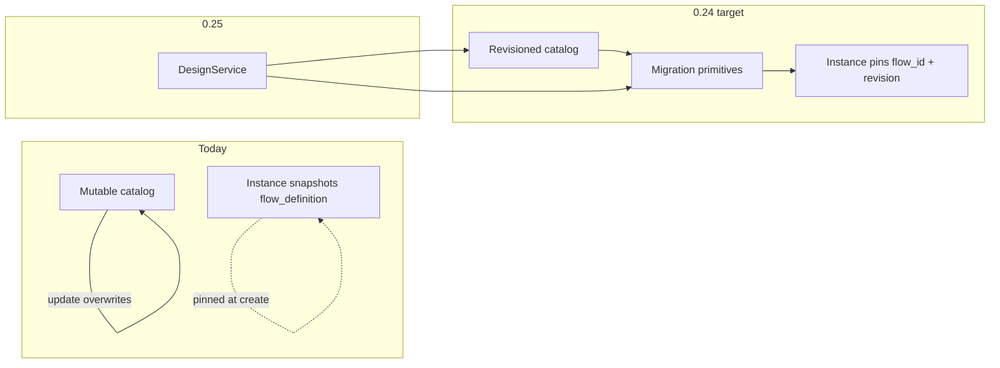

# Vision 0.24 — Definition Revisioning & Migration

**Theme:** Safe definition evolution — immutable revision history, instance revision pins, and migration as first-class Palm primitives.

**Status:** Shipped **0.25.0** on PyPI (0.24.1–0.24.4 bundled with Design Service)  
**Builds on:** [0.23.1 shipped](STATUS.md) · [0.16 services API](VISION-0.16.md)  
**Design Service:** [VISION-0.25.md](VISION-0.25.md) (shipped in 0.25.0)

---

## Problem

0.16–0.23 gave Palm a mature **catalog** (`definitions`), **run** (`execution/*`), **observe** (`system`), and **operate** (`assist`). Definition changes remain **mutable and silent**:

| Symptom | Cause |
|---------|-------|
| No rollback for catalog edits | `DefinitionRepository.register_flow` overwrites in place |
| Running sessions drift from catalog silently | Instances snapshot `flow_definition` at submit — catalog updates do not break resume, but there is no upgrade path |
| No `from_revision → to_revision` story | `FlowDefinition.version` is serialization format (`_DEFINITION_VERSION = 1`), not semantic revisioning |
| Agent-driven edits lack structure | MCP/REST can `create_flow` / `update_flow` directly — no impact report or migration orchestration |
| Design Service blocked | Propose/validate/commit needs `publish revision N+1`, not blind overwrite |

Palm already pins definitions on instances (`ProcessInstance.flow_definition` in `src/palm/instances/process_instance.py`). What is missing is **revision history** and **migration primitives** before a Design Service (0.25) can orchestrate safe evolution.

---

## Goal

| Shift | From | To |
|-------|------|-----|
| Catalog writes | Mutable overwrite | **Append-only revisions** per `flow_id` |
| Instance binding | Snapshot blob only | Snapshot + explicit **`flow_revision`** pin |
| Live instance upgrades | Not supported | **Migration rules** + optional migration flows |
| Impact visibility | None | **Impact query** — instances behind latest revision |
| Agent evolution | Direct DefinitionService CRUD | **Design Service (0.25)** on top of revisions |

**DefinitionService CRUD stays** for direct integrators and Explorer. Revisioning enhances the repository and instance model; it does not remove existing catalog verbs in 0.24.

---

## Architecture

```
Agent / CLI / Explorer / REST / MCP
        ↓
palm/runtimes/              thin mounts (definitions REST/MCP unchanged in 0.24)
        ↓
palm/services/definitions/  catalog reads + writes (gains revision-aware methods in 0.24.1)
        ↓
palm/common/persistence/    DefinitionRepository — revision keys + latest pointer
palm/common/transforms/     DefinitionMigrationRule registry (0.24.2)
palm/common/hooks/          InstancePersistenceHook — migration metadata (0.24.3)
        ↓
palm/instances/             ProcessInstance — flow_revision pin
palm/definitions/           FlowDefinition — revision field (semantic, not format version)
        ↓
palm/core/                  unchanged — core purity preserved
```

### Today vs target



---

## What shipped in 0.24 (local)

| Release | Delivered |
|---------|-----------|
| **0.24 vision** | This document, design spec, ADR-007, implementation plan |
| **0.24.1** | Append-only revisions, `flow_revision` pin, `?revision=` on get flow |
| **0.24.2** | Migration rules registry, impact query |
| **0.24.3** | Instance migration execution, demo wizard, metadata preservation |
| **0.24.4** | [MIGRATION-0.24.md](../../MIGRATION-0.24.md), MCP tools, operator doc sync |

Operator guide: [MIGRATION-0.24.md](../../MIGRATION-0.24.md) · Example: `migrate-instance-demo`

---

## Implementation phases (0.24.1+)

| Release | Theme |
|---------|-------|
| **0.24.1** | Flow revisioning — repository keys, `flow_revision` on instances, `publish_flow_revision` |
| **0.24.2** | Migration rules registry + impact query |
| **0.24.3** | Migration execution hooks + example migration flow |
| **0.25.0** | Design Service — propose / validate / impact / `commit_revision` |

See the [implementation plan](superpowers/plans/2026-07-03-definition-revisioning.md) for file-level tasks.

---

## Explicitly out of scope (0.24)

| Item | Where / when |
|------|----------------|
| Design Service code | 0.25 |
| MCP design tools | 0.25 |
| Governance / blockchain audit | 0.25+ |
| Explorer visual designer | Future |
| Deprecating DefinitionService direct writes | Not planned — layered coexistence |
| 0.23 deferred items (`palm-compose-guide`, process handoff, WebSocket) | Orthogonal — tracked separately in STATUS |

---

## Relationship to 0.23 mutation guard

0.23 shipped inspect-before-write for **session mutations** (`input_token`, `mutations_allowed`). Definition commits in 0.25 Design Service should follow the same discipline where agents drive writes. The 0.23.2 mutation-gate cleanup (single choke point, `MutationRejectedError`) is committed locally and independent of this vision release.

---

## Mapping external feedback → Palm roadmap

| Feedback idea | Palm home | Release |
|---------------|-----------|---------|
| Validation-first evolution | Design Service + existing `validate_flow` | 0.25 |
| Impact analysis | `definitions` impact query → Design Service | 0.24.2 / 0.25 |
| Migrations as Palm flows | Migration rules + hooks | 0.24.2–0.24.3 |
| Registry + CQRS | Existing buses; Design Service 0.25 | 0.25 |
| Dogfooding `palm://agent/guide` | Design Service + assist | 0.25+ |
| Blockchain governance | Out of scope | — |

**Correction vs generic feedback:** Design Service lives in `palm/services/design/` (not `palm/common/services/`). Definitions live in `palm/definitions/` (not `palm/core/`).

---

## References

- Design: [definition-revisioning-design.md](superpowers/specs/2026-07-03-definition-revisioning-design.md)
- Design Service (deferred): [design-service-design.md](superpowers/specs/2026-07-03-design-service-design.md)
- Plan: [definition-revisioning.md](superpowers/plans/2026-07-03-definition-revisioning.md)
- ADR: [007-definition-revisioning.md](adr/007-definition-revisioning.md)
- Prerequisite context: [0.23 mutation guard](MIGRATION-0.23.md)