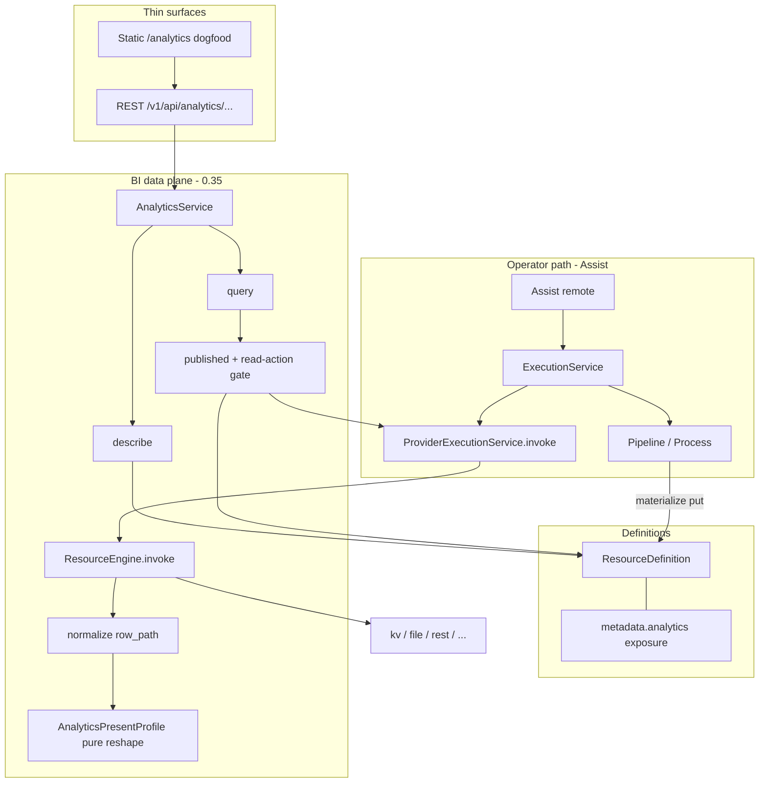

# VISION 0.35 — BI Data Plane (Exposure, Not Entry)

**Palm Engine 0.35.0** — design-approved foundation.

| Field | Value |
|-------|--------|
| **Document** | Design / VISION foundation for 0.35 |
| **Author** | (TBD — Palm core) |
| **Date** | 2026-07-10 |
| **Status** | **0.35.0 foundation** — design consensus; implementation 0.35.1+ |
| **Depends on** | 0.34 Assist operator remote; 0.33 Assist modularity; 0.28 local document/KV resources (ADR-011); 0.12 Compositional Power (ADR-001); 0.16 Service Domain API (ADR-005) |
| **Ship baseline** | Palm **0.34.5** (Assist modularity + operator remote) |
| **Target path in repo** | `docs/VISION-0.35.md` (this design is the implementable source) |

---

## Overview

Palm 0.35 introduces a **BI data plane**: a disciplined path from **sources → pipelines → published resources (facts / views) → analytics (query / aggregate / shape) → dashboard present profiles**. The product intent is **data exposure**, not business-data entry. Interactive wizards that collect todos or form fields remain operator/demo flows; they are **not** the BI dogfood path. Durable resource I/O (e.g. coconut `kv` load/save) remains the write-path dogfood; BI consumes **already published** resource contracts.

Analytics is a **new service domain** (`palm/services/analytics/`) that sits beside definitions, execution, system, assist, and design. It must **not** become a warehouse or OLAP engine: it **composes** `ProviderExecutionService.invoke` (read-only actions only), normalizes `ProviderResult` payloads, optionally applies **service-layer** thin shaping, and returns **typed DTOs** (`raw` | `table` | `series` | `kpi`).

Tables, charts, and KPIs are **present profiles** — pure reshape functions inspired by the *philosophy* of Assist `tool` | `chat` profiles (separate presentation without a second orchestration brain). They are **not** Assist-style policy/continuity machinery and share no profile framework with Assist.

**No Bot** for BI. Assist stays the **operator remote** (run pipelines, browse definitions, doctor). Analytics + a thin dashboard surface are separate product surfaces. The CLI `palm status` / live dashboard remains **ops** only and must never be conflated with the BI dashboard.

**0.35 dogfood is materialize-first.** Virtual “SQL-view-like” behavior is **not** available as ResourceEngine invoke-time transforms today; optional thin virtual shaping (if any) lives only inside AnalyticsService post-invoke, not on `ResourceDefinition` alone.

---

## Background & Motivation

### Current state (0.34.5)

| Capability | Where it lives | BI relevance |
|------------|----------------|--------------|
| `ResourceDefinition` | `src/palm/definitions/resource.py` | Type contract via `input_schema` / `output_schema` + free-form `metadata` |
| Catalog | `src/palm/common/resource/catalog.py`, `DefinitionService` | List/describe resources; REST `GET /v1/api/definitions/resources` |
| Invoke | `ResourceEngine` (`palm/core/resource/engine.py`), `ProviderExecutionService` | `POST /v1/api/providers/{provider}/{resource_ref}/invoke` |
| Transforms | `TransformEngine` + transform catalog (incl. `enrich_resource`) | Pipeline materialization / field shaping — **not** on resource invoke |
| Pipeline pattern | `palm/patterns/pipeline/` | Ordered transform steps; ETL / materialization spine |
| Local durable store | `kv` / `file` providers (ADR-011) | Facts can materialize into KV/file without a warehouse |
| Coconut dogfood | `examples/definitions/coconut/resources.py` | Write path for durable resources |
| Assist profiles | `palm/services/assist/profiles/` (`tool` \| `chat`) | Philosophy only: alternate presentation — **not** pure DTO reshape |
| Execution façade | `palm/services/execution/service.py` | Thin façade + leaf services |
| Design | `palm/services/design/` | Publish resource definitions (incl. `publish-resource`) |
| Host wiring | `ApplicationHost._wire_cqrs`, `ServerContext` | Services constructed + mirrored for REST |
| Route registration | `runtimes/server/surfaces/rest/service_routes.py` | Hard-coded domain route imports |
| CLI dashboard | `palm status` (`runtimes/cli/commands/dashboard.py`), Explorer SSR | **Ops**, not BI |
| AnalyticsService | **Does not exist** | Gap for 0.35 |

### Pain points

1. **Resources are invokable but not “BI-published.”** There is no first-class `published` / `kind: fact|view` / lineage contract on definitions; list rows do not distinguish operational resources from analytics datasets.
2. **No query/present layer.** Consumers must invent ad-hoc JSON parsing after `invoke`. No shared `AnalyticsResult` shape for table/series/KPI.
3. **Risk of product confusion.** Without explicit non-goals, BI work could sprawl into Metabase-like OLAP, Bot “ask the data,” or Portal-chat-as-dashboard.
4. **todo-builder temptation.** Session-answer wizards look like “data apps” but do not produce durable, schema’d datasets suitable for analytics.
5. **ResourceEngine is invoke-only.** There is no definition-level transform-on-invoke; “virtual views” cannot be pure ResourceDefinitions without service composition or a future engine extension.

### Why now

0.33–0.34 made Assist a modular **operator remote** with clear presentation profiles. Resources + pipelines + transforms already form a credible **materialization spine**. 0.35 is the smallest coherent product slice that **exposes** that spine for analytics without rewriting core.

---

## Goals & Non-Goals

### Goals

1. **Document and ship a ladder** (0.35.0 → 0.35.6+) from vision → metadata → AnalyticsService → present profiles → REST → dogfood → thin dashboard page.
2. **Resource exposure metadata** for BI: optional flags on `ResourceDefinition.metadata.analytics` — `published`, `kind` (`fact` \| `view`), `derived_from` / lineage; validated via `parse_analytics_exposure()`.
3. **`AnalyticsService`**: `describe(dataset)` + `query(...)` → `AnalyticsResult` + schema; thin domain only; **read-action allowlist**.
4. **Present profiles** `raw` \| `table` \| `series` \| `kpi` under `analytics/present/profiles/` as **pure functions**.
5. **REST** (and optional thin MCP) for analytics; full host + ServerContext + `service_routes` wiring.
6. **Dogfood (materialize-first)**: pipeline writes fact + derived view resources; query both; static page renders one table + one chart from profiles.
7. Preserve **core purity**: no analytics imports into `palm/core/`; no definitions → analytics imports.

### Non-goals (0.35)

- Full Metabase / Superset / embedded OLAP or columnar warehouse
- Bot / LLM BI agent (“ask questions in natural language”)
- Making Portal chat the BI UI (Portal remains Assist operator remote)
- Replacing external SQL warehouses; Palm is not the system of analytical record
- Auth production hardening beyond existing server auth patterns (`auth_required` on routes)
- Auto-exposing every resource as public REST CRUD
- Form wizards for business data entry as BI dogfood (todo-builder is **out of scope** for BI)
- Joins and multi-dataset query planning in the browser or in AnalyticsService
- DashboardDefinition productization in the first dogfood (0.35.7+ only)
- True SQL-view-like **invoke-time** transforms on ResourceEngine / ResourceDefinition alone
- Per-dataset ACL / multi-tenant row security (authenticated + published only for 0.35)
- Scheduled refresh execution (metadata `refresh` is documentation-only in 0.35)

---

## Proposed Design

### Spine (product)

```text
Sources (providers: kv, file, rest, …)
        │
        ▼
Pipelines / transforms (pattern: pipeline — materialize durable keys)
        │
        ▼
Resources — facts | views  (ResourceDefinition + schemas + exposure metadata)
        │   (read actions only: get / list / fetch / …)
        ▼
AnalyticsService — gate → invoke (via ProviderExecutionService) → normalize → present
        │
        ▼
Present profiles — pure reshape: raw | table | series | kpi
        │
        ▼
Dashboard surface (static HTML under server mount) — paint DTOs only
```

### Layer placement (AGENTS.md)

```text
User / CLI / REST / MCP / static dashboard
        ↓
palm/runtimes/          thin: REST analytics/* + static /analytics dogfood
        ↓
palm/app/               ApplicationHost wires AnalyticsService from PalmSettings
        ↓
palm/services/analytics/   NEW domain (describe, query, present, exposure parse)
palm/services/definitions  resource CRUD (no analytics import)
palm/services/execution    ProviderExecutionService.invoke + pipeline runs
        ↓
palm/common/            resource catalog, transforms (no analytics product policy)
        ↓
palm/core/              ResourceEngine, TransformEngine — ZERO analytics imports
```

**Allowed dependency direction:**  
`analytics` → `definitions`, `execution` (providers), `common` (transforms helpers if needed), `core` types via those layers.  

**Forbidden:**  
`core` → analytics; `definitions` → analytics; putting BI product policy in `palm/common`.

### Package map (target)

```text
palm/services/analytics/
  __init__.py                 # AnalyticsService export
  service.py                  # THIN façade
  registry.py                 # verbs / optional future assist aliases
  exposure.py                 # parse_analytics_exposure(metadata) — strict known keys
  datasets.py                 # resolve dataset ref + published gate + action allowlist
  normalize.py                # ProviderResult → row payload (row_path + heuristics)
  query.py                    # invoke + normalize + present (no join planner)
  describe.py                 # schema + exposure surface
  settings.py                 # typed knobs or helpers reading PalmSettings fields

  present/
    __init__.py
    pipeline.py               # present(payload, profile, options) entry
    profiles/
      __init__.py
      base.py                 # AnalyticsPresentProfile enum + PresentOptions
      raw.py                  # pure: payload → data
      table.py
      series.py
      kpi.py

  # CQRS deferred: REST → AnalyticsService direct in 0.35 unless parity required

palm/runtimes/server/surfaces/rest/analytics/
  routes.py                   # REST /v1/api/analytics/*
  handlers.py
  static.py                   # analytics_file_response (mirror portal_file_response)
  static/
    index.html                # dogfood: one table + one chart (0.35.6)
    analytics.js              # fetch REST only; no join logic
    analytics.css             # optional
```

**Static mount (PR6, locked):** Co-locate assets under  
`src/palm/runtimes/server/surfaces/rest/analytics/static/`  
with `static.py` providing `analytics_file_response(relative)` cloned from  
`runtimes/server/surfaces/websocket/static.py` (`portal_file_response` — path-safe resolve under root).  
Register on the server route table:

| Method | Path | Handler |
|--------|------|---------|
| `GET` | `/analytics` | `index.html` |
| `GET` | `/analytics/` | `index.html` |
| `GET` | `/analytics/*` | static file under `static/` |

Do **not** put BI dogfood under websocket/Portal static; keep Assist Portal and Analytics surfaces separate.

**Profile philosophy (not Assist structure):** Assist profiles (`AssistProfile.TOOL|CHAT` in `assist/profiles/base.py`) carry **policy, continuity, and render options**. Analytics profiles are **pure** `(payload, options) → data` with **no session, no auto-start, no action filtering**. Name the enum **`AnalyticsPresentProfile`** to avoid confusion with `AssistProfile`. Package layout uses small files like 0.33, not a shared profile framework.

### Mermaid — architecture



### Mermaid — query sequence (normalize contract)

```mermaid
sequenceDiagram
  participant Client as Dashboard / REST client
  participant REST as rest/analytics
  participant AS as AnalyticsService
  participant Def as DefinitionService
  participant PES as ProviderExecutionService
  participant RE as ResourceEngine
  participant Prov as Provider

  Client->>REST: POST .../query {dataset, profile, ...}
  REST->>AS: query(...)
  AS->>Def: resolve dataset → ResourceDefinition
  AS->>AS: gate published (else 404)
  AS->>AS: gate action in READ_ALLOWLIST (else 403)
  AS->>PES: invoke(resource_ref, params) NO action override from client
  PES->>RE: invoke
  RE->>Prov: definition.action only
  Prov-->>RE: ProviderResult
  RE-->>PES: ProviderResult
  PES-->>AS: {success, data, error, metadata}
  alt success false
    AS-->>REST: AnalyticsResult status=error
    REST-->>Client: 502/400 + error body
  else success true
    AS->>AS: payload = data; row_path; heuristics → rows
    AS->>AS: select project; limit truncate; caps
    AS->>AS: present(profile) pure reshape
    AS-->>REST: AnalyticsResult status=ok
    REST-->>Client: 200 JSON
  end
```

### Materialized vs virtual views (corrected)

| Mode | Meaning in 0.35 | Engine support |
|------|-----------------|----------------|
| **Materialized (default / dogfood)** | Pipeline (or operator put) writes durable data; analytics **read-invokes** a `ResourceDefinition` with `action` in the read allowlist (`get` / `list` / `fetch` / …) | Fully supported today via `ResourceEngine` + providers |
| **Virtual (optional, service-layer only)** | After a **read** invoke, AnalyticsService may apply thin post-invoke shaping driven by `metadata.analytics` (e.g. `row_path`, optional future `virtual_steps` using existing transform helpers) | **Not** ResourceEngine/ResourceDefinition transform-on-invoke — that does not exist |
| **Out of scope 0.35** | Definition-level SQL-view / pipeline embedded in resource invoke | Would require core/common extension — future |

**Facts for implementers (verified against codebase):**

- `ResourceEngine.invoke` resolves provider/action/params/`resource_id`, binds `{{ state.* }}`, calls the provider — **no** post-invoke transform chain on the definition.
- Pipeline transforms live in `palm/patterns/pipeline/` (`PipelineConfig.steps`), not on resources.
- `kv` actions are get/put/list/delete — analytics must never call put/delete.

**SQL-view-like product language:** A “view” is still a `ResourceDefinition` with `analytics.kind: "view"` and `derived_from`. In 0.35, **prefer a second materialized key** written by the materialization pipeline (filter/map steps). Optional virtual post-invoke shaping is analytics service composition, **not** “ResourceDefinition alone.”

**Dogfood (0.35.5) success criteria — materialize only:**

1. Seed + pipeline materializes fact into `kv` (or `file`).
2. Same pipeline (or second stage) writes a **derived** key for the view.
3. Two published **read** resources (`action: get` or `list`) with `kind: fact` / `kind: view` and lineage.
4. `AnalyticsService.query` both with `table` / `series`.
5. **No** virtual branch required for green CI.

### Exposure gate + read-action allowlist

Analytics `describe` / `query` / `list_datasets` accept a resource only if **all** apply:

1. **Resolved** from the definition repository (see [Dataset resolution](#dataset-resolution-algorithm)).
2. **Published:** `parse_analytics_exposure(metadata).published is True`, **unless** `PalmSettings.analytics_allow_unpublished` is true **and** host is not exposing public HTTP without `analytics_allow_unpublished_with_server` (see Security).
3. **Read action:** definition’s `action` is in the **read allowlist** (case-sensitive provider names as registered):

```text
READ_ALLOWLIST = frozenset({
    "get", "list", "fetch", "read", "exists",  # common providers
    # extend only with explicitly read-only provider actions
})
```

**`exists`:** Read-only (e.g. file provider) and allowed for completeness. Payload is boolean-ish and will not satisfy table/series row heuristics — use **`profile=raw` only**. Dogfood and BI widgets use `get` / `list` / `fetch` / `read`.

Refuse mutations (`put`, `delete`, `write`, and unknown actions not on the allowlist) with **HTTP 403** / service error `AnalyticsActionNotAllowed` — even if `published: true`.

4. **No client action override:** `query` body **must not** accept `action` (or silently ignore it). Provider/action come only from the ResourceDefinition. Optional `params` may supply **non-mutating** bind values (e.g. key fragments) but must not re-target write paths; reject params keys that map to write semantics for known providers if detectable.

Operational invoke via `ProviderExecutionService` / REST providers remains available for operators; **BI query is not unrestricted invoke**.

### Two dashboards (must not confuse)

| Surface | Purpose | Implementation |
|---------|---------|----------------|
| **Ops dashboard** | Job health, instances, REPL status | CLI `palm status` (`runtimes/cli/commands/dashboard.py`), Explorer SSR |
| **BI / Analytics dashboard** | Consume analytics present profiles | Static dogfood at **`/analytics`** served from `rest/analytics/static/` (0.35.6); later DashboardDefinition |

Never overload “status dashboard” for BI.

### Relationship to Assist

- Assist may **open** catalog items, **run** materialization pipelines, and link operators to `/analytics`.
- Assist does **not** implement table/series as a second query engine.
- Optional later: assist alias `analytics/query` → `AnalyticsService` with tool-profile summary — not chat-as-BI.

---

## API / Interface Changes

### AnalyticsService (Python)

Prefer **composing `ProviderExecutionService`** (reuse runtime resolve, `engine.invoke`, `enrich_provider_result`) rather than re-implementing invoke.

```python
# Target: palm/services/analytics/service.py

class AnalyticsService(BaseService):
    """Thin BI query/present domain — not a warehouse. Read-only invoke path."""

    def __init__(
        self,
        *,
        commands: Any,
        queries: Any,
        schemas: Any,
        definitions: DefinitionService,
        providers: ProviderExecutionService,  # compose — do not reimplement invoke
        allow_unpublished: bool = False,
        default_limit: int = 1000,
        max_limit: int = 10_000,
        max_response_bytes: int = 2_000_000,
        enabled: bool = True,
    ) -> None: ...

    def list_datasets(self, *, published_only: bool = True) -> list[dict[str, Any]]:
        """Analytics-owned list — see list_datasets access path (PR2)."""
        ...

    def describe(self, dataset: str) -> dict[str, Any]:
        """Schema + exposure for a resolvable dataset (404 if missing/unpublished)."""
        ...

    def query(
        self,
        dataset: str,
        *,
        profile: str = "table",  # raw | table | series | kpi
        params: dict[str, Any] | None = None,  # bind only; never action
        select: list[str] | None = None,       # project columns only (no rename in 0.35)
        limit: int | None = None,
        series: dict[str, Any] | None = None,  # required shape when profile=series (0.35.3+)
        kpi: dict[str, Any] | None = None,     # required shape when profile=kpi (0.35.3+)
        runtime_name: str | None = None,
    ) -> dict[str, Any]:
        """Gate → invoke → normalize → present → AnalyticsResult."""
        ...
```

**0.35.2 frozen query params:** `dataset`, `profile`, `params`, `select`, `limit`, `runtime_name`.  
**0.35.3+:** add `series` / `kpi` options when those profiles ship. **No `filters` in 0.35** (deferred).

**PR2 unit tests:** construct `AnalyticsService` with a **fake** `ProviderExecutionService` (or fake that returns provider envelopes) and real/fake `DefinitionService` — **no host required**. Contract: `providers.invoke(resource_ref, params=..., runtime_name=...) -> dict` matching `_provider_result_body` shape.

### Dataset resolution algorithm

Match repository semantics (`DefinitionRepository.get_resource` in `palm/common/persistence/definition_repository.py`):

1. Strip whitespace; empty → error.
2. Try **`get_resource_by_name(ref)`** first (primary operator-facing id).
3. If not found, try **`get_resource_by_id(ref)`** (`definition_id` / `id` field).
4. If still missing → **404** `dataset_not_found` (same code for unpublished — see Security).
5. If found but not published (and not allow_unpublished) → **404** `dataset_not_found` (do not leak existence via 403).
6. If action not in read allowlist → **403** `analytics_action_not_allowed` (resource exists and is published but not BI-safe).

### Normalize pipeline (ProviderResult → rows → select/limit → present)

**Canonical order** — select/limit always run on the **row set** before profile reshape. Series/kpi must never see pre-select raw columns or post-collapse `select` (that would no-op or corrupt DTOs).

```text
1. envelope = providers.invoke(...)   # {success, data, error, metadata}
2. if not success:
     return AnalyticsResult(status="error", error=envelope["error"] or "invoke failed")
3. payload = envelope["data"]
4. if analytics.row_path set:
     payload = dotted_get(payload, row_path)  # e.g. "items" or "value.rows"
   else heuristics (in order):
     a. payload is list → use as rows source
     b. payload is dict with "items" list → use items
     c. payload is dict with "rows" list → use rows
     d. payload is dict with "value" that is list → use value (kv patterns)
     e. else → single-row dict if mapping; else raw-only payload
5. if profile == "raw":
     present raw on payload after step 4 (no select/limit on collapsed DTOs)
     still enforce max_response_bytes on serialized payload
     return
6. coerce payload → rows: list[dict] when possible
   (list of non-dicts → wrap or reject with 400)
7. select: project keys on each row (project only; no renames)
   Missing keys: omit column (do not error) so sparse rows stay usable
8. limit: truncate rows to min(requested_limit, max_limit);
   set meta.truncated if input longer than applied limit
9. enforce row×column cap and max_response_bytes on the row set
10. present(profile) pure reshape on the post-select/limit row set only
    - table: columns + row arrays from rows
    - series: series/kpi options apply only to this row set
    - kpi: aggregate only this row set; delta always null in 0.35
```

**`output_key`:** Flow/state-oriented binding on ResourceDefinition for wizard/pipeline blackboard — **not** the primary analytics row path. Only use if `metadata.analytics.row_path` is absent **and** authors set `analytics.row_path` to alias, or document an explicit `analytics.use_output_key: true` (default **false**). Prefer `row_path`.

**Failed invoke HTTP mapping:** service `status: error` → REST **502** if provider failed; **400** for bad client profile/params; **404** unpublished/missing; **403** action not allowed; **503** if `analytics_enabled=false`.

### DTO shapes (AnalyticsResult)

Common envelope:

```json
{
  "status": "ok",
  "dataset": "sales-facts-daily",
  "profile": "table",
  "schema": {
    "fields": [
      {"name": "day", "type": "string"},
      {"name": "revenue", "type": "number"},
      {"name": "orders", "type": "integer"}
    ]
  },
  "lineage": {
    "kind": "fact",
    "derived_from": [],
    "resource_ref": "sales-facts-daily",
    "provider": "kv",
    "action": "get"
  },
  "meta": {
    "row_count": 30,
    "truncated": false,
    "limit": 1000,
    "invoke_ms": 12,
    "present_ms": 1
  },
  "data": {}
}
```

Error envelope:

```json
{
  "status": "error",
  "dataset": "sales-facts-daily",
  "error": "provider message or gate reason",
  "code": "invoke_failed | dataset_not_found | analytics_action_not_allowed | ..."
}
```

#### Profile: `raw`

```json
{ "data": { "payload": { "...": "envelope data after optional row_path only" } } }
```

#### Profile: `table` (canonical)

**columns + row arrays** (chart-friendly). Input may be list-of-dicts; normalizer projects.

```json
{
  "data": {
    "columns": ["day", "revenue", "orders"],
    "rows": [
      ["2026-07-01", 1200.5, 14],
      ["2026-07-02", 980.0, 11]
    ]
  }
}
```

`select` = project subset of columns (order preserved); **no renames** in 0.35.

#### Profile: `series`

```json
{
  "data": {
    "x_field": "day",
    "series": [
      { "name": "revenue", "points": [["2026-07-01", 1200.5], ["2026-07-02", 980.0]] }
    ]
  }
}
```

Multi-metric: multiple entries in `series` from `series.y_fields: ["revenue", "orders"]`. Single metric default: one y field.

#### Profile: `kpi`

```json
{
  "data": {
    "label": "Revenue (30d)",
    "value": 42100.25,
    "unit": null,
    "format": "number",
    "delta": null
  }
}
```

Aggregations in 0.35: `sum` | `count` | `avg` | `min` | `max` over one field. **`delta` always null** in 0.35.

| Profile | Module | Responsibility |
|---------|--------|----------------|
| `raw` | `present/profiles/raw.py` | Pass-through post-`row_path` payload (skips row select/limit) |
| `table` | `present/profiles/table.py` | post-select/limit `list[dict]` → columns + row arrays |
| `series` | `present/profiles/series.py` | post-select/limit rows → series points |
| `kpi` | `present/profiles/kpi.py` | single aggregation over post-select/limit rows |

**No join logic** in present profiles. Profiles assume steps 7–9 already applied (except `raw`).

### REST

Prefix: `/v1/api/analytics`.

| Method | Path | Intent | Auth |
|--------|------|--------|------|
| `GET` | `/v1/api/analytics/datasets` | `list_datasets` | required |
| `GET` | `/v1/api/analytics/datasets/{dataset}` | `describe` | required |
| `POST` | `/v1/api/analytics/query` | `query` | required |

```json
{
  "dataset": "sales-facts-daily",
  "profile": "table",
  "limit": 100,
  "select": ["day", "revenue"]
}
```

### Integration checklist (host / ServerContext / routes)

Must all be done before analytics REST works end-to-end (split across PR4a/PR4b):

| # | Location | Change |
|---|----------|--------|
| 1 | `PalmSettings` (`src/palm/app/settings.py`) | `analytics_enabled`, `analytics_allow_unpublished`, `analytics_allow_unpublished_with_server`, `analytics_default_limit`, `analytics_max_limit`, `analytics_max_response_bytes` (`PALM_*` env) |
| 2 | `ApplicationHost._wire_cqrs` | Construct `AnalyticsService(providers=host.execution.providers, definitions=..., settings knobs)`; store `self._analytics` |
| 3 | `ApplicationHost` | `@property analytics` |
| 4 | `ServerContext.__init__` standalone branch | Construct local `AnalyticsService` like design/definitions |
| 5 | `ServerContext.__init__` host branch | `self._analytics = host.analytics` |
| 6 | `ServerContext.attach_host` | Assign `self._analytics = host.analytics` |
| 7 | `ServerContext` | `@property analytics` |
| 8 | `service_routes.register_service_routes` | `register_analytics_routes(...)` import + call |
| 9 | `rest/analytics/routes.py` + `handlers.py` | Handlers use `ctx.analytics` |
| 10 | Optional OpenAPI | Register ops if openapi_registry pattern requires |
| 11 | `INSTALLED_SERVICES` | **Optional.** Design is also **not** listed; host/context import design directly. Add `"analytics"` only if package-level `registry.py` side-effects need autoload — **not required** for REST if host imports `AnalyticsService` explicitly. Prefer explicit host import (same as design). |
| 12 | Doctor (optional PR) | Preflight: count published datasets; warn published without output_schema / non-read action |

### Optional MCP

Prefer REST-first. Later slim assist aliases (`analytics/list`, `analytics/describe`, `analytics/query`) — do not explode tool count (VISION-0.31).

### Definitions / catalog surface

- **`list_datasets` is analytics-owned** — do **not** depend on `resource_catalog_row` gaining metadata.
- Today `DefinitionService.list_resources()` returns **thin** catalog rows only (no `metadata`); full metadata is on `get_resource` / `ResourceCatalog.describe`. There is **no** public `list_resource_definitions()` parallel to `list_flow_definitions()`.

#### `list_datasets` access path (locked for PR2)

**Chosen approach: public API N+1 via `DefinitionService`.**

```text
1. rows = definitions.list_resources()          # thin rows: name, definition_id, provider, …
2. for each row:
     detail = definitions.get_resource(row["name"] or row["definition_id"])
     # get_resource → ResourceCatalog.describe → includes metadata
     exposure = parse_analytics_exposure(detail.get("metadata"))
     if published_only and not exposure.published: skip
     if action not in READ_ALLOWLIST: skip (or include with flag bi_safe=false — prefer skip)
     emit {dataset, kind, provider, action, default_profile, …}
```

| Property | Choice |
|----------|--------|
| API surface | Public `DefinitionService` only — **no** inject `DefinitionRepository` in 0.35 |
| Cost | **N+1** `get_resource` after list — acceptable for small catalogs (typical Palm: tens of resources) |
| Scale later | Optional 0.35.7+ batch helper on definitions (`list_resources_with_metadata`) if N becomes large |
| PR owner | **PR2** implements this loop in `datasets.py` |

- Optional later: thin `analytics: {published, kind}` on definitions list rows for Explorer only — not required for analytics.
- BI clients must use `/v1/api/analytics/*`, not definitions list, for published discovery.

---

## Data Model Changes

### ResourceDefinition (no new core type)

Existing fields (`src/palm/definitions/resource.py`): `name`, `provider`, `action`, `params`, `input_schema`, `output_schema`, `output_key`, `metadata`.

**0.35.1 convention** — `metadata.analytics`:

```json
{
  "metadata": {
    "description": "Daily sales fact table",
    "tags": ["bi", "sales"],
    "analytics": {
      "published": true,
      "kind": "fact",
      "derived_from": [],
      "default_profile": "table",
      "row_path": "items",
      "refresh": {
        "pipeline_flow_id": "materialize-sales-facts",
        "schedule": null
      }
    }
  },
  "output_schema": { "...": "row / payload contract" }
}
```

| Field | Type | Meaning | 0.35 functional? |
|-------|------|---------|------------------|
| `analytics.published` | bool | Queryable via Analytics when true | **Yes** (gate) |
| `analytics.kind` | `"fact"` \| `"view"` | Lineage UI semantics | Yes (describe) |
| `analytics.derived_from` | list[str] | Parent resource refs | Yes (describe) |
| `analytics.default_profile` | str | Default present profile | Yes |
| `analytics.row_path` | str | Dotted path into invoke `data` | Yes (normalize) |
| `analytics.refresh` | object | Operator documentation only | **No** — non-functional; no scheduler |
| `analytics.virtual_steps` | list | Optional future thin service-layer transform | **Deferred**; not dogfood |

**PR1:** ship `parse_analytics_exposure(metadata) -> AnalyticsExposure | None`:

- Known keys only; **ignore unknown** keys (forward compatible).
- Invalid types → treat as unpublished / raise validation error on strict parse used by Design later.
- Typos like `publshed` → ignored (unpublished) — optional Design validator warning **later**, not 0.35.1 required.

**No definition storage version bump** — metadata free-form already round-trips in `to_dict`/`from_dict`.

### Schema as type contract

- `output_schema` is the contract for field types.
- `describe()` merges exposure + schema; optional best-effort infer from sample **not** required in 0.35.2.
- Present profiles fail clearly on missing columns.

### Migration strategy

1. Existing resources: **unpublished by default** (`published` absent/false) → not queryable via analytics.
2. Dogfood sets `metadata.analytics` explicitly on **read** resources only.
3. Design `publish-resource` may store any metadata blob today; optional analytics validator is post-0.35.1.
4. No forced migration of coconut or other operational resources.

### Materialized sample dogfood (0.35.5)

Mirror `examples/definitions/coconut/resources.py` registration:

```python
# examples/definitions/analytics_dogfood.py
FACT = ResourceDefinition(..., action="get", metadata={"analytics": {"published": True, "kind": "fact", ...}})
VIEW = ResourceDefinition(..., action="get", metadata={"analytics": {"published": True, "kind": "view", "derived_from": ["sales-facts-daily"], ...}})

def register_definitions(repository): ...
```

1. **Seed** — pipeline `initial_state` or fixture rows (synthetic, no PII).
2. **Pipeline flow** `pattern: pipeline` — transform + resource put to `kv` namespace `analytics` keys `facts/sales-daily` and `views/sales-revenue-by-day`.
3. **Fact resource** `sales-facts-daily`: `provider=kv`, `action=get`, published, kind fact.
4. **View resource** `sales-revenue-by-day`: second **materialized** key, published, kind view, `derived_from`.
5. **Test recipe:** pytest fixture loads definitions → runs pipeline once (process/flow submit via host or direct transform+put) → `AnalyticsService.query` both profiles → assert columns.
6. Optional: `just` target or documented CLI: `palm` run materialize flow then curl analytics.

**Drop virtual from dogfood success criteria.**

---

## Alternatives Considered

### A. Build analytics into Assist present pipeline

| Pros | Cons |
|------|------|
| Reuse profiles machinery | Conflates operator remote with BI; Assist profiles are policy/continuity, not DTO reshape |

**Decision:** Reject. Share **philosophy** (presentation separate from brain), not Assist code.

### B. New core “DatasetEngine” / OLAP in `palm/core`

| Pros | Cons |
|------|------|
| Fast aggregates | Core purity erosion; warehouse creep |

**Decision:** Reject.

### C. Only REST wrappers around existing `invoke`

| Pros | Cons |
|------|------|
| Minimal code | No exposure gate, no DTO stability, no read-action safety |

**Decision:** Reject as sole approach.

### D. Full SQL surface over resources

| Pros | Cons |
|------|------|
| Familiar | Warehouse scope |

**Decision:** Defer indefinitely.

### E. DashboardDefinition as first deliverable

| Pros | Cons |
|------|------|
| Declarative layouts | Premature before DTO + dogfood |

**Decision:** 0.35.7+ only; 0.35.6 **static HTML** under server static mount at `/analytics`.

### F. Analytics as leaf under `ExecutionService`

| Pros | Cons |
|------|------|
| Smaller host surface | Mixes “run work” (jobs/pipelines) with “query published data”; exposure policy does not belong under job execution |

**Decision:** Reject. New top-level domain `palm/services/analytics/` (product API + gates).

### G. Virtual views = always run a named pipeline then present

| Pros | Cons |
|------|------|
| Uses existing pipeline pattern | High latency; confuses query with materialization job; ops cost |

**Decision:** Reject for query path. Pipelines materialize **offline/on-demand via Assist**; query only reads.

---

## Security & Privacy Considerations

| Threat | Severity | Mitigation |
|--------|----------|------------|
| Mutating invoke via “query” | **Critical** | Read-action allowlist; no client `action` override |
| Unrestricted invoke of secrets resources | High | **Published-only** query gate (default unpublished) |
| Dashboard scraping all namespaces | High | Only registered definitions that are published + read-safe |
| Authz: any authed user sees all published datasets | Medium (accepted 0.35) | Auth model = **authenticated + published resource**; no per-dataset ACL in 0.35; document |
| `analytics_allow_unpublished` full bypass | High if public server | Require `analytics_allow_unpublished_with_server=true` second flag when host binds HTTP server; default refuse combo |
| Large result DoS | Medium | `default_limit` / `max_limit`; row×column cap; `max_response_bytes`; reject non-list huge objects before table DTO |
| Existence leakage | Low–Med | Unpublished/missing → **404** same code |
| Schema leakage | Low | Publishing is deliberate disclosure |
| Definitions REST still lists unpublished | OK | Operator surface; BI clients use analytics list only |
| PII in dogfood | Low | Synthetic sample only |

**Authz model (0.35):** Same class as other Palm REST: server auth middleware + `auth_required=True`. Authorization = “can call analytics API” + resource published + read allowlist. **Not** row-level or dataset ACL.

---

## Observability

| Signal | Source | Notes |
|--------|--------|-------|
| Resource invoke events | `ResourceEngine` + `ResourceInvocationProjection` | Correlate analytics queries |
| Timing | `meta.invoke_ms`, `meta.present_ms` | Every result |
| Logs | Service logger | `dataset`, `profile`, `gate`, `truncated`, `code` |
| Doctor | System preflight (PR optional / with PR5) | Published count; published + non-read action warning |
| Metrics (later) | Counters | `analytics_query_total`, `denied`, `rows_returned` |

---

## Rollout Plan / Ladder

| Step | Deliverable | Success criteria |
|------|-------------|------------------|
| **0.35.0** | Vision/design; STATUS + CHANGELOG hooks | Doc as `docs/VISION-0.35.md` |
| **0.35.1** | `parse_analytics_exposure` + unit tests; analytics `list_datasets` helper logic | Published filter correct; no dependency on definitions list-row metadata |
| **0.35.2** | AnalyticsService skeleton + settings defaults + read allowlist + normalize + raw | Unit tests with fake providers |
| **0.35.3** | Present profiles table/series/kpi | Snapshot tests |
| **0.35.4a** | Host + ServerContext + settings property (service reachable without REST) | Integration smoke without HTTP |
| **0.35.4b** | REST routes + `service_routes` + OpenAPI if needed | `test_rest_analytics_routes` |
| **0.35.5** | Dogfood examples + materialize fixture + integration test | Fact + view query green |
| **0.35.6** | Static `/analytics` dogfood page | Table + chart from REST only |
| **0.35.7+** | DashboardDefinition, schedule refresh, pagination/cursor | Separate mini-vision |

### Settings (`PalmSettings`, env prefix `PALM_`)

| Field | Default | Notes |
|-------|---------|-------|
| `analytics_enabled` | `True` | False → 503 on REST |
| `analytics_allow_unpublished` | `False` | Dev escape |
| `analytics_allow_unpublished_with_server` | `False` | Must be true to combine allow_unpublished with server bind |
| `analytics_default_limit` | `1000` | |
| `analytics_max_limit` | `10000` | |
| `analytics_max_response_bytes` | `2000000` | Soft cap on serialized data |

Owned by **PR2** (defaults + service constructor); REST respects in PR4b.

### Rollback

- `analytics_enabled=false` → no behavior change to definitions; REST 503.
- Remove static assets independently.
- Metadata ignored if service removed.

---

## Risks

| Risk | Severity | Mitigation |
|------|----------|------------|
| Scope creep into OLAP | High | Non-goals; reject join planners |
| Virtual views assumed in ResourceEngine | High | Materialize-first; virtual only service-layer, deferred for dogfood |
| Mutating query path | Critical | Read allowlist |
| Present profiles → second transform engine | Medium | Pure reshape only; heavy work in pipelines |
| Confusion with `palm status` | Medium | `/analytics` naming |
| Host wiring incomplete (REST only) | High | Integration checklist |
| Large payloads | Medium | Limits + max_response_bytes |
| Metadata typos | Low | parse helper; optional Design warn later |
| definitions → analytics coupling | Medium | Forbidden import direction |

---

## Key Decisions

1. **Exposure not entry** — BI consumes published resources; pipelines materialize; form data-entry out of BI scope.
2. **Spine** — Sources → pipelines → resources (facts/views) → analytics → present profiles → dashboard.
3. **Profiles not engines** — `AnalyticsPresentProfile` pure reshape; philosophy of Assist separation, not Assist policy machinery.
4. **No Bot for BI** — Assist remains operator remote only.
5. **Views = ResourceDefinitions with lineage** — 0.35 **materialize-first**; virtual only as optional AnalyticsService post-invoke composition (not ResourceEngine transform-on-invoke). No new core type.
6. **Schema on resources** is the analytics/widget type contract.
7. **No warehouse** — ResourceEngine + providers + transforms; analytics is thin query/present.
8. **Thin dashboard** — static `/analytics` consumes DTOs; no join logic in JS.
9. **Two dashboards** — ops (`palm status` / Explorer) ≠ BI analytics dashboard.
10. **Published-only query gate (default unpublished)** — only resources with `metadata.analytics.published == true` are queryable unless explicit host allow_unpublished (with server guardrails).
11. **Read-action allowlist** — analytics never invokes put/delete/write; no client action override.
12. **Package location** — `palm/services/analytics/`; runtimes thin; core pure; compose `ProviderExecutionService`.
13. **todo-builder out** — coconut-style durability for write path; analytics dogfood is materialize + read/query.
14. **Normalize contract** — success gate → `data` → `row_path` / heuristics → profile; `output_key` not primary.

---

## Open Questions

Resolved defaults (no user input required to start PR0–PR2):

| Topic | Decision |
|-------|----------|
| Table row shape | columns + row arrays |
| MCP in 0.35.4 | REST first |
| Filters | Deferred past 0.35 |
| Unpublished HTTP | **404** same as missing |
| Dataset ref order | name then id |
| PR6 surface | Static HTML under server static mount at `/analytics` |
| Promote metadata to dataclass fields | Metadata through 0.35.x |

No blocking product open questions for implementation start.

---

## PR Plan (ordered, tightened)

| PR | Title | Scope | Notes |
|----|-------|-------|-------|
| **PR0** | `docs: VISION-0.35 BI data plane` | This design → `docs/VISION-0.35.md`; STATUS/CHANGELOG | No code |
| **PR1** | `feat(analytics): exposure parse helpers` | `exposure.py` `parse_analytics_exposure`; unit tests; no REST | Strict known keys; ignore unknown |
| **PR2** | `feat(analytics): service skeleton + gates` | `AnalyticsService` describe/query raw; published gate; **read allowlist**; normalize (**rows → select/limit → present**); **list_datasets** N+1 via public `list_resources`+`get_resource`; **PalmSettings** knobs; fake `ProviderExecutionService` | No host required for unit tests |
| **PR3** | `feat(analytics): present profiles` | table/series/kpi pure modules + tests | |
| **PR4a** | `feat(host): wire AnalyticsService` | ApplicationHost property + `_wire_cqrs`; ServerContext standalone/host/`attach_host`; settings applied | Service reachable in process tests |
| **PR4b** | `feat(server): REST analytics` | `rest/analytics/*`; `register_service_routes`; HTTP tests; OpenAPI if needed | Split from host to keep LOC reviewable |
| **PR5** | `examples: analytics dogfood` | `analytics_dogfood.py` register_definitions; pipeline materialize fact+view; pytest recipe; optional doctor bullets | Materialized only |
| **PR6** | `feat(dashboard): static /analytics dogfood` | Assets at `rest/analytics/static/`; `analytics_file_response`; routes `GET /analytics` + `/analytics/*`; one table + one chart | Mirror Portal static pattern; not under websocket |

**LOC guidance:** Prefer &lt;~400 LOC per PR for product code; tests may push totals higher (especially PR4b REST tests — acceptable).

---

## Implementation notes for engineers (0.33–0.34 veterans)

### Copy these patterns

| Concern | Precedent |
|---------|-----------|
| Thin façade | `execution/service.py`, `assist/service.py` |
| Pure BI reshape modules | Own package `analytics/present/profiles/` — small-file **size culture** from 0.33; **do not** copy `assist/profiles` (policy/continuity) or treat `assist/present` (view formatting / humanize) as BI reshape |
| Domain REST | `rest/design/`, `rest/definitions/`; register in **`service_routes.py`** |
| Static dogfood serve | Clone `websocket/static.py` `portal_file_response` → `rest/analytics/static.py` |
| Host + context | `ApplicationHost._wire_cqrs`; `ServerContext` both branches + `attach_host` |
| Invoke | **Compose** `ProviderExecutionService.invoke` |
| Resource metadata | Coconut tags; free-form `metadata` |
| Pipeline | `patterns/pipeline/bindings/definitions/config.py` |
| Settings | `PalmSettings` + `PALM_*` env (`src/palm/app/settings.py`) |
| Example registration | `examples/definitions/coconut_resources.register_definitions` |
| list_datasets | N+1 `list_resources` + `get_resource` (PR2); public DefinitionService only |

### Do not

- Import analytics from `palm/core/**` or definitions → analytics
- Assume ResourceDefinition can transform on invoke
- Put join/SQL planner in `palm/common`
- Invoke put/delete from analytics
- Reuse Explorer resources UI or Portal chat as BI dashboard
- Call todo-builder a BI dataset
- Copy Assist auto-start / continuity into analytics profiles
- Depend on `resource_catalog_row` metadata for `list_datasets`

### Test targets

- `tests/test_analytics_exposure.py`
- `tests/test_analytics_service.py`
- `tests/test_analytics_present_profiles.py`
- `tests/test_analytics_host_wire.py` (PR4a)
- `tests/test_rest_analytics_routes.py` (PR4b)
- `tests/test_analytics_dogfood.py` (PR5)
- Core purity: `scripts/guard_core.py`

### Latency / size targets (dogfood)

| Metric | Target |
|--------|--------|
| `describe` | &lt; 50 ms local |
| `query` table ≤ 1k rows | &lt; 200 ms local kv |
| Default limit | 1000 |
| Hard max | 10_000 |
| Max response bytes | ~2 MB default |

---

## References

| Doc / code | Why |
|------------|-----|
| [AGENTS.md](AGENTS.md) | Layering, core purity |
| [docs/VISION-0.33.md](docs/VISION-0.33.md) | Modularity / small files |
| [docs/VISION-0.34.md](docs/VISION-0.34.md) | Operator remote; no Bot |
| [docs/VISION-0.31.md](docs/VISION-0.31.md) | Slim MCP |
| [docs/adr/001-compositional-power-resources.md](docs/adr/001-compositional-power-resources.md) | Resources |
| [docs/adr/005-service-domain-api.md](docs/adr/005-service-domain-api.md) | Services product API |
| [docs/adr/011-local-document-resources.md](docs/adr/011-local-document-resources.md) | kv/file |
| `src/palm/definitions/resource.py` | Resource contract |
| `src/palm/core/resource/engine.py` | Invoke-only (no transform chain) |
| `src/palm/core/resource/result.py` | `ProviderResult` |
| `src/palm/services/execution/providers/service.py` | Invoke façade + envelope |
| `src/palm/common/resource/catalog.py` | describe includes metadata |
| `src/palm/services/definitions/resources.py` | list rows **without** metadata today |
| `src/palm/common/runtimes/server/context.py` | ServerContext dual-path wiring |
| `src/palm/runtimes/server/surfaces/rest/service_routes.py` | Hard-coded route registration |
| `src/palm/app/host/application_host.py` | `_wire_cqrs` |
| `src/palm/app/settings.py` | `PalmSettings` |
| `src/palm/services/_apps.py` | `INSTALLED_SERVICES` (design not listed; analytics optional) |
| `examples/definitions/coconut/resources.py` | register_definitions pattern |
| [STATUS.md](STATUS.md) | Update at 0.35.0 |

---

## Appendix A — Glossary

| Term | Definition |
|------|------------|
| **Fact** | Published read resource of base measurements |
| **View** | Derived resource with `derived_from` (prefer materialized in 0.35) |
| **Dataset** | Analytics query name; resolve name then definition id |
| **AnalyticsPresentProfile** | Pure reshape of normalized payload |
| **Ops dashboard** | CLI/Explorer operational view |
| **Analytics dashboard** | `/analytics` BI surface |

## Appendix B — Example `describe` response

```json
{
  "status": "ok",
  "dataset": "sales-facts-daily",
  "published": true,
  "kind": "fact",
  "derived_from": [],
  "provider": "kv",
  "action": "get",
  "default_profile": "table",
  "schema": {
    "fields": [
      {"name": "day", "type": "string"},
      {"name": "revenue", "type": "number"},
      {"name": "orders", "type": "integer"}
    ]
  },
  "row_path": "items"
}
```

---

*End of design document — Palm 0.35.0 BI data plane (revised).*
