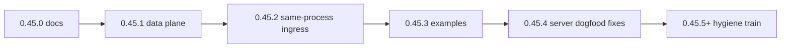

# VISION 0.45 — Reactive data plane

**Status:** 0.45.1–0.45.5 shipped (data plane, internal inbound, watchdog dogfood, runtime-bus + persist fixes, event plane contract)
**Builds on:** [VISION-0.44](VISION-0.44.md) (inbound store, poll, stream, work drain)

## Problem

Inbound → WorkIntent → flow works, but the **data plane** has holes that force workarounds:

| Gap | Forces today | Maturity cost |
|-----|--------------|---------------|
| `flow_command_from_body` drops `metadata` / `state` | Work drain payload lost on submit | Reactive flows look broken while wired |
| No `work.seed_state` | Mandatory inbox `get` in every flow | Wizard-as-ETL becomes “the Palm way” |
| No `append_item` | kv `put` replaces; no ring buffer | Every log/tail invents merge logic |
| Stream inbound needs loopback URL | `PALM_ORIGIN_URL` / WS to self for same-host | Examples bake ceremony; not true dogfood |
| Pipeline has no `put_resource` | Wizard resource steps for persist | Pattern semantics lie |

**Principle:** Engine and ingress contracts first; definitions and migrations **prove** them — never define them.

## Release train

| Version | Scope |
|---------|--------|
| **0.45.0** | This vision + design spec + implementation plan |
| **0.45.1** | Phase A — metadata/state plumbing, `work.seed_state`, `append_item`, `put_resource` |
| **0.45.2** | Phase C — same-process inbound (`mode: internal` on palm resource **or** `on_event` trigger) |
| **0.45.3** | Phase B — system event-watch definitions + coconut pipeline migration slice |
| **0.45.4** | Phase D — watchdog **works on `palm host server`** (runtime event bus, ingress self-skip, `persist_log` batch) |
| **0.45.5** | Event plane contract — [EVENT-PLANE.md](EVENT-PLANE.md), doctor `event_plane`, emit `flow.session.*`, test helpers |
| **0.45.6** | Work-drain ergonomics — `submit_flow` naming, debounce defer-vs-drop, coalesce semantics |
| **0.45.7** | Transform safety — `put_resource` list persist defaults; real-flow integration test |
| **0.45.8** | Ops dogfood — example-root isolation in tests, invoke route docs, durable log guidance |

Phase C before Phase B so the watchdog example does **not** ship on loopback/WS self-connect. **0.45.4** closes Phase B on a real server — internal inbound listens on the **runtime orchestration** bus (`runtime.event`), not the host coordination bus.



## Target flow (post 0.45.4)

```
palm resource (inbound internal/stream)
  → store_resource inbox (audit)
  → WorkIntent
  → drain: seed_state → SubmitFlowCommand.state
  → pipeline: map_fields → append_item → put_resource
  → kv log (analytics.published) → dashboard tile
```

## Phase A contracts (0.45.1)

### Submission plumbing

REST/MCP/work-drain bodies may include:

```json
{
  "flow_name": "my-pipeline",
  "metadata": { "inbound": {}, "source": "stream" },
  "state": { "event": {} }
}
```

`metadata` → job observability. `state` → blackboard seed (coerced to `BlackboardState`).

### `work.seed_state`

```yaml
metadata:
  inbound:
    store_resource: palm-system-event-inbox
    work:
      flow_id: palm-system-watch-event
      seed_state:
        event: inbound.payload
        source: source
```

Paths resolve against WorkIntent payload (dot or `$.` jsonpath). Engine stores resolved map as `_seed_state` on payload; drain strips it into `SubmitFlowCommand.state`.

`store_resource` + inbox remains the durable audit handoff; seed state removes mandatory inbox `get` on the happy path.

### `append_item` transform

```yaml
rule: append_item
options:
  max_items: 50
  unique_field: offset
  prepend: true
```

Appends `source_key` value into list at `target_key` (via `_target_key` from TransformEngine).

### `put_resource` transform

Thin persist leaf for pipelines — invoke resource `put` from blackboard `source_key` (unblocks definition-only watchdog).

## Phase C contracts (0.45.2)

**Preferred:** `metadata.inbound.mode: internal` on palm provider resources — subscribe to the **primary runtime** `EventEngine` in-process (no HTTP/WS loopback). *(0.45.4 — was incorrectly wired to host coordination bus.)*

**Alternative:** `metadata.triggers` `on_event` kind matching `resource.changed`, `job.completed`, `inbound.received`, etc.

Pick one for 0.45.2; document the other as follow-up if both are needed.

## Phase B (0.45.3)

- System pack: `palm-system-events-watch`, inbox, log, pipeline `palm-system-watch-event`, dashboard tile
- Coconut (or one slice): non-interactive wizard-ETL → pipeline

## Phase D (0.45.4) — server dogfood fixes

Shipped after first real `palm host server` run exposed integration gaps (unit tests used the wrong event bus).

| Fix | Where | Why |
|-----|--------|-----|
| Inbound + work-drain triggers on `runtime.event` | `ApplicationHost._runtime_event_engine()` | `job.completed` emits on orchestration bus |
| Ingress skip self `job.completed` | `InboundBindingService` | Pipeline loop guards run too late; prevented watch storm |
| `persist_log` `batch: false` | `event_watch` pipeline | List + `put_resource` defaulted to per-item batch → dict tail |
| `debounce_seconds: 0` on watch | `event_watch` resource | Debounce **drops** in-window signals; bad for tail log |
| Multi-event + runtime-bus tests | `test_system_event_watch_0_45_3.py` | Single-event tests masked persist bug |

Invoke tail: `POST /v1/api/providers/kv/palm-system-event-log/invoke` with `{"action":"get"}`.

## Phase E (0.45.5) — event plane contract

| Deliverable | Where | Why |
|-------------|--------|-----|
| Two-bus documentation | [EVENT-PLANE.md](EVENT-PLANE.md) | Host vs runtime confusion caused silent production failure |
| `event_plane` in doctor | `ApplicationHost.event_plane_status()`, CLI doctor | Ops can verify inbound subscribes to orchestration bus |
| `flow.session.succeeded` / `failed` | `OrchestrationEngine._emit_flow_session_terminal` | Watch `event_types` listed dead config; triggers need `flow_id` |
| Ingress skip for session events | `InboundBindingService` | Same self-flow storm as `job.completed` |
| Test helpers | `tests/helpers/event_plane.py` | Forbid `host.event.emit` in orchestration contract tests |

## 0.45.6+ — hygiene train (code-smell backlog)

| Version | Theme | Targets |
|---------|--------|---------|
| **0.45.5** | **Event plane contract** *(shipped)* | [EVENT-PLANE.md](EVENT-PLANE.md); `event_plane` in doctor/control_plane; `OrchestrationEngine` emits `flow.session.succeeded`/`failed`; ingress skip for session events; `tests.helpers.event_plane` |
| **0.45.6** | **Work-drain / inbound** | Rename work-drain `run_wizard` → `submit_flow`; debounce **defer** (merge payload) vs drop; declarative `inbound.skip_flows` / `skip_self` instead of engine hardcode; coalesce_key vs per-event `coalesce_field` docs |
| **0.45.7** | **Transform safety** | `put_resource` safe default for list persistence (no silent per-item batch); catalog/docs for `TransformLeaf` batch heuristics |
| **0.45.8** | **Ops dogfood** | Test isolation from cwd `examples/definitions`; REST invoke path discoverability; `control_plane` key consistency; server profile guidance for durable event-log storage |

## Non-goals (0.45.x)

- Full system logger / journal-as-resource
- Mesh multi-worker inbound fan-out
- `InboundDefinition` kind
- Replacing inbox audit with seed-only

## References

- [WORK-DRAIN.md](WORK-DRAIN.md)
- [inbound_demo README](../examples/definitions/inbound_demo/README.md)
- Design: [docs/superpowers/specs/2026-07-15-reactive-data-plane-design.md](superpowers/specs/2026-07-15-reactive-data-plane-design.md)
- Plan: [docs/superpowers/plans/2026-07-15-reactive-data-plane-0.45.md](superpowers/plans/2026-07-15-reactive-data-plane-0.45.md)