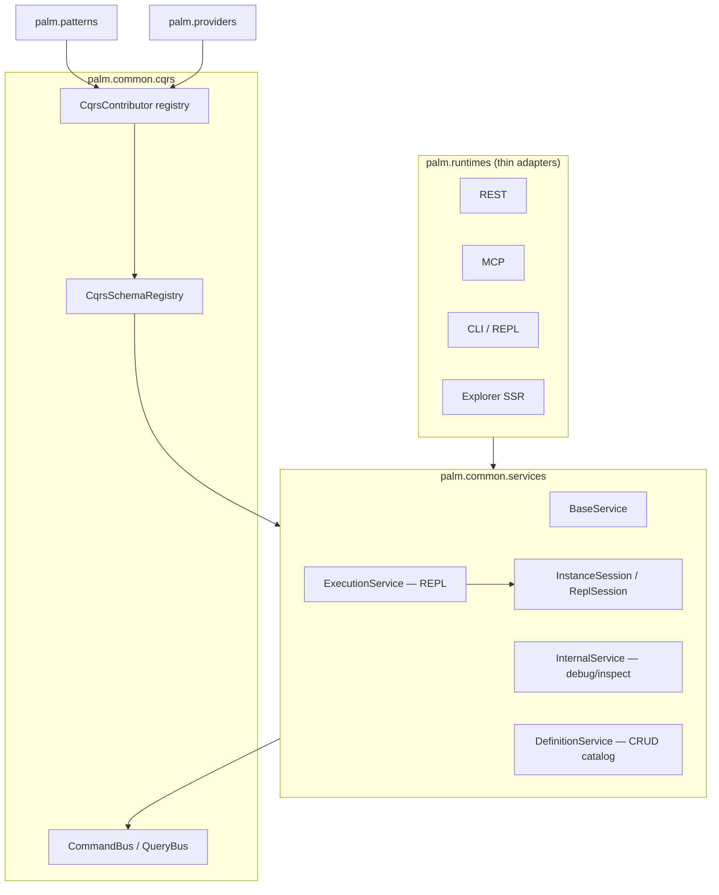

# 0.15 Design: CQRS Schemas + Service Layer

**Status:** Approved  
**Date:** June 30, 2026  
**Version target:** 0.15  
**Theme:** Unify Palm's user-facing API behind a service layer that consumes schema-described CQRS.

---

## Problem

Through 0.14, Palm has mature CQRS (command/query buses, projections, pattern contributors) and multiple runtime surfaces (REST, MCP, CLI, Explorer). Each surface maintains its own contract:

- REST: hand-maintained `DictStateSchema` definitions in `rest/schemas.py`
- MCP: HTTP proxy via `PalmRestClient`, reconstructing JSON bodies
- CLI: mixed direct-runtime and bus paths

Commands and queries are plain dataclasses with no attached metadata. Validation, OpenAPI generation, and MCP tool schemas duplicate CQRS shapes in parallel. There is no user-facing business API — runtimes talk to CQRS handlers or REST routes directly.

This blocks a CQRS-only internal architecture and makes it hard to spot validation errors consistently across surfaces.

---

## Goals

| Goal | Outcome |
|------|---------|
| CQRS schemas | Every command/query carries machine-readable contract metadata |
| Service layer | User-facing business API that composes CQRS (not 1:1 mapping) |
| Instance-centric execution | `execution.on(instance_id)` as primary handle; convenience `run_flow()`; REPL session for CLI |
| Surface unification | REST, MCP, CLI, Explorer become thin adapters over services |
| Internal consolidation | Phase 1 absorbs today's operational surface; discard duplication |
| Extension | Patterns/providers register CQRS + schemas; services discover via registry |

## Non-goals (0.15)

- Pydantic migration for CQRS types
- `ServiceContributor` registry (deferred until a pattern needs business methods beyond instance verbs)
- WebSocket live streaming
- Full Definition CRUD write paths (save/update/delete definitions) — read + validate in 0.15c; writes may follow in 0.16
- Breaking REST URL changes (routes stay stable; handlers thin out)

---

## Architecture



### Dependency rules

- Services live in `palm/common/services/` (coordination layer)
- Services consume `CommandBus`, `QueryBus`, `CqrsSchemaRegistry` — never import runtimes
- Runtimes import services; services never import runtimes
- `palm/core/` unchanged; schemas use existing `DictStateSchema`
- Core purity preserved

### Service layer ≠ CQRS surface

The service layer is Palm's **user-facing business API**. CQRS remains the **internal dispatch mechanism**. A single service method may orchestrate multiple commands and queries, branch on pattern metadata, and return a normalized view.

**Example:** `InternalService.inspect_instance(instance_id)` resolves pattern → dispatches `GetWizardStatusQuery` or `GetJobContextQuery` → returns one `InspectView`. One service method, multiple CQRS operations.

---

## Section 1: CQRS Schemas

### Mechanism

Extend `CqrsContributor` with schema maps alongside existing handler fields:

```python
@dataclass(frozen=True)
class CqrsContributor:
    pattern_name: str
    command_types: tuple[type, ...] = ()
    query_types: tuple[type, ...] = ()
    command_schemas: dict[type[Command], DictStateSchema] = field(default_factory=dict)
    query_schemas: dict[type[Query], DictStateSchema] = field(default_factory=dict)
    handle_command: CommandHandlerFn | None = None
    handle_query: QueryHandlerFn | None = None
```

Core commands/queries in `palm/common/cqrs/` register schemas in `palm/common/cqrs/schemas.py` (or alongside `cqrs_wiring.py`). Patterns register in `PatternApp.ready()` alongside handlers.

### CqrsSchemaRegistry

**Location:** `palm/common/cqrs/schemas.py`

| Method | Purpose |
|--------|---------|
| `register_command(type, schema)` | Bootstrap registration |
| `register_query(type, schema)` | Bootstrap registration |
| `schema_for(type) -> DictStateSchema \| None` | Lookup |
| `validate(instance) -> ValidationResult` | Structured errors before dispatch |
| `all_commands() / all_queries()` | Introspection for OpenAPI/MCP |

Populated at bootstrap from core types + `iter_cqrs_contributors()`.

### Validation flow

```
User payload → Service method → builds Command/Query dataclass
                             → CqrsSchemaRegistry.validate(instance)
                             → CommandBus.dispatch / QueryBus.ask
```

Uses existing `DictStateSchema` from `palm/core/context/state_schema.py`.

### Deletion target (0.15.3)

Hand-maintained duplicates in `src/palm/runtimes/server/surfaces/rest/schemas.py` that mirror CQRS shapes (`WIZARD_INPUT_BODY`, `PROVIDE_INPUT_BODY`, etc.). REST OpenAPI request bodies for command-aligned routes derive from `CqrsSchemaRegistry` via `rest/schema_bridge.py`. HTTP multi-variant bodies (`SUBMIT_WIZARD_BODY`, `VALIDATE_FLOW_BODY`, …) remain REST-local.

**Policy:** Palm is experimental — no deprecation window. Full cleanup track: [0.15 cleanup track spec](2026-06-30-0.15-cleanup-track-design.md) (0.15.0 hygiene → 0.15.2 dedupe → 0.15.3 legacy removal).

---

## Section 2: Service Layer

### Package layout

```
palm/common/services/
├── __init__.py
├── base.py           # BaseService — buses, schema registry, dispatch/ask with validation
├── internal.py       # Phase 1 — absorbs today's operational API
├── definition.py     # Phase 2 — flows, processes, resources, state schemas
├── execution.py      # Phase 2 — instance-centric run/interact
├── session.py        # InstanceSession, ReplSession
├── errors.py         # ServiceValidationError, structured error types
└── views.py          # Normalized read models (InspectView, InstanceView, DoctorReport, ...)
```

### BaseService

```python
class BaseService:
    def __init__(
        self,
        *,
        commands: CommandBus,
        queries: QueryBus,
        schemas: CqrsSchemaRegistry,
    ) -> None: ...

    def dispatch(self, command: Command) -> Any:
        """Validate command against schema, then CommandBus.dispatch."""

    def ask(self, query: Query) -> Any:
        """Validate query against schema, then QueryBus.ask."""
```

Shared infrastructure — not user-facing directly.

### InternalService (Phase 1)

Absorbs everything operational today. Methods are business-shaped:

| Service method | CQRS composed (internal) | Replaces today |
|----------------|--------------------------|----------------|
| `doctor()` | registry + storage introspection | `GET /v1/doctor`, `palm doctor` |
| `list_jobs(status, limit)` | `ListJobStatusQuery` | `GET /v1/jobs` |
| `inspect_job(job_id)` | `GetJobContextQuery` | `GET /v1/jobs/{id}/context` |
| `inspect_instance(instance_id)` | pattern-aware wizard/generic | `GET /v1/wizards/{id}`, MCP inspect |
| `list_instances(...)` | `ListInstancesQuery` | `GET /v1/instances` |
| `instance_tree(instance_id)` | composition queries | `GET /v1/instances/{id}/tree` |
| `list_snapshots(instance_id)` | `ListInstanceSnapshotsQuery` | snapshot routes |
| `get_snapshot(instance_id, snapshot_id)` | `GetInstanceSnapshotQuery` | snapshot routes |
| `cancel_job(job_id)` | `CancelJobCommand` | cancel routes |

Phase 1 temporarily keeps submit/input/resume here; they move to `ExecutionService` in Phase 2d without changing runtime adapter signatures if adapters already call service methods.

### DefinitionService (Phase 2)

User definitions — flows, processes, resources, state schemas:

| Method | CQRS behind it |
|--------|----------------|
| `list_flows(pattern?)` | `ListFlowsQuery` |
| `get_flow(id)` | `GetFlowQuery` |
| `validate_flow(body)` | build-only / validation command |
| `list_processes()` | `ListProcessesQuery` |
| `get_process(id)` | `GetProcessQuery` |
| `list_resources()` | resource catalog query |
| `get_resource(name)` | resource catalog query |

Write paths (save/update/delete definitions) deferred; may need new commands registered by patterns/providers.

### ExecutionService (Phase 2) — instance-centric

**Primary metaphor (B):** instance is the handle.

```python
class ExecutionService(BaseService):
    def on(self, instance_id: str) -> InstanceSession: ...

    # Convenience (A):
    def run_flow(self, flow: str | FlowDefinition, **kwargs) -> InstanceSession: ...
    def run_wizard(self, body: dict, **kwargs) -> InstanceSession: ...
```

```python
class InstanceSession:
    instance_id: str

    def status(self) -> InstanceView: ...
    def input(self, value: Any) -> InstanceView: ...
    def backtrack(self, to_step: str | None = None) -> InstanceView: ...
    def resume(self) -> InstanceSession: ...
    def cancel(self) -> InstanceView: ...
    def resume_child_wait(self) -> InstanceView: ...  # wizard-specific; skip otherwise
```

`InstanceSession` selects CQRS commands based on instance pattern metadata (`wizard` → `ProvideWizardInputCommand`; generic → `ProvideInputCommand`).

**REPL metaphor (C):**

```python
class ReplSession:
    """Stateful handle for CLI REPL — tracks active instance."""
    def activate(self, instance_id: str) -> InstanceSession: ...
    def run(self, flow: str, **kwargs) -> InstanceSession: ...
    @property
    def active(self) -> InstanceSession | None: ...
```

CLI REPL holds `ReplSession`. REST/MCP stay stateless: `execution.on(instance_id)`.

---

## Section 3: Runtimes as Thin Adapters

```
REST handler  →  service.method()  →  CQRS
MCP tool      →  service.method()  →  CQRS   (in-process; REST proxy optional for remote)
CLI command   →  service / ReplSession  →  CQRS
Explorer SSR  →  service.method()  →  CQRS
```

### MCP migration

`PalmRestClient` becomes optional (remote-only mode). In-process MCP calls services on `ServerContext` / `ApplicationHost` directly.

### REST migration

Handlers shrink to: auth → HTTP mapping → `service.method()` → response serialization. OpenAPI from `CqrsSchemaRegistry` + service view types.

### ApplicationHost wiring

```python
host = ApplicationHost(...)
host.start()
session = host.execution.on("inst_abc")
view = session.input("yes")
```

Host gains service properties wired at `_wire_cqrs` time, sharing existing buses.

### ServerContext wiring

`ServerContext` exposes `internal`, `execution`, `definition` services — same pattern as command/query buses today (host-attached vs standalone).

---

## Section 4: Extension (Patterns & Providers)

Patterns and providers continue registering via `CqrsContributor` with schemas added.

Service layer discovers capabilities through:

1. **Schema registry** — validate their commands/queries
2. **Pattern metadata on instance** — `InstanceSession` dispatches pattern-specific commands
3. **Future `ServiceContributor`** — only when a pattern needs business-level methods beyond instance verbs (e.g. `wizard.collection.add_item` composing multiple CQRS ops)

Providers register CQRS for resource catalog/invoke. `DefinitionService` exposes catalog; invoke routing TBD between Internal (operational) and Execution (run-time).

---

## Phased Delivery

| Phase | Ships | Success criteria |
|-------|-------|------------------|
| **0.15a** | `CqrsSchemaRegistry`, schemas on core + wizard CQRS | Validation tests; structured errors; `rest/schemas.py` dedup started |
| **0.15b** | `BaseService` + `InternalService`; REST routes through services | `just check` green; handlers thin |
| **0.15c** | MCP in-process via services; `PalmRestClient` optional | Local MCP no HTTP round-trip |
| **0.15d** | `DefinitionService` extracted | Catalog routes use DefinitionService |
| **0.15e** | `ExecutionService` + `InstanceSession` + `ReplSession` | CLI REPL uses ReplSession; wizard routes instance-centric |
| **0.15f** | Docs: `VISION-0.15.md`, ADR, ARCHITECTURE, AGENTS.md, STATUS.md | Documentation parity |

---

## Testing Strategy

- Unit: `CqrsSchemaRegistry` validation (valid/invalid payloads, error structure)
- Unit: `BaseService.dispatch/ask` rejects invalid commands before bus
- Unit: `InternalService` methods mock buses; assert correct CQRS composition
- Unit: `InstanceSession` pattern branching (wizard vs generic)
- Integration: REST handler → InternalService → CQRS (existing route tests adapted)
- Integration: MCP tool in-process path (no REST mock)
- Regression: `just check`, existing CQRS phase tests, wizard/MCP tests

---

## Documentation Updates (0.15f)

- `docs/VISION-0.15.md` — release vision
- `docs/adr/004-cqrs-schemas-service-layer.md` — ADR
- `ARCHITECTURE.md` — service layer section
- `AGENTS.md` — extension table entry for services + CQRS schemas
- `STATUS.md` — 0.15 tracking
- `docs/MCP.md` — in-process service path
- `docs/llms.txt` — agent guide update

---

## Open Questions (resolved)

| Question | Decision |
|----------|----------|
| CQRS schema format | Extend `CqrsContributor` + `CqrsSchemaRegistry` (not Pydantic) |
| Service vs CQRS mapping | Many-to-many; services compose CQRS |
| Execution entry metaphor | B primary (instance-centric), A convenience, C REPL session |
| Phase 1 scope | InternalService absorbs today; carve Definition/Execution later |
| Service package location | `palm/common/services/` |

---

## References

- `src/palm/common/cqrs/` — buses, commands, queries, projections
- `src/palm/app/host/cqrs_wiring.py` — host handler wiring
- `src/palm/common/runtimes/server/context.py` — ServerContext
- `src/palm/patterns/_registry.py` — CqrsContributor
- `src/palm/runtimes/server/surfaces/rest/schemas.py` — duplication target
- `src/palm/runtimes/mcp/rest_client.py` — HTTP proxy to replace in-process