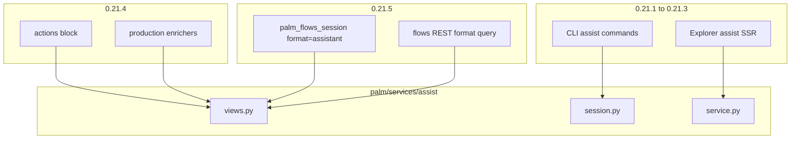

# Assistant Expansion — Human Surfaces & Envelope Depth

**Status:** Approved (July 1, 2026)  
**Version target:** 0.21.0 (spec) · 0.21.1–0.21.6 (implementation)  
**Builds on:** [0.20.5 shipped](../../MIGRATION-0.20.md) · [Assistant vs Powertool views](2026-07-01-assistant-powertool-views-design.md)  
**Vision:** [docs/VISION-0.18-ASSIST.md](../../VISION-0.18-ASSIST.md)

---

## Problem

0.20 shipped the **assistant envelope** on assist REST/MCP surfaces (`question`, numbered `choices`, `hint`, `compose`). The API is stable; **human-native surfaces do not consume it**.

| Surface | Today | Gap |
|---------|-------|-----|
| **CLI REPL** | Custom Rich panels from [`JobContext`](../../../src/palm/runtimes/cli/shared/job_inspect.py) in [`display.py`](../../../src/palm/runtimes/cli/tui/display.py) | No `host.assist` commands; duplicated humanize rules; `flow start palm-operator-entry` bypasses assist service |
| **Explorer** | Wizard workspace via flows CQRS at `/explorer/instances/{id}` | No `/explorer/assist/*`; operator-entry via flows submit shows powertool prompt shape |
| **Assistant envelope** | `next_commands` computed in [`schemas.py`](../../../src/palm/services/assist/schemas.py) but stripped from assistant output | No `actions` block for progressive agent disclosure (deferred from 0.20 spec) |
| **Flows inspect** | Powertool-only on `palm_flows_session` and flows REST | Humans who skip assist handoff cannot opt into assistant view |

Agents using MCP already get assistant turns. **Operators using Palm's own CLI and Explorer cannot.**

---

## Goal

Make the 0.20 assistant envelope the **default human experience** in CLI and Explorer, then deepen the envelope and add opt-in flows assistant views.

| Phase | Deliverable | Audience |
|-------|-------------|----------|
| **0.21.1** | CLI `assist *` commands + `render_assistant_panel` | Terminal operators |
| **0.21.2–0.21.3** | Explorer assist catalog + HTMX session workspace | Browser operators |
| **0.21.4** | `actions` block + production enrichers | Conversational agents |
| **0.21.5** | `format=assistant` opt-in on flows REST/MCP | Humans on business sessions |
| **0.21.6** | `MIGRATION-0.21.md`, docs, verification | Integrators |

**Ordering:** surfaces first (0.21.1–0.21.3), envelope depth (0.21.4), flows opt-in (0.21.5).

---

## Principles

1. **Single source of humanize** — CLI and Explorer call [`build_assistant_view`](../../../src/palm/services/assist/views.py) via `AssistSession.context()` or `ctx.assist.dispatch(..., format="assistant")`. No copy of `_humanize_*` in runtimes.
2. **Common stays small** — no new humanize logic in `palm/common/`; `just guard-common` must pass every release.
3. **Powertool defaults unchanged** — `palm_flows_*` and flows REST default to powertool; `format=assistant` is opt-in only.
4. **Reuse Explorer patterns** — assist SSR mirrors wizard HTMX contract ([EXPLORER-WIZARD.md](../../../EXPLORER-WIZARD.md)); new `#assist-workspace` target, same loading/disable overlay pattern.
5. **Assist routes for assist UI** — Explorer assist pages dispatch through `ctx.assist`, not flows CQRS.
6. **Core purity unchanged** — view shaping remains service/runtime concern.

---

## Architecture

```
Humans (CLI REPL, Explorer SSR)
        ↓
palm/runtimes/cli/          assist commands → host.assist
palm/runtimes/server/ssr/   AssistFetcher → ctx.assist.dispatch(format=assistant)
        ↓
palm/services/assist/
  session.py / service.py   AssistSession.context(view_format="assistant")
  views.py                  build_assistant_view (+ actions in 0.21.4)
  registry.py               enrichers, contributors
        ↓
palm/common/operator/
  view_registry.py          format dispatch (unchanged)
  compose_status.py         compositional merge (unchanged)
```



---

## 0.21.1 — CLI REPL assistant rendering

### Command grammar

Registered in [`commands/registry.py`](../../../src/palm/runtimes/cli/commands/registry.py) via new [`commands/assist.py`](../../../src/palm/runtimes/cli/commands/assist.py).

| Phrase | Args | Service call | Output |
|--------|------|--------------|--------|
| `assist list` | — | `dispatch(["assist","scenarios"])` | Rich table of scenario ids |
| `assist start` | `<scenario_id>` | `start_scenario(scenario_id)` | First assistant turn + panel |
| `assist input` | `<value>` | `session(active_id).input(value)` | Updated turn + panel |
| `assist handoff` | — | `handoff(active_id)` | Handoff payload + next-step hint |
| `assist status` | `[--format assistant\|powertool\|verbose]` | `session(active_id).context()` | Panel or field table |
| `assist cancel` | — | `session(active_id).cancel()` | Terminal status |

**Active session:** extend [`CliContext`](../../../src/palm/runtimes/cli/shared/context.py) with `active_assist_session_id: str | None`. On `assist start`, set it; clear on cancel or explicit `flow`/`instance` switch.

**REPL prompt** ([`tui/prompt.py`](../../../src/palm/runtimes/cli/tui/prompt.py)): when assist session active, suffix `assist:{scenario_id}` instead of `flow:step`.

**Plain input in REPL:** when `active_assist_session_id` is set and user types a line that does not match a registered command phrase, treat as `assist input <line>` (mirror wizard REPL coercion).

### Rendering

New `render_assistant_panel(console, view: dict)` in [`tui/display.py`](../../../src/palm/runtimes/cli/tui/display.py):

| Assistant field | CLI rendering |
|-----------------|---------------|
| `question` | Bold primary text |
| `choices[{n,label,value}]` | Numbered list with human labels |
| `hint` | Dim footer line |
| `handoff_ready` | Yellow CTA: "Ready to hand off — run `assist handoff`" |
| `compose.active_child` | Child-wait block with child `instance_id` |
| `validation_error` | Red error line |
| `status` | Badge in panel title (`waiting`, `complete`, …) |

**Integration (normative):**

```python
handle = ctx.host.assist.session(instance_id)
view = handle.context(view_format="assistant").to_dict(view_format="assistant")
render_assistant_panel(ctx.console, view)
```

**Non-assist flows:** keep existing `render_job_panel()` + `inspect_job()` path unchanged.

### Welcome banner

Update [`tui/repl.py`](../../../src/palm/runtimes/cli/tui/repl.py) to mention `assist start operator-entry` as recommended entry (per VISION-0.18). Do not remove flow commands.

### Tests

`tests/test_cli_assist.py`:

- `assist start operator-entry` → response contains `question`, not `operator_hint`
- input loop advances choices
- `assist handoff` after terminal step returns `handoff.kind`

---

## 0.21.2 — Explorer assist catalog + workspace

### Routes

Add to [`ssr/routes.py`](../../../src/palm/runtimes/server/surfaces/ssr/routes.py):

| Method | Path | Handler |
|--------|------|---------|
| `GET` | `/explorer/assist` | Scenario catalog |
| `GET` | `/explorer/assist/scenarios/{scenario_id}` | Scenario detail + start form |
| `POST` | `/explorer/assist/scenarios/{scenario_id}/start` | Start session → redirect |
| `GET` | `/explorer/assist/session/{session_id}` | Assistant workspace |

New module: `ssr/explorer/pages/assist.py` (`AssistPages`).

### Data layer

`AssistFetcher` methods on [`fetch.py`](../../../src/palm/runtimes/server/surfaces/ssr/explorer/fetch.py) (or dedicated `assist_fetch.py`):

```python
ctx.assist.dispatch(["assist", "scenarios"], format="assistant")
ctx.assist.dispatch(["assist", "scenarios", scenario_id, "start"], body, format="assistant")
ctx.assist.dispatch(["assist", "session", session_id], format="assistant")
```

Do **not** use `GetWizardStatusQuery` for assist sessions.

### Components

New `assist_workspace(view: dict)` in [`components.py`](../../../src/palm/runtimes/server/surfaces/ssr/explorer/components.py):

| Region | Content |
|--------|---------|
| Header | `scenario_id`, `status` badge, `session_id` |
| Prompt card | `question` + choice button grid from `choices` |
| Hint | `hint` below prompt |
| Sidebar | Slim `compose` (step, `active_child` link to `/explorer/instances/{child_id}`) |
| Refs | Collapsible `refs` (job_id, flow_id) |

HTMX target id: **`#assist-workspace`** (outerHTML swap on partial updates).

Reuse [`layout.py`](../../../src/palm/runtimes/server/surfaces/ssr/explorer/layout.py) `_WIZARD_EXPLORER_CSS`; add `.assist-workspace` only where wizard classes do not fit.

### Navigation

- Add **Assist** to `_EXPLORER_NAV` in `layout.py`
- Overview `link_card` on `/explorer` pointing to `/explorer/assist`

---

## 0.21.3 — Explorer HTMX verbs + handoff

### POST handlers

Add to [`actions.py`](../../../src/palm/runtimes/server/surfaces/ssr/explorer/actions.py):

| POST path | Dispatches to | Response |
|-----------|---------------|----------|
| `/explorer/assist/session/{id}/input` | `assist/session/{id}/input` | Re-render `assist_workspace` |
| `/explorer/assist/session/{id}/backtrack` | `assist/session/{id}/backtrack` | Re-render workspace |
| `/explorer/assist/session/{id}/cancel` | `assist/session/{id}/cancel` | Redirect to catalog |
| `/explorer/assist/session/{id}/handoff` | `assist/session/{id}/handoff` | Handoff result card |

Mirror `_wizard_action_response()`:

- HTMX request → partial HTML (`assist_workspace`)
- Non-HTMX → redirect to session page or flows submit

### Forms

In [`forms.py`](../../../src/palm/runtimes/server/surfaces/ssr/explorer/forms.py):

- `assist_input_form()` — text input + choice buttons
- `_assist_htmx_attrs()` — `hx-target="#assist-workspace"`, `hx-swap="outerHTML"`, `#assist-loading` overlay
- `assist_handoff_button()` — shown when `handoff_ready: true`

**Handoff success UX:** render card with target `flow_id`; CTA links to `/explorer/flows/submit?flow_id={flow_id}` or direct flows create when handoff returns `kind: "flow"`.

### Auth

REST assist start/input/backtrack/resume/cancel require auth ([`rest/assist/handlers.py`](../../../src/palm/runtimes/server/surfaces/rest/assist/handlers.py)). Explorer POST handlers must use the same `require_auth` gate as wizard actions.

### Tests

`tests/test_explorer_assist_ssr.py`:

- `GET /explorer/assist` returns scenario list
- `POST …/start` redirects to session workspace
- HTMX input partial contains updated `question`

---

## 0.21.4 — Assistant envelope depth

### `actions` block

Extend [`views.py`](../../../src/palm/services/assist/views.py) `_humanize_assistant_view` (or post-step) to map `next_commands` into:

```json
{
  "actions": [
    {
      "label": "Send answer",
      "path": ["assist", "session", "inst-…", "input"]
    },
    {
      "label": "Hand off to business flow",
      "alias": "operator-entry/handoff",
      "params": {"session_id": "inst-…"}
    },
    {
      "label": "Open child session",
      "path": ["flows", "session", "inst-child"]
    }
  ]
}
```

| Rule | Detail |
|------|--------|
| Inclusion | `format=assistant` only; omitted from powertool |
| Source | `AssistSessionContext.next_commands` + contributor `mcp_aliases` |
| Labels | Human-readable; no raw MCP tool names in `label` |
| Child-wait | Action pointing at child flows session when `compose.active_child` set |
| Handoff-ready | Action for handoff alias when `handoff_ready: true` |

### Production enrichers

Extend `AssistContributor` in [`registry.py`](../../../src/palm/services/assist/registry.py):

```python
@dataclass(frozen=True)
class AssistContributor:
    ...
    assistant_enricher: Callable[[dict, *, context: OperatorViewContext], dict] | None = None
```

`register_assist_contributor()` auto-registers enricher when provided.

**Ship enricher** in [`examples/definitions/operator_entry.py`](../../../examples/definitions/operator_entry.py):

```python
def enrich_operator_entry(view, *, context):
    if view.get("handoff_ready"):
        view["hint"] = (view.get("hint") or "") + " Say handoff to start your flow."
    return view
```

### REST parity

Add `GET /v1/api/assist/catalog/flows` — wire existing `assist/catalog/flows` command from [`registry.py`](../../../src/palm/services/assist/registry.py) (service method already exists).

---

## 0.21.5 — Flows `format=assistant` (opt-in)

**Policy:** Default unchanged. Powertool remains default on `palm_flows_session`, `palm_flows_session_input` responses, and flows REST session inspect.

### MCP

[`runtimes/mcp/flows/tools.py`](../../../src/palm/runtimes/mcp/flows/tools.py):

- `palm_flows_session(..., format: str = "powertool")` — accept `assistant`, `powertool`, `verbose`
- `compact` alias → `powertool` with deprecation note in docs
- When `assistant`: flatten session view → `build_operator_view("assistant", flat_view=…, context=OperatorViewContext(scenario_id=None, invoke_tree=…))`

Invoke tree for compose: reuse `AssistService.invoke_tree` pattern or flows equivalent already used in compose_status tools.

### REST

Add `?format=assistant|powertool|verbose` to flows session GET routes (same `resolve_view_format` as assist).

### Semantics

| Context | `scenario_id` in `OperatorViewContext` | Enricher |
|---------|--------------------------------------|----------|
| Assist session | Set from flow metadata | Per-scenario enricher runs |
| Flow session (opt-in) | `None` | Generic humanize only |

---

## 0.21.6 — Migration & docs

Document in `MIGRATION-0.21.md`:

| Topic | Guidance |
|-------|----------|
| CLI entry | `assist start operator-entry` replaces `flow start palm-operator-entry` for guided UX |
| Explorer entry | `/explorer/assist` instead of flows submit for operator-entry |
| `actions` field | New on assistant turns; agents may use instead of parsing `hint` |
| Flows opt-in | `palm_flows_session(format="assistant")` for human labels on business sessions |

Update: `docs/MCP.md`, `docs/llms.txt`, `AGENTS.md`, `STATUS.md`, `CHANGELOG.md`, MCP data `llms.txt` copy.

---

## Release roadmap

| Release | Deliverable | Verification |
|---------|-------------|--------------|
| **0.21.0** | This spec | Review + STATUS update |
| **0.21.1** | CLI assist commands + `render_assistant_panel` | `tests/test_cli_assist.py` |
| **0.21.2** | Explorer catalog + `assist_workspace` | `tests/test_explorer_assist_ssr.py` (catalog) |
| **0.21.3** | Explorer HTMX + handoff CTA + nav | SSR HTMX tests |
| **0.21.4** | `actions` block + enrichers + REST catalog/flows | `tests/test_assistant_view.py` |
| **0.21.5** | Flows `format=assistant` opt-in | `tests/test_flows_assistant_format.py` |
| **0.21.6** | `MIGRATION-0.21.md`, docs, full pass | `just guard-common`, `just docs-check` |

### Final verify command

```bash
uv run pytest tests/test_cli_assist.py tests/test_explorer_assist_ssr.py \
  tests/test_assistant_view.py tests/test_assist_service.py \
  tests/test_flows_assistant_format.py -v
just docs-check
just guard-common
```

---

## Deferred to 0.22+

| Item | Rationale |
|------|-----------|
| `palm-compose-guide` scenario | Larger definition + resource wiring |
| `kind: process` handoff | Needs process entry contract review |
| `create_params` from assist answers | Requires `metadata.assist.create_params_map` schema |
| WebSocket live assist stream | Separate transport work |
| `format=explorer` view builder | SSR renders assistant JSON directly in 0.21 |
| Pattern-owned assistant enrichers | Bridge `register_session_enricher` → humanize |

---

## Testing strategy

| Layer | Tests |
|-------|-------|
| CLI | Start → input → handoff; panel fields; active session tracking |
| Explorer SSR | Catalog, start redirect, HTMX input partial, handoff CTA visibility |
| Actions | Mapped from `next_commands`; handoff + child-wait actions |
| Enrichers | `operator-entry` handoff CTA on summary |
| Flows format | Assistant opt-in returns `question`; powertool default regression |
| Guard | `just guard-common` — no assist humanize in common |

---

## Success criteria

1. `assist start operator-entry` in CLI shows `question` + numbered `choices` without a follow-up inspect.
2. `/explorer/assist` provides start → input → handoff loop with assistant UX.
3. `handoff_ready` surfaces a clear CTA in CLI and Explorer.
4. `actions` block present on assistant turns where commands exist.
5. `palm_flows_session(format="assistant")` works; powertool default unchanged.
6. `just guard-common` passes — no assistant humanize logic in `palm/common/`.

---

## Related documents

- [Assistant vs Powertool views (0.20)](2026-07-01-assistant-powertool-views-design.md)
- [Assist domain design](2026-07-01-assist-domain-design.md)
- [MIGRATION-0.20.md](../../MIGRATION-0.20.md)
- [EXPLORER-WIZARD.md](../../../EXPLORER-WIZARD.md)
- [docs/MCP.md](../../MCP.md)
- [STATUS.md](../../STATUS.md)