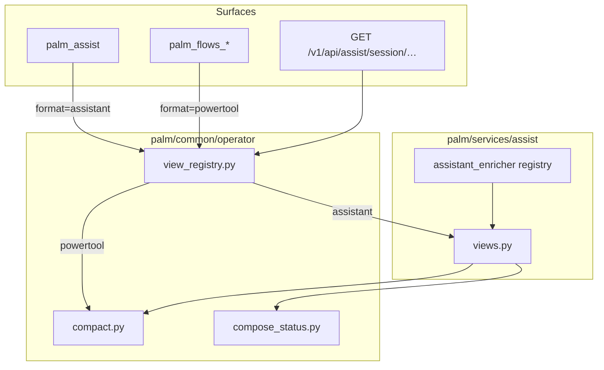

# Assistant vs Powertool Operator Views

**Status:** Approved (July 1, 2026)  
**Version target:** 0.20.0 (spec) · 0.20.1–0.20.5 (implementation) · 0.21 (deferred surfaces)  
**Builds on:** [0.19.0 shipped](../../MIGRATION-0.19.md) · [Assist domain](2026-07-01-assist-domain-design.md)  
**Vision:** [docs/VISION-0.18-ASSIST.md](../../VISION-0.18-ASSIST.md)

---

## Problem

0.19 shipped `palm_assist` with **powertool-shaped** responses. A live assist inspect today looks like:

```json
{
  "path": ["assist", "session", "inst-…"],
  "instance_id": "inst-…",
  "step": "intent",
  "step_kind": "input",
  "field_type": "choice",
  "next_actions": ["resume_child_wait", "session_input", …],
  "operator_hint": "palm_flows_session_input(input=choice slug or number)",
  "choices": ["todo-builder", "compositional-parent", "inspect-only"]
}
```

That shape is correct for **coding agents** driving `palm_flows_*` — it was designed in [`compact_wizard_inspect`](../../../src/palm/common/operator/compact.py) for MCP automation. It is wrong for **Assist's stated purpose**: conversational, human-first operator guidance.

Two problems got conflated:

| Concept | Built for | Used by Assist today |
|---------|-----------|----------------------|
| **Powertool** | Agent snapshots — ids, step kinds, MCP tool hints | Yes (default) |
| **Assistant** | Human turns — question, numbered choices, plain hint | No |

Additionally, `start_scenario` returns ids only; the user must inspect again to see the first question. Assist feels like a powertool wrapper, not an assistant.

0.19.1 fixed **plumbing** (in-process `SessionContext` dataclasses now compact). This spec fixes **product shape**.

---

## Goal

Explicit two-mode operator read model:

| Mode | Audience | Default on | Shape |
|------|----------|------------|-------|
| **Assistant** | Humans, conversational agents | `assist/*`, `palm_assist`, REST assist session | Composed + humanized turn |
| **Powertool** | Coding agents, automation | `palm_flows_*`, `palm_system_*`, flows/system dispatch | Today's compact snapshot |

**Assistant default is compose** — merge invoke context + wizard snapshot via [`build_compose_status`](../../../src/palm/common/operator/compose_status.py), then humanize for readability.

**Powertool is unchanged** — same fields, semantics, and defaults on per-domain MCP tools.

---

## Principles

1. **Common stays small** — registry dispatch + powertool only; no assistant humanize logic in `palm/common/`.
2. **Registry at edges** — assistant builder registers from assist bootstrap; scenario enrichers register in `assist/registry.py` (same pattern as [`register_session_enricher`](../../../src/palm/patterns/_registry.py)).
3. **Progressive disclosure** — assistant hides transport; powertool exposes it; `verbose` is debug-only.
4. **No breaking powertool defaults** — `palm_flows_session` keeps powertool; `compact` alias deprecated one release.
5. **Core purity unchanged** — view shaping is service/runtime concern, not core.

---

## Architecture

```
Surfaces (MCP, REST, CLI, Explorer)
        ↓
palm/runtimes/…           format param → build_operator_view(format, …)
        ↓
palm/common/operator/
  view_registry.py        thin dispatch only (NEW)
  compact.py              powertool builders (existing)
  compose_status.py       compositional merge (existing)
        ↓
palm/services/assist/
  views.py                  build_assistant_view (NEW)
  registry.py               register_assistant_enricher (extend)
  session.py / service.py   assistant default responses
```



---

## View formats

| Format | Alias | Returns | Default on |
|--------|-------|---------|------------|
| `assistant` | — | Humanized composed turn | assist surfaces |
| `powertool` | `compact` (deprecated) | Agent snapshot | flows, system MCP |
| `verbose` | — | Full flat inspect dict | Opt-in debug |

Unknown format → `ValueError` with allowed list.

---

## Common layer: view registry

**File:** `palm/common/operator/view_registry.py` (~60 lines)

### `OperatorViewContext`

Dataclass passed to all builders:

| Field | Purpose |
|-------|---------|
| `session_id` | Durable instance handle |
| `flow_id` | Flow catalog id |
| `scenario_id` | Assist scenario, when known |
| `invoke_tree` | Pre-fetched tree (optional; assistant may fetch) |
| `path` | Dispatch path echo (powertool only; omitted from assistant default) |

### API

```python
def register_operator_view_builder(format: str, fn: ViewBuilderFn) -> None: ...
def build_operator_view(
    format: str,
    *,
    flat_view: dict[str, Any],
    context: OperatorViewContext,
) -> dict[str, Any]: ...
```

- Thread-safe `threading.RLock` (same as other Palm registries).
- **Powertool** registered at common import/bootstrap.
- **Assistant** registered in `AssistApp.ready()` — never defined in common.

### `just guard-common`

Must pass after every 0.20.x release. No imports from `palm/services/assist/` inside `palm/common/`.

---

## Assist layer: assistant view

**File:** `palm/services/assist/views.py`

### Pipeline

1. **Flatten** — reuse `flatten_session_view` from MCP flows helpers (detail merged).
2. **Internal powertool** — `compact_wizard_inspect(flat, include_operator_hint=False)`.
3. **Compose always** — for inspectable sessions:
   - Build or reuse invoke tree (`AssistService.invoke_tree`)
   - `build_compose_status(tree, snapshot)`
4. **Humanize** — map compose output to assistant envelope (below).
5. **Enrich** — `register_assistant_enricher(scenario_id, fn)` post-process.

### Humanize rules

| Powertool field | Assistant field | Rule |
|-----------------|-----------------|------|
| `prompt` / `prompt_title` | `question` | Primary prompt text |
| `choices` (string list) | `choices` | `[{n, label, value}]` numbered from 1 |
| `operator_hint` | `hint` | Plain language; no MCP tool names |
| `status` (`WAITING_FOR_INPUT`) | `status` | `waiting` \| `running` \| `complete` \| `failed` |
| `instance_id`, `job_id`, `flow` | `refs` | Secondary bucket |
| `compose_status` fields | `compose` | Slim: `step`, `focus`, `active_child`, `ancestors` count |
| `path` | — | Dropped from assistant default |
| `step_kind`, `field_type` | — | Dropped from assistant default |
| `next_actions` | — | Dropped; optional `actions` block in 0.21 for agents |

### Assistant envelope (normative)

```json
{
  "session_id": "inst-…",
  "scenario_id": "operator-entry",
  "status": "waiting",
  "question": "What would you like to do with Palm?",
  "choices": [
    {"n": 1, "label": "Build a todo flow", "value": "todo-builder"},
    {"n": 2, "label": "Compositional parent demo", "value": "compositional-parent"},
    {"n": 3, "label": "Inspect only", "value": "inspect-only"}
  ],
  "hint": "Reply with a number or choice name.",
  "handoff_ready": false,
  "compose": {
    "step": "intent",
    "focus": null,
    "active_child": null
  },
  "refs": {
    "job_id": "job-…",
    "flow_id": "flow-palm-operator-entry"
  }
}
```

### Collection phases

| Phase | `question` | `hint` |
|-------|------------|--------|
| `menu` | Collection menu title | "Say add, edit, remove, or done" |
| `field` | Field prompt | "Enter text for this item" |
| `select_item` | "Which item?" | "Reply with item number or label" |
| `remove_confirm` | Confirm remove | "Reply yes or no" |

### Child-wait

When `waiting_for_child`:

```json
{
  "status": "waiting",
  "question": "Waiting for nested flow to finish.",
  "hint": "Continue the child session, then resume here.",
  "compose": {
    "active_child": {"instance_id": "inst-child", "status": "waiting"}
  }
}
```

### Handoff-ready

When `handoff_ready: true`, append to `hint`: "Ready to hand off — call assist session handoff or choose continue."

---

## Powertool layer (unchanged)

[`compact_wizard_inspect`](../../../src/palm/common/operator/compact.py) and [`compact_job_inspect`](../../../src/palm/common/operator/compact.py) remain the powertool implementation.

Powertool response (reference — no field removals):

```json
{
  "instance_id": "inst-…",
  "job_id": "job-…",
  "flow": "palm-operator-entry",
  "status": "WAITING_FOR_INPUT",
  "step": "intent",
  "step_kind": "input",
  "field_type": "choice",
  "prompt": "What would you like to do with Palm?",
  "choices": ["todo-builder", "…"],
  "operator_hint": "palm_flows_session_input(input=choice slug or number)",
  "next_actions": ["session_input", "request_backtrack"]
}
```

Registered as format `powertool` in view registry. Alias `compact` accepted with deprecation log in docs.

---

## Assist service changes

### `start_scenario`

**Before:** ids-only submission view.

**After:** returns **first assistant turn** (question + choices + `session_id`). Powertool via `format=powertool` query param on REST or `params.format` on MCP.

### `AssistSession.context()` / session verbs

**Before:** `AssistSessionContext.to_dict()` includes full `detail` blob; MCP merges compact fields ad hoc.

**After:** default `view_format=assistant`; `to_dict()` returns assistant envelope. Internal `detail` available only on `verbose`.

### REST

`GET /v1/api/assist/session/{id}?format=assistant` (default)  
`GET /v1/api/assist/session/{id}?format=powertool`  
`GET /v1/api/assist/session/{id}?format=verbose`

Same for `POST …/input` response body.

---

## MCP changes

### `palm_assist`

```python
def palm_assist(
    path: list[str] | None = None,
    alias: str | None = None,
    params: dict | None = None,
    format: str = "assistant",  # NEW default
) -> dict: ...
```

| Dispatch prefix | Default format |
|-----------------|----------------|
| `assist` | `assistant` |
| `flows`, `system`, `definitions`, `processes`, `providers` | `powertool` |

`shape_dispatch_result` (rename from `compact_dispatch_result`) accepts `format` and delegates to `build_operator_view`.

### Per-domain tools

`palm_flows_session`, `palm_system_inspect_job`, etc. — default `format=powertool`; accept `compact` alias.

---

## Extension registry

| Hook | Location | Registers |
|------|----------|-----------|
| `register_operator_view_builder` | `common/operator/view_registry.py` | New view formats (e.g. `explorer` in 0.21) |
| `register_assistant_enricher` | `services/assist/registry.py` | Per-scenario post-humanize |
| `register_session_enricher` | `patterns/_registry.py` | Pattern fields on flat view (unchanged) |
| `AssistContributor` | `services/assist/registry.py` | Optional `assistant_enricher` callable on contributor dataclass (0.20.2) |

Example enricher — `operator-entry` adds handoff CTA on summary step:

```python
def enrich_operator_entry(view: dict, *, context: OperatorViewContext) -> dict:
    if view.get("handoff_ready"):
        view["hint"] = view.get("hint", "") + " Say handoff to start your flow."
    return view
```

---

## Release roadmap

| Release | Deliverable | Verification |
|---------|-------------|--------------|
| **0.20.0** | This spec | Review + STATUS update |
| **0.20.1** | `view_registry.py`; powertool registration | Unit tests for registry dispatch |
| **0.20.2** | `assist/views.py`; enricher registry; bootstrap wire | `test_assistant_view.py` humanize cases |
| **0.20.3** | Assist session/service defaults; start returns first turn | `test_assist_service.py`, REST tests |
| **0.20.4** | `palm_assist` format default; dispatch shaping | `test_palm_assist_tool.py` assistant shape |
| **0.20.5** | `MIGRATION-0.20.md`; MCP/llms/AGENTS; full test pass | `just guard-common`, `just docs-check` |

### 0.21 — Deferred

| Item | Rationale |
|------|-----------|
| CLI REPL renders assistant turns | Needs TUI layer; API stable first |
| Explorer assist panel | SSR consumer of assistant envelope |
| `format=assistant` on flows REST/MCP | Humans use assist handoff; flows stay powertool |
| `actions` block in assistant (command paths for agents) | Optional progressive disclosure |
| Pattern-owned assistant enrichers | Beyond assist scenario registry |

---

## Migration

Document in `MIGRATION-0.20.md` at 0.20.5.

| Surface | Before (0.19) | After (0.20) |
|---------|---------------|--------------|
| `palm_assist` inspect | Powertool compact | **Assistant** default |
| `palm_assist` + `format=powertool` | N/A | Opt-in to 0.19 shape |
| `palm_flows_session` | `format=compact` | `format=powertool` (`compact` alias) |
| REST assist GET | Mixed detail + compact fields | Assistant envelope |
| `operator_hint` on assist | Always present | Powertool only |
| `start_scenario` body | ids only | First assistant turn |

**Agent integrators:** if you parsed `step_kind` / `operator_hint` from `palm_assist`, switch to `format=powertool` or read `question` / `choices` / `hint`.

---

## Testing strategy

| Layer | Tests |
|-------|-------|
| Registry | Unknown format raises; powertool round-trip |
| Humanize | Choice numbering, status mapping, collection phases, child-wait |
| Compose-always | Assistant includes `compose` even for simple wizard steps |
| Start scenario | First turn includes `question`, not bare ids |
| MCP | `palm_assist` default assistant; `format=powertool` matches 0.19 |
| Guard | `just guard-common` — no assist imports in common |

---

## Success criteria

1. `palm_assist` default response has `question` and numbered `choices`, not `operator_hint`.
2. `start_scenario` returns first turn without a follow-up inspect.
3. `palm_flows_session` default unchanged (powertool).
4. `palm/common/operator/` gains only `view_registry.py` — no humanize logic.
5. Assistant builder registered from assist bootstrap, not common.
6. All 0.20.x releases pass `just guard-common`.

---

## Related documents

- [Assist domain design](2026-07-01-assist-domain-design.md)
- [ADR-006 Assist domain](../../adr/006-assist-domain.md)
- [docs/MCP.md](../../MCP.md) — updated at 0.20.5
- [STATUS.md](../../STATUS.md) — release map 0.20.0–0.20.5