```mermaid
flowchart LR
    subgraph hotfix [0.21.7]
        Boot[MCP boot fix]
        Null[null param coercion]
        Default[bare palm_assist default]
    end

    subgraph collection [0.21.8]
        OneShot[add + value one-shot]
        Errors[actionable errors]
    end

    subgraph assistant [0.21.9]
        Mutations[format on session_input]
        Actions[collection actions block]
    end

    subgraph unify [0.21.10]
        AssistFlows[palm_assist flows paths]
    end

    subgraph shortcuts [0.21.11]
        Edit[compound edit shortcut]
        Fuzzy[fuzzy menu labels]
    end

    subgraph verify [0.21.12]
        Replay[conversation replay harness]
        Docs[MIGRATION addendum]
    end

    hotfix --> collection --> assistant --> unify --> shortcuts --> verify
```

# Assistant Weak-LLM & MCP Ergonomics

**Status:** Approved (July 1, 2026)  
**Version target:** 0.21.7–0.21.12 (micro-releases)  
**Builds on:** [0.21.6 shipped](../../MIGRATION-0.21.md) · [Assistant expansion](2026-07-01-assistant-expansion-design.md)  
**Evidence:** [Conversation replay](../../conversations/019f1e9c-43b6-76d1-92dd-54b56ca73ee5/) — `grok-composer-2.5-fast` via Palm MCP HTTP

---

## Problem

0.21.6 shipped human surfaces and opt-in `format=assistant` on flows **inspect**. Live agent sessions with weaker models still hit friction:

| Friction | Session `019f1e9c` | Root cause |
|----------|-------------------|------------|
| **MCP boot failure** | Pre-0.21.7 | REST handlers imported `palm.runtimes.mcp` (`shape_flow_session_view` circular import) |
| **Null tool params** | Llama clients send `action: null`, `format: null` | Strict MCP schema validation |
| **Bare `palm_assist()`** | Agent must know `operator-entry/start` | No human-first default |
| **Collection one-shot** | `palm_wizard_collection_action(action=add, value="Test Palm")` **failed** | Menu-phase `add` rejects `value`; agent must chain 2+ inputs |
| **Powertool on mutations** | `palm_flows_session_input` returns compact, not assistant | Only **GET** session supports `format=assistant` |
| **Tool sprawl** | Agent read 27 JSON schemas before driving todo-builder | Weak models over-fetch; no progressive `palm_assist` path for flows |
| **Edit path length** | Priority change took 6 `session_input` calls | No compound edit shortcut; menu labels not fuzzy-matched from action names |

**Success path today:** assist `{}` → operator-entry → handoff → todo-builder → 2 items → commit (`SUCCEEDED`). **Replay bar:** same outcome with fewer tool calls and **zero** collection-action errors.

---

## Goal

Micro-releases **0.21.7–0.21.12** harden MCP for weak LLMs without changing powertool defaults on `palm_flows_*`.

| Release | Theme | Primary audience |
|---------|-------|------------------|
| **0.21.7** | Tag hotfixes (boot, null params, bare assist) | All MCP clients |
| **0.21.8** | Collection one-shot `add` + actionable errors | Wizard collection steps |
| **0.21.9** | Assistant envelope on flows **mutations** | Agents opting into `format=assistant` |
| **0.21.10** | Unified `palm_assist` for flows driving | Weak models (single tool) |
| **0.21.11** | Edit shortcuts, fuzzy menu, priority intent | Todo-builder-style collections |
| **0.21.12** | Docs addendum + conversation replay harness | CI + integrators |

**0.22+ unchanged:** `palm-compose-guide`, process handoff, WebSocket assist stream.

---

## Principles

1. **Powertool default preserved** — `palm_flows_*` and flows REST stay compact unless `format=assistant` is passed.
2. **Single humanize path** — `build_operator_view` / `shape_flow_session_view` in `palm/common/operator/`; REST must not import `palm/runtimes/mcp/`.
3. **Common stays small** — collection coercion and view shaping only; no pattern logic in `palm/common/`. `just guard-common` every release.
4. **Opt-in assistant on mutations** — `session_input`, `collection_action`, and `palm_assist` flows dispatch accept `format=assistant`; default response shape unchanged.
5. **Recoverable errors** — ValueError messages include `suggested_action` / `next_step` fields where MCP tools return structured errors.
6. **Replay-driven verification** — Session `019f1e9c` path becomes an automated harness target.

---

## Architecture

```
Weak LLM (MCP client)
        ↓
palm_assist()  ──normalize──►  dispatch path (assist | flows | …)
        ↓                           ↓
palm/runtimes/mcp/assist/     palm/runtimes/mcp/flows/
  tools.py · dispatch.py        tools.py (format on mutations)
        ↓                           ↓
palm/common/operator/
  collection_input.py   ← one-shot add, compound edit
  input_coercion.py     ← fuzzy menu + priority intent
  flow_session_view.py  ← shared REST + MCP shaping
        ↓
palm/services/assist/views.py   build_operator_view("assistant", …)
```



---

## 0.21.7 — Hotfix release (shipped on master, tag pending)

Commits after 0.21.6:

| Commit | Fix |
|--------|-----|
| `2a47f31` | Move `shape_flow_session_view` → `palm/common/operator/flow_session_view.py` |
| `8cbb54f` | `palm_assist` accepts `action`/`format: null` |
| `d838781` | Bare `palm_assist()` → `operator-entry/start`; `normalize_assist_dispatch_args` |

**Ship:** version bump **0.21.7**, `CHANGELOG.md`, `RELEASE-0.21.7.md`, extend `MIGRATION-0.21.md` § weak-LLM defaults.

---

## 0.21.8 — Collection ergonomics

### One-shot `add` with `value`

When `collection_phase == "menu"` and caller passes `action=add` **with** `value`:

1. Auto-send menu choice `"Add a new item"`.
2. If next phase is `field`, auto-send `value` as field input.
3. Return final compact (or assistant if requested) view.

Applies to:

- `palm_wizard_collection_action`
- `palm_flows_session_input` when input resolves to `add` + value (via extended coercion)
- `palm_assist` flows `session/…/input` when `params` include `collection_action=add` + `value`

### Actionable errors

Replace bare `ValueError` strings with structured payload on tool failure:

```json
{
  "error": "collection_menu_add_requires_two_steps",
  "message": "'add' at menu phase cannot include value yet — use one-shot or chain inputs",
  "suggested_actions": [
    {"label": "Add with title", "tool": "palm_wizard_collection_action", "args": {"action": "add", "value": "…"}},
    {"label": "Open add menu", "tool": "palm_flows_session_input", "args": {"input": "Add a new item"}}
  ]
}
```

(0.21.8 ships the **one-shot** so the primary path no longer errors.)

---

## 0.21.9 — Assistant envelope on flows mutations

### MCP + REST

| Surface | Change |
|---------|--------|
| `palm_flows_session_input` | New `format: str = "powertool"` param |
| `palm_wizard_collection_action` | New `format: str = "powertool"` param |
| `palm_assist` flows `…/input` | Respect `params.format=assistant` in `shape_dispatch_result` |
| Flows REST `POST …/input` | `?format=assistant` (mirror GET session) |

### Collection `actions` in assistant turns

When `format=assistant` and `step_kind=collection`, include:

```json
{
  "question": "Manage your todos — add items…",
  "choices": [{"n": 1, "label": "Add A New Item", "value": "Add a new item"}],
  "actions": [
    {"label": "Add item", "alias": "flows/session-input", "params": {"collection_action": "add"}},
    {"label": "Add titled item", "alias": "flows/session-input", "params": {"collection_action": "add", "value": "…"}}
  ]
}
```

Implement via `build_collection_assistant_actions()` in `palm/common/operator/collection_actions.py` (thin mapper, no pattern imports).

---

## 0.21.10 — Unified `palm_assist` for flows

Extend `normalize_assist_dispatch_args`:

| `params` shape | Inferred path |
|----------------|---------------|
| `session_id` + `value`/`input` (no assist session) | `flows/{flow_id}/session/{id}/input` (flow_id from prior turn or `params.flow_id`) |
| `session_id` + `collection_action` | Wizard collection via flows input coercion |
| `alias=flows/session-input` | Registered contributor alias |

Register aliases in `examples/definitions/operator_entry.py` or `palm/services/assist/registry.py`:

- `flows/session-input`
- `flows/session` (inspect with optional `format`)

Update `operator_hint` on powertool responses to mention `palm_assist(params={session_id, value})` as preferred weak-LLM path.

**Non-goal:** Remove `palm_flows_*` tools (deprecation hints only).

---

## 0.21.11 — Edit shortcuts & intent coercion

### Compound edit shortcut

`palm_assist` / `palm_flows_session_input` accepts:

```json
{
  "session_id": "inst-…",
  "edit": {"item_index": 0, "title": "Test Palm", "priority": "high"}
}
```

Maps to existing `__compound_edit__` tuple + sequential field inputs internally (max fields from collection schema).

### Fuzzy menu from action names

Extend `resolve_menu_choice` / `resolve_wizard_collection_action`:

| User input | Menu choice |
|------------|-------------|
| `add` | `Add a new item` |
| `done`, `continue` | `Continue to summary…` (prefix match) |
| `edit`, `remove` | Matching menu row when unique |

### Priority intent

In field phase for todo-builder-like schemas, map:

- `"high"`, `"high priority"` → choice/value for priority field when `collection_field == "priority"`.

---

## 0.21.12 — Docs & replay harness

### Docs addendum

Extend `MIGRATION-0.21.md`:

- Weak-LLM MCP playbook (bare `palm_assist`, one-shot collection add, `format=assistant` on input)
- Link conversation export as reference trace

### Replay harness

`tests/test_conversation_replay_019f1e9c.py`:

- In-process MCP backend
- Script: assist start → todo-builder → add 2 items (one-shot) → edit priority (shortcut) → commit
- Assert: `SUCCEEDED`, ≤ N tool calls, zero `collection_menu` errors

---

## Release roadmap

| Release | Deliverable | Verification |
|---------|-------------|--------------|
| **0.21.7** | Tag hotfixes, migration note | `tests/test_palm_assist_tool.py`, `tests/test_flows_assistant_format.py` |
| **0.21.8** | One-shot add + error payloads | `tests/test_operator_collection_input.py`, `tests/test_mcp_phase3.py` |
| **0.21.9** | `format=assistant` on mutations + collection actions | `tests/test_flows_assistant_format.py` (extend) |
| **0.21.10** | `palm_assist` flows inference + aliases | `tests/test_palm_assist_tool.py` (extend) |
| **0.21.11** | Edit shortcut + fuzzy menu + priority | `tests/test_operator_input_coercion.py`, replay partial |
| **0.21.12** | Docs + full replay harness | `just docs-check`, `just guard-common`, replay test green |

### Final verify (0.21.12)

```bash
uv run pytest tests/test_palm_assist_tool.py tests/test_flows_assistant_format.py \
  tests/test_operator_collection_input.py tests/test_operator_input_coercion.py \
  tests/test_mcp_phase3.py tests/test_conversation_replay_019f1e9c.py -v
just docs-check
just guard-common
```

---

## Success criteria

1. `palm-mcp` starts in-process and over HTTP without import errors.
2. `palm_assist()` with no args starts operator-entry (assistant turn).
3. `palm_wizard_collection_action(action=add, value="Title")` succeeds at menu phase in one call.
4. `palm_flows_session_input(…, format=assistant)` returns `question` + `choices`, not only `operator_hint`.
5. Weak-LLM replay of session `019f1e9c` completes with ≤ 12 MCP tool calls and zero collection errors.
6. Powertool default on `palm_flows_session` unchanged when `format` omitted.

---

## Related documents

- [Assistant expansion (0.21.0–0.21.6)](2026-07-01-assistant-expansion-design.md)
- [MIGRATION-0.21.md](../../MIGRATION-0.21.md)
- [docs/MCP.md](../../MCP.md)
- [Conversation export](../../conversations/019f1e9c-43b6-76d1-92dd-54b56ca73ee5/)