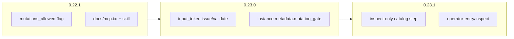

# Mutation Guard & Inspect Semantics

**Status:** Approved (July 3, 2026)  
**Version target:** 0.22.1 (protocol) · 0.23.0 (input_token) · 0.23.1 (inspect-only product fix)  
**Builds on:** [0.22.0 shipped](../../RELEASE-0.22.0.md) · agent skill + `docs/mcp.txt`  
**Evidence:** [archive/conversation_export.xml](../../archive/conversation_export.xml) — agent sent unsolicited `yes` at summary, completing operator-entry

---

## Problem

| Failure | Export evidence | Root cause |
|---------|-----------------|------------|
| User said **“inspect”** | Turn 3–4 | Agent mapped to menu item `inspect-only` (write), not read-only tools |
| Session **completed** without user confirm | `tc4`: `value: "yes"` | Weak LLM auto-confirms summary steps |
| **Cannot restore** WAITING state | Turns 17–20 | Terminal `SUCCEEDED` is irreversible; backtrack fails |
| Read/write tools **undifferentiated** | `palm_flows_session` then `palm_assist` write | No protocol signal that inspect must not mutate |

**Inspect-only operator-entry** is a wizard intent with `handoff_map: None`, but `include_summary: True` — it still commits on `yes`. User wanted a **pausable read mode**, not a terminal path.

---

## Goal

Prevent accidental wizard advancement during agent “inspect” work without breaking human Explorer/CLI or powertool defaults.

| Release | Deliverable |
|---------|-------------|
| **0.22.1** | `mutations_allowed` in assistant envelope; agent docs; replay test (read-only path) |
| **0.23.0** | Optional `input_token` (CSRF-style) on mutations; `PALM_MCP_REQUIRE_INPUT_TOKEN` |
| **0.23.1** | `inspect-only` no-commit catalog step; `operator-entry/inspect` read alias |

---

## Principles

1. **Read tools stay read-only** — `palm_flows_session`, MCP resources never require tokens.
2. **Opt-in strictness** — `input_token` enforced only when env flag set (default off for Explorer).
3. **Core purity** — gate logic in `palm/common/operator/`; validation at service/MCP edges.
4. **Instance metadata** — `ProcessInstance.metadata["mutation_gate"]` + `operator_mode`; no new storage backend.
5. **Replay-driven** — `conversation_export.xml` path becomes CI harness.

---

## Architecture

```
Inspect (GET / MCP read)
        ↓
build_assistant_view / shape_flow_session_view
        ↓
mutation envelope { mutations_allowed, input_token?, step_slug }
        ↓
Agent holds token (if strict mode)
        ↓
Write (POST input / palm_assist value + input_token)
        ↓
apply_flows_session_input → validate_mutation_gate()
        ↓
provide_interactive_input_for_instance
```



---

## Non-goals (0.22–0.23)

- WebSocket assist stream
- `palm-compose-guide` scenario
- Process handoff extensions
- Agent conversation session store (Palm instance owns enforcement)

---

## Success criteria

1. Replay test: user message “inspect” → **zero** `palm_assist` writes without matching user input in transcript.
2. With `PALM_MCP_REQUIRE_INPUT_TOKEN=1`, mutation without token returns structured `mutation_rejected`.
3. `inspect-only` choice leaves session **WAITING** in catalog compose (not `SUCCEEDED`) until explicit exit.
4. `just guard-common` and `just docs-check` green every release.