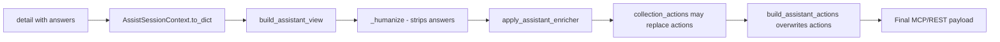
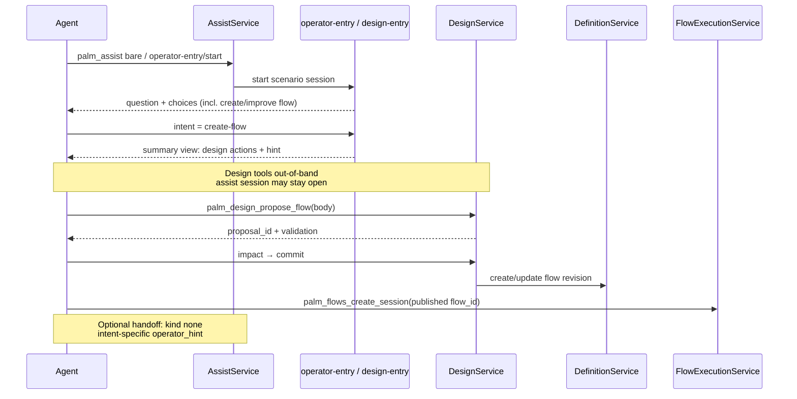
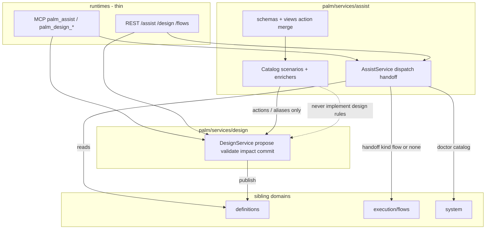

# Palm 0.30 — Assist Design Entry

| Field | Value |
|-------|--------|
| **Document** | Design specification + phased roadmap |
| **Author** | Palm maintainers / AI design pass |
| **Date** | 2026-07-08 |
| **Status** | **Approved** (design review consensus; product: promote 0.30.0 docs; bare assist stays operator-entry; design as sibling domain) |
| **Target track** | **0.30 Assist design entry** |
| **Depends on** | Assist 0.18–0.23 (shipped), Design Service 0.25+ (shipped), compositional design 0.27+, document/KV 0.28–0.29 |
| **Vision** | [docs/VISION-0.30.md](../../VISION-0.30.md) |
| **Plan** | [docs/superpowers/plans/2026-07-08-assist-design-entry-0.30.md](../plans/2026-07-08-assist-design-entry-0.30.md) |
| **Delivery** | Sequential phase commits on master when good enough (short branches optional for tracking) |

---

## Overview

Coding agents already run business flows successfully through **Assist** (`palm_assist` → operator-entry → session drive) and already **create/improve definitions** through **Design Service** (`palm_design_*` propose → impact → commit). Those two loops are powerful but **disconnected at the operator front door**: `examples/definitions/operator_entry.py` only triages `todo-builder`, `compositional-parent`, and `inspect-only`. Agents therefore discover design via prose skill/docs rather than via the same entry UX that teaches “what next?”, and post-session they often drift into free-form Python instead of staying in Design/Assist.

**0.30** closes that gap by making **design entry a first-class Assist surface** — discovery CTAs, optional guided scenario, and polished handoff/actions that **compose Design Service without reimplementing it**. **0.30.0 is documentation and contracts only** (vision, this spec, plan, STATUS/AGENTS/skill alignment). Later micro-releases add behavior in a testable ladder: **assistant pipeline plumbing + inspect CTAs + choices first**, scenario shell second, deeper handoff third.

**Implementability note (post-review):** 0.30.1 is not “enricher-only.” Today’s pipeline **overwrites** enricher `actions` and **strips** answers before enrichers run. This design specifies action-merge, intent visibility, a normative multi-turn script, and a split between view-level vs handoff-payload work so PR-2 is buildable against the real code.

---

## Background & Motivation

### Current state (repo anchors)

| Layer | What exists today | Path |
|-------|-------------------|------|
| Operator triage | Wizard choices: `todo-builder`, `compositional-parent`, `inspect-only`; handoff_map to flow ids or `None` | `examples/definitions/operator_entry.py` |
| Assist enricher | Catalog mode actions + handoff hint; **no design CTAs** | `enrich_operator_entry()` same file |
| Assist service | `dispatch`, `handoff()` → `{kind: flow\|none, flow_id, create_params, operator_hint}`; **none-hint is hardcoded** | `src/palm/services/assist/service.py` |
| Assist session view | `AssistSessionContext.to_dict()` builds assistant view then **replaces** `actions` via `build_assistant_actions` | `src/palm/services/assist/schemas.py` |
| Assistant views | Humanize → enricher → collection actions replace; **no answers on payload** | `src/palm/services/assist/views.py` |
| OperatorViewContext | session_id, flow_id, scenario_id, handoff_ready, invoke_tree, gate — **no intent/answers** | `src/palm/common/operator/view_registry.py` |
| Design Service | `propose_flow/resource`, validate, impact, commit, discard | `src/palm/services/design/service.py` |
| Design MCP / aliases | `palm_design_*` + `design/*` path aliases; assistant impact/validate views | `src/palm/runtimes/mcp/design/`, `design/registry.py`, `design/views.py` |
| Agent skill | Design loop documented, **not** wired into operator-entry | `docs/skills/palm/references/design-flows.md`, `docs/mcp.txt` §15 |
| Constitution | Handoff not duplicate; scenarios are catalog flows | ADR-006, `docs/VISION-0.18-ASSIST.md` |

### Verified pipeline gaps (must fix for 0.30.1)



| Gap | Code fact | Consequence for design entry |
|-----|-----------|------------------------------|
| **Actions overwrite** | After `build_assistant_view`, `to_dict` sets `payload["actions"] = build_assistant_actions(self)` whenever non-empty (`schemas.py` ~55–60). Collection menu can also replace actions inside the builder (`views.py` ~57–63). | Enricher-injected design CTAs on **session** turns are dropped today. Catalog `inspect_catalog` bypasses this (static payload in `service.py`) — that path still works for CTAs. |
| **No intent on enricher input** | Humanize does not put `answers` / `answers_preview` on the assistant payload; `OperatorViewContext` has no intent field. | Enricher cannot branch on `create-flow` vs `todo-builder` at summary without new plumbing. |
| **Hardcoded none-hint** | `handoff()` for non-flow targets always returns a fixed `operator_hint` string. | Calling handoff after `create-flow` misleads agents unless `service.py` is updated. |

### Pain points (from product + agent feedback)

1. **Missing top-level intent** — “Create a new flow from scratch” is not a choice on operator-entry.
2. **Split mental models** — Run flows via Assist; write catalog via Design tools. Agents that only learn operator-entry never see design.
3. **Post-terminal drift** — After handoff/session success, no strong CTA back into propose/improve loops.
4. **Documentation exists but is not discoverable in-session** — `palm://agent/references/design-flows` is load-on-demand; weak LLMs skip it unless `actions`/`hint` force the path.
5. **Deferred items nearby but distinct** — STATUS tracks `palm-compose-guide`, process handoff, `create_params` mapping, WebSocket assist stream as **0.23 deferred**. 0.30 must **relate carefully** and **not absorb** that scope. When STATUS Priorities are rewritten (PR-1), keep that deferred list **explicitly outside** the 0.30 critical path.

### Why not “just document design more”?

Prose alone failed to keep agents in the Design loop once they are inside operator-entry. The fix is **in-band operator UX** (choices, actions, scenario, handoff metadata) that points at existing Design tools — consistent with Assist’s role as the “operator soul.”

---

## Goals & Non-Goals

### Goals

1. **0.30.0 foundation** — Ship vision + design + phased plan + STATUS/AGENTS/skill/mcp alignment with **no required runtime behavior change**.
2. **End-state UX (0.30 series)** — From operator-entry (or a linked scenario), an agent/human can start **create flow**, **improve existing flow**, or **propose resource**, follow propose → impact → commit, then optionally **run** the published flow — all without free-form Python.
3. **Strict boundaries** — Assist guides and hands off; Design owns proposals and catalog writes; Definitions remain catalog/CRUD; Flows remain business REPL.
4. **Incremental complexity** — Each micro-release independently mergeable and testable; prefer pipeline-safe actions + inspect CTAs + choices before new wizards; wizards before new service methods.
5. **Registry-first extension** — New scenarios via `register_assist_contributor()`; no core purity violations; no Design logic inside Assist route handlers.
6. **Buildable 0.30.1 contract** — Action-merge, intent visibility, multi-turn script, and view vs handoff ownership are specified before code.

### Non-Goals (0.30 track)

| Non-goal | Rationale |
|----------|-----------|
| Reimplement propose/validate/impact/commit inside Assist | Violates ADR-006 / SRP; Design already owns this |
| Replace `palm_design_*` tools | They remain the write path; Assist only surfaces them |
| Full visual flow builder / natural-language→full AST codegen in Assist | Complexity without proven need; agents already propose JSON bodies |
| `palm-compose-guide` as a 0.30.0 deliverable | Deferred 0.23 item; may be referenced as optional later ladder step |
| Process handoff (`kind: process`) completion | Separate deferred track |
| WebSocket assist streaming | Unrelated transport work |
| Core engine changes | Design entry is services + examples + docs |
| Big-bang refactor of assist package | Cleanup only when a phase is blocked |
| New metrics infrastructure | Correlation fields optional; no new observability platform in 0.30 |
| `resource:` action field for MCP resources | Not established; playbook URI lives in `hint` / skill / mcp.txt only |

---

## Proposed Design

### North-star operator loop



### Layer boundaries (explicit)



| Concern | Owner | Assist may… | Assist must not… |
|---------|-------|-------------|------------------|
| Operator triage & “what next?” | Assist | Offer choices, hints, actions, scenarios | Execute design commits itself |
| Proposal lifecycle | Design | Point actions at `design/*` / `palm_design_*` | Store proposals, run impact scan, auto-migrate |
| Catalog CRUD / revisions | Definitions (+ Design commit) | List/describe via existing reads | Bypass Design for agent writes |
| Run published flow | execution/flows | Handoff `kind: flow` with `flow_id` (after publish, 0.30.2/3) | Become a second design API |
| Observe | system | doctor / waiting lists in catalog mode | — |

### Complexity ladder (refined)

| Phase | Theme | What ships | Behavior change? | Testability |
|-------|-------|------------|------------------|-------------|
| **0.30.0** | Vision + design + roadmap | `VISION-0.30.md`, durable spec/plan, STATUS priorities (0.30 table; **0.23 deferred kept separate**), AGENTS note, skill/mcp.txt **future-tense** stubs | **No** | `just docs-check`; PR-1 checklist |
| **0.30.1** | Pipeline + discovery | Action-merge; intent visibility; operator-entry choices; enricher/design CTA helper; `inspect_catalog` design action; optional small none-hint map in `handoff()` | **Yes** | Final payload after `to_dict()`; inspect_catalog unit; handoff matrix for design intents |
| **0.30.2** | Design-entry scenario shell | Scenario with step slug **`intent`** (handoff-compatible); actions still point at Design; no catalog write on start | **Yes** | Proposal repo unchanged on start; propose not called; no design.service import in enricher |
| **0.30.3** | Handoff polish + optional kind | `create_params` / post-terminal CTAs; optional `kind: design` + MIGRATION note (unknown kind → treat as none + read hint) | **Yes** | Contract tests on `handoff()` |
| **0.30.4+** | Deeper UX (optional) | Catalog pick, step collection, compose-guide link — **only if justified** | Optional | Replay harness |

### Assistant action composition (normative for 0.30.1)

**Problem:** Enricher-only design `actions` do not reach the client on interactive sessions.

**Rule — merge, do not replace (session assistant format):**

Final `actions` list =

1. **Base session verbs** from `build_assistant_actions(session_ctx)` (Send answer, Hand off, Cancel, …) — always first when present.
2. **Scenario / design CTAs** from enricher **or** a shared helper invoked after base actions (preferred: helper callable from both enricher and `to_dict` so tests can assert one function).
3. **Collection menu actions** from `build_collection_assistant_actions` — when collection phase is active, collection actions **win for mutation verbs** but design CTAs that are pure tool/alias pointers **append** after collection actions (or replace only conflicting labels).

**Dedupe key:** `(alias or tool or path tuple, label)` — first wins.

**Implementation options (pick one in PR-2; recommended = Option 1):**

| Option | Where | Notes |
|--------|-------|-------|
| **1 (recommended)** | `AssistSessionContext.to_dict` after `build_assistant_actions`: `merge_assistant_actions(base, payload.get("actions"), design_ctas)` | Enricher may still set provisional actions; final merge is authoritative |
| **2** | Extend `build_assistant_actions` to accept optional extra CTAs derived from intent | Keeps all action logic in `views.py` |
| **3** | Design CTAs only via `build_assistant_actions` + intent from context (enricher only sets `hint`) | Enricher stops owning actions for design |

**Files for PR-2:** at least `src/palm/services/assist/schemas.py`, `src/palm/services/assist/views.py`, optionally a small `action_merge.py` or helper in `views.py`; **tests must assert the payload returned by `to_dict(view_format="assistant")`**, not the enricher return value alone.

**Out of scope for action shape (0.30.1):**

Wire-faithful action objects only:

```json
{ "label": "Propose new flow", "tool": "palm_design_propose_flow" }
```

```json
{ "label": "Propose via assist proxy", "alias": "design/propose" }
```

```json
{
  "label": "Propose improvement",
  "tool": "palm_design_propose_flow",
  "params": { "base_flow_id": "<from intent / answers when known>" }
}
```

**Not allowed in 0.30.1 action dicts:** `resource:`, `when:`, free-form commentary fields. Playbook URI (`palm://agent/references/design-flows`) appears in **`hint`**, skill text, and mcp.txt — not as an action key until a separate schema + client work item exists (Open Question OQ-6).

### Intent visibility for enrichers / CTA helpers (normative for 0.30.1)

**Problem:** Enrichers cannot see `create-flow` on the humanized payload.

**Decision (KD-9):** Use **Option A** as the primary 0.30.1 path:

| Option | Description | 0.30.1 |
|--------|-------------|--------|
| **A (chosen)** | Extend `OperatorViewContext` with optional `answers_preview: dict[str, Any] \| None` and/or `intent: str \| None`, populated in `AssistSessionContext.to_dict` from `detail` via the same extraction as `_answers_from_view` / first-level answers. | **Yes** |
| **B** | Put `answers_preview` on the assistant payload before enricher (humanize change). | Optional complement if clients need answers; not required if A is enough for CTA helpers |
| **C** | Encode design mode only via `step_slug` (dedicated steps). | Used in **0.30.2** design-entry structure; not sufficient alone for operator-entry summary after intent choice |

**Derivation rule:**

```text
answers = answers from detail (top-level or pattern.answers)
intent  = answers.get("intent")
answers_preview = slim dict: at least { "intent": intent } when present
                  (do not dump full secrets; reuse compact preview patterns if available)
```

Enricher / CTA helper branches:

- `intent in {"create-flow", "improve-flow"}` (and later `propose-resource`) → design CTAs + design-oriented `hint`.
- `intent` business flow → existing handoff behavior (no design CTAs required).
- `operator_mode == "inspect"` / catalog → catalog + design discovery CTAs.

### View-level vs handoff-payload ownership

| Surface | 0.30.1 | 0.30.3 |
|---------|--------|--------|
| **Session assistant view** (`to_dict`) | Design `actions` + `hint` on summary after design intent; primary agent path | Post-terminal re-entry CTAs refined |
| **`AssistService.handoff()` JSON** | **Small additive change allowed:** intent-specific `operator_hint` when `kind: none` and intent is design-related (metadata map preferred). Still `kind: none`. **Not** full `kind: design`. | Optional `kind: design`, `create_params` mapping, ADR/MIGRATION |
| **Primary agent path** | **Do not require handoff** to start design; tools run out-of-band | Handoff optional for structured clients |

**Metadata-driven none-hints (preferred, keeps Design out of Assist code):**

In assist flow metadata (operator-entry):

```python
"handoff_none_hints": {
    "create-flow": (
        "No business flow handoff. Use palm_design_propose_flow, then "
        "palm_design_impact and palm_design_commit. See skill design-flows."
    ),
    "improve-flow": (
        "No business flow handoff. Use palm_design_propose_flow with base_flow_id, "
        "then impact and commit."
    ),
    "inspect-only": "Assist session complete — no business flow handoff requested.",
},
```

`handoff()` reads `answers["intent"]`, resolves `handoff_map`, and if target is None, uses `handoff_none_hints.get(intent, DEFAULT_NONE_HINT)` instead of only the hardcoded string.

**Example return for `intent=create-flow` (0.30.1 minimum):**

```json
{
  "handoff": {
    "kind": "none",
    "flow_id": null,
    "session_id": null,
    "create_params": {},
    "operator_hint": "No business flow handoff. Use palm_design_propose_flow, then palm_design_impact and palm_design_commit. See skill design-flows."
  }
}
```

### Phase details

#### 0.30.0 — Fundamentals (this release intent)

**In scope**

- Product vision, this design specification (including pipeline contracts above), implementation plan skeleton.
- STATUS “Priorities & Next Steps” → **0.30 Assist design entry** table with open/shipped markers for 0.30.0–0.30.3; **retain 0.23 deferred list as non-0.30**.
- AGENTS.md short pointer.
- Skill / mcp.txt stubs: **future tense** (“will offer”, “planned 0.30.x”); do not claim operator-entry already has create-flow choices.
- Key Decisions including KD-9 (intent visibility) and KD-10 (action merge).

**Preferred:** zero Python behavior change in 0.30.0.

**PR-1 acceptance checklist**

- [ ] No new choices in `operator_entry.py`
- [ ] mcp/skill language uses future tense / “planned”
- [ ] STATUS priority table rows for 0.30.0–0.30.3 with open/shipped markers
- [ ] 0.23 deferred items listed separately, not under 0.30 critical path
- [ ] `just docs-check` passes when links land in-repo

#### 0.30.1 — Discovery CTAs + pipeline plumbing

**End-user visible change**

Operator-entry intent step gains design choices; summary (and inspect surfaces) show design tools; optional handoff none-hint is truthful.

| Choice slug | Human label (preferred) | Meaning | Routing |
|-------------|-------------------------|---------|---------|
| `todo-builder` | Run todo builder | existing demo | handoff → flow |
| `compositional-parent` | Run compositional parent | existing demo | handoff → flow |
| `inspect-only` | Inspect catalog | existing | catalog step |
| `create-flow` | Create a new flow | design discovery | summary + design CTAs; handoff_map → `None` |
| `improve-flow` | Improve an existing flow | design discovery | summary + design CTAs; handoff_map → `None` |

**`propose-resource`:** **defer to 0.30.2+** as a choice on operator-entry (reduces choice sprawl). May appear as a design-entry mode later.

**Choice labels:** Prefer dict choices if wizard schema already supports `{slug, label}` (or equivalent used elsewhere); otherwise keep string slugs and update the intent step **prompt** to group options, e.g.:

> “Run a demo flow, inspect the catalog, or create/improve a flow definition (Design Service).”

`_humanize_choices` title-casing is acceptable fallback, not ideal copy.

**`route_on_answer`:** Keep `inspect-only` → `catalog`; design intents use **`default` → summary** with `include_summary: true` (already compatible).

##### Normative multi-turn script (0.30.1 minimum viable path)

Weak-LLM agents follow **one primary path**. Session-mutating vs side-tool steps are marked.

| Step | Agent does | Mutates assist session? | Notes |
|------|------------|-------------------------|-------|
| 1 | `palm_assist` / `operator-entry/start` | Yes — creates session | |
| 2 | Input `create-flow` (or `improve-flow`) on intent step | Yes | |
| 3 | Land on **summary** (confirm if wizard requires `yes` / continue) | Yes if confirmation needed | View must show design `actions` + `hint` |
| 4 | **Primary:** call `palm_design_propose_flow` (then impact → commit) **out-of-band** | **No** assist mutation | Assist session may remain open at summary/`handoff_ready` |
| 5 | Load playbook via skill/resource docs if needed (`palm://agent/references/design-flows`) | No | Not an action field |
| 6 | **Optional:** call assist session **handoff** | Read-only handoff API | Returns `kind: none` + intent-specific `operator_hint` (same tool names). **Not required** to start design |
| 7 | After commit: `palm_flows_describe` / `palm_flows_create_session` | Flows domain | **Not** via assist handoff in 0.30.1 |
| 8 | Optional: cancel or leave assist session | Yes | Avoid looping on useless none-handoff |

**Anti-patterns to document in skill:**

- Do not abandon design because handoff returned `kind: none` — that is expected for design intents.
- Do not draft Python flow definitions; use `palm_design_*`.
- Do not use `palm_definitions_*` create/update for agent catalog writes.

##### Implementation sketch (0.30.1)

1. **Intent visibility (KD-9):** Populate `OperatorViewContext.intent` / `answers_preview` in `to_dict` from `detail`.
2. **Action merge (KD-10):** Implement merge in `schemas.py` / `views.py`; design CTA helper e.g. `design_discovery_actions(intent: str | None) -> list[dict]`.
3. **operator_entry.py:** Extend `choices`, `handoff_map`, optional `handoff_none_hints`; expand `enrich_operator_entry` for hints (and provisional actions if still useful); keep catalog `_catalog_actions` design CTA.
4. **`AssistService.inspect_catalog`:** Add static action e.g. `{ "label": "Create a new flow", "tool": "palm_design_propose_flow" }` (and optionally improve) — **high value, low risk**, not subject to session `to_dict` overwrite.
5. **`AssistService.handoff`:** Intent-specific none `operator_hint` via metadata map (small, additive). **Do not** add `kind: design` in this phase.
6. **Docs:** mcp.txt, skill, design-flows “Entry from operator-entry” with the normative script above (present tense once shipped).

#### 0.30.2 — `design-entry` scenario shell

When discovery alone is insufficient, ship a **thin wizard scenario**:

```
scenario_id: design-entry
flow_id: flow-palm-design-entry
contributor_id: builtin-design-entry
```

**Handoff-compatible step keying (required):**

`AssistService.handoff()` keys only on `answers.get("intent")` and `handoff_map[intent]`. Therefore design-entry **must** use a step with slug **`intent`** for the primary mode choice (not `mode`), so handoff stays coherent without a 0.30.2 resolver rewrite.

| Step slug | Role |
|-----------|------|
| **`intent`** | choice: `create-flow` \| `improve-flow` \| `propose-resource` \| `exit` |
| `name_or_base` | text — new flow name or existing flow id for improve |
| `summary` | instruct agent: design tools; actions from enricher/pipeline |
| `intent` after publish path (optional second phase) **or** separate answer | If agent chooses to run after publish, either (a) agent holds `flow_id` from Design commit and calls flows create_session out-of-band (0.30.2 default), or (b) 0.30.3 maps answers → handoff |

**Recommended 0.30.2 after-publish behavior:** **Out-of-band** `palm_flows_create_session` using the **published flow id from Design commit response** (agent-held). Do **not** require assist handoff to start the business flow in 0.30.2.

**0.30.3 extension (if in-session run-flow is needed):**

- Metadata: `handoff_answer_key: "intent"` (default) remains.
- Optional: `create_params_from_answers: {"flow_id": "name_or_base"}` **or** handoff_map value that is not a static demo id but resolved from answers when intent is a reserved slug like `run-published` with `flow_id = answers["name_or_base"]` after successful publish.
- Agent must have set `name_or_base` to the **published** id/name; Design commit response is source of truth — session state is a convenience copy only if we later add a non-magic “confirm published id” step.

**Approach C (`kind: scenario`)** from earlier drafts: **not** in 0.30.2. If ever needed, it requires ADR-006 amendment (`flow | process | design | scenario | none`) and is deferred behind OQ-3-style evidence. Prefer starting `design-entry` via action alias `design-entry/start` from operator-entry.

Register via same pattern as operator-entry (`examples/definitions/design_entry.py` + `register_assist_contributor`).

**Boundary tests (0.30.2 oracle):**

1. Start design-entry → **proposal repository count unchanged**.
2. Monkeypatch / spy: `DesignService.propose_flow` **must not be called** on start or pure input of intent.
3. Static/import check: design_entry enricher module **must not** import `palm.services.design.service` (aliases/tools in action dicts are strings only).

#### 0.30.3 — Handoff contract polish

Today (`AssistService.handoff`):

```python
# kind: "flow" | "none"  (ADR-006 also mentions process — deferred / unimplemented)
{
  "handoff": {
    "kind": "flow" | "none",
    "flow_id": str | None,
    "session_id": None,
    "create_params": {},
    "operator_hint": str,
  }
}
```

| Approach | Description | When |
|----------|-------------|------|
| **A. Action-only + none-hint (0.30.1–0.30.2)** | Design via session actions; handoff `kind: none` with metadata hints | Default |
| **B. Typed `kind: design` (optional 0.30.3)** | Envelope fields: `design_action`, `base_flow_id`, `proposal_id`, `operator_hint` | After replay evidence (OQ-3) |
| **C. `kind: scenario`** | Chain assist→assist | Deferred; not preferred |

**Backward compatibility if `kind: design` ships:**

- Document in `MIGRATION-0.30.md`: clients **must** treat unknown `kind` values like `none` and **always read `operator_hint`**.
- Strict equality clients that only handle `flow` may no-op — migration note is mandatory, not optional soft claim.
- Keep OQ-3 as go/no-go after replay failures.

**Post-terminal CTAs (session views):** improve-flow, create another, back to operator-entry, run published flow (flows tools).

#### 0.30.4+ — Optional deeper UX

Only if 0.30.1–0.30.3 leave measurable agent failure modes. No new metrics platform — optional correlation of assist `session_id` in hints is enough.

| Enhancement | Gate |
|-------------|------|
| Dynamic improve catalog pick | Replay shows agents cannot find base_flow_id |
| In-wizard step builder → propose body | High complexity; last resort |
| Link compose-guide | Depends on deferred 0.23 work |
| ResourceLeaf → design | Avoid unless multi-turn commit must be in-job |

---

## End-state UX (0.30 series)

### Personas

1. **Weak LLM agent** — Follows `choices` and `actions` only; must not invent Python.
2. **Strong agent** — May call `palm_design_*` directly but should still discover them from operator-entry.
3. **Human via CLI/Explorer** — Same assistant view fields.

### Canonical scripts

**Create from scratch (0.30.1 normative — see multi-turn table)**

1. Start operator-entry.
2. Choose `create-flow` → summary with design actions.
3. Out-of-band: propose → impact → commit.
4. Run published flow via flows create session.
5. Handoff optional; if used, `kind: none` + design tool names in hint.

**Improve existing**

1. Same entry → `improve-flow`.
2. Identify `base_flow_id` (user text or catalog list tool).
3. `palm_design_propose_flow(base_flow_id=..., body=...)` → impact → commit.

**After business demo**

1. Complete todo-builder.
2. Re-entry CTA (0.30.3): “Create your own flow?” → design intents / design-entry.

---

## API / Interface Changes

### 0.30.0

None (documentation only).

### 0.30.1

**Definition metadata** (`operator_entry.py`) — illustrative:

```python
"choices": [
    # Prefer labeled dicts if schema supports; else strings + richer prompt
    "todo-builder",
    "compositional-parent",
    "inspect-only",
    "create-flow",
    "improve-flow",
],
"handoff_map": {
    "todo-builder": "todo-builder",
    "compositional-parent": "compositional-parent",
    "inspect-only": None,
    "create-flow": None,
    "improve-flow": None,
},
"handoff_none_hints": {
    "create-flow": "No business flow handoff. Use palm_design_propose_flow → impact → commit.",
    "improve-flow": "No business flow handoff. Use palm_design_propose_flow(base_flow_id=…) → impact → commit.",
},
```

**OperatorViewContext (additive fields):**

```python
@dataclass
class OperatorViewContext:
    # ... existing fields ...
    intent: str | None = None
    answers_preview: dict[str, Any] | None = None
```

**Action merge (pseudocode):**

```python
base = build_assistant_actions(self)
extras = payload.get("actions") or []
design = design_discovery_actions(context.intent)
payload["actions"] = merge_assistant_actions(base, extras, design)
```

**inspect_catalog actions (additive):**

```python
{"label": "Create a new flow", "tool": "palm_design_propose_flow"}
{"label": "Improve a flow", "tool": "palm_design_propose_flow"}  # hint explains base_flow_id
```

### 0.30.2

- New scenario registration; MCP aliases `design-entry/start`.
- Step slug **`intent`** for mode; handoff_map entries for design intents → `None`.

### 0.30.3 (if kind: design)

```json
{
  "handoff": {
    "kind": "design",
    "design_action": "propose_flow",
    "flow_id": null,
    "base_flow_id": "my-flow",
    "proposal_id": null,
    "session_id": null,
    "create_params": {},
    "operator_hint": "Call palm_design_propose_flow(base_flow_id='my-flow', body={...}) then impact and commit."
  }
}
```

MIGRATION: unknown kinds → behave as `none` + read `operator_hint`.

---

## Data Model Changes

| Area | Change | Migration |
|------|--------|-----------|
| Flow definitions | New optional design-entry flow; operator-entry options growth | Example catalog bootstrap; user catalogs pin revisions |
| OperatorViewContext | Optional intent / answers_preview | Additive |
| Instance state | New intent slugs in answers | Old sessions unchanged |
| Handoff JSON | Intent-specific none hints (0.30.1); optional kind design (0.30.3) | Additive |
| Proposals | Unchanged | — |

---

## Testing Strategy (per phase)

| Phase | Tests | Notes |
|-------|-------|-------|
| **0.30.0** | Docs consistency; PR-1 checklist | No pytest required |
| **0.30.1** | **Final** `AssistSessionContext.to_dict(view_format="assistant")` contains design actions when intent is create/improve; intent present on context for CTA helper; `inspect_catalog` includes create-flow action; `handoff()` create-flow → kind none + non-generic operator_hint; enricher alone is **insufficient** as sole assertion | Extend `tests/test_operator_entry_flow.py`, `tests/test_assist_service.py`, `tests/test_assistant_view.py` as needed |
| **0.30.2** | Start design-entry → proposal repo count unchanged; `propose_flow` not called; no `palm.services.design.service` import in design_entry enricher module; assistant actions present after `to_dict` | Integration host fixture |
| **0.30.3** | Handoff matrix intents → kind/fields; unknown-kind client note in migration doc | Golden JSON |
| **0.30.4+** | Replay harness full create→commit→run | 0.21.12 harness extensions |

**Latency / load:** Interactive agent scale; no new hot path. Design impact cost remains instance-count dependent.

---

## Alternatives Considered

### 1. Docs-only forever (no operator-entry change)

| Pros | Cons |
|------|------|
| Zero code risk | Already failing for weak LLMs |

**Rejected** as end state; accepted only as **0.30.0** foundation.

### 2. Put design wizard logic inside AssistService methods

**Rejected** — duplicates DesignService; violates ADR-006.

### 3. Auto-start Design propose from resource steps

**Deferred** beyond 0.30.3 — over-magic vs explicit tools.

### 4. Single mega wizard that collects full step list and commits

**Rejected** for early 0.30; optional 0.30.4+ only with justification.

### 5. Expand choices only (0.30.1) without design-entry scenario

**Accepted as 0.30.1** (+ required pipeline plumbing); scenario is 0.30.2.

### 6. Catalog / inspect CTAs only (no new wizard choices)

| Pros | Cons |
|------|------|
| Avoids handoff_map / intent branching and definition churn | Design still not a first-class “what would you like to do?” answer |
| `inspect_catalog` already bypasses session action overwrite — quick win | Bare assist that lands on operator-entry intent still never mentions design |
| Good **subset** or **fallback** if choice-based work slips | Weaker for weak LLMs that only read intent choices |

**Disposition:** Ship **inspect_catalog design CTAs inside 0.30.1** (Issue 8 win) **and** still add wizard choices once action-merge + intent visibility land. If PR-2 must split, **PR-2a** can be inspect-only CTAs + pipeline plumbing without new choices; **PR-2b** adds choices. Not a replacement for end-state operator-entry design intents.

---

## Security & Privacy Considerations

| Threat | Severity | Mitigation |
|--------|----------|------------|
| Assist tricks agents into definitions direct write | Medium | Actions point at `palm_design_*` only |
| Commit without impact | Medium | Unchanged Design commit gate / mutation token |
| Assist escalate privileges | Low | No new privilege |
| Secrets in answers_preview | Medium | Slim preview (intent only by default); no full body dump |
| Prompt injection via catalog names | Low | Treat as data |

---

## Observability

| Signal | Where | Phase |
|--------|-------|-------|
| Scenario starts | Existing job/instance logs | 0.30.2 |
| Handoff kind / intent | Debug log on `handoff()` | 0.30.1+ |
| Optional assist session_id in design-oriented hints | Hint string only | 0.30.1+ optional |
| Agent drift | Replay: create-flow without design tool call | 0.30.2+ |

**Do not** invent metrics infrastructure in this track (0.30.2+ correlation remains optional fields/logs only).

---

## Rollout Plan

| Step | Mechanism |
|------|-----------|
| 0.30.0 | Docs PR; no feature flag |
| 0.30.1 | Pipeline + examples + inspect_catalog; revision pin rollback |
| 0.30.2 | Register design-entry scenario |
| 0.30.3 | Additive handoff; MIGRATION if kind design |
| Rollback | Revert definition revision / unregister contributor; Design path unaffected |

---

## Risks

| Risk | Severity | Mitigation |
|------|----------|------------|
| Enricher-only actions silent failure | **Critical** (pre-revision) | KD-10 action merge; test final `to_dict` |
| Intent invisible to CTA helper | **Critical** (pre-revision) | KD-9 OperatorViewContext intent |
| Generic none-handoff misleads | High | Metadata none-hints in 0.30.1 |
| Choice sprawl | Medium | Cap operator-entry at +2 design choices; propose-resource later; labeled prompt |
| Scope creep (compose-guide, WebSocket) | Medium | KD-6; STATUS separation |
| Design logic in Assist | High | Import ban on design.service in enrichers; boundary tests |

---

## Key Decisions

| # | Decision | Rationale |
|---|----------|-----------|
| **KD-1** | **0.30.0 is docs/vision/spec/plan + STATUS/AGENTS/skill alignment only** | Fundamentals first |
| **KD-2** | **Assist never reimplements Design** | ADR-006 / SRP |
| **KD-3** | **Pipeline plumbing + enricher/actions/aliases (0.30.1) before design-entry wizard (0.30.2) before optional kind: design (0.30.3)** | Minimal magic; buildable order |
| **KD-4** | **Design intents: `handoff.kind: none` + view actions through 0.30.2; intent-specific none `operator_hint` starts in 0.30.1 (small `handoff()` change); full `kind: design` only 0.30.3 if needed** | Separates view vs handoff ownership; avoids useless generic none-hint |
| **KD-5** | **Bare `palm_assist` stays on operator-entry**; design-entry is sibling scenario | Preserve 0.21.7+ default |
| **KD-6** | **0.23 deferred items out of 0.30 critical path** | Prevent track collision; STATUS must keep them separate |
| **KD-7** | **Durable docs:** vision + superpowers spec + plan; ADR only if handoff kinds change | Matches 0.18/0.25 discipline |
| **KD-8** | **Agent-facing docs ship with or before behavioral discovery** | Discoverability |
| **KD-9** | **Intent visibility via `OperatorViewContext.intent` / `answers_preview` populated in `to_dict` from detail** | Enricher/CTA helper can branch without putting full answers on the wire |
| **KD-10** | **Final assistant `actions` are merged in `to_dict` (base ∪ enricher ∪ design CTAs); collection rules documented; tests assert post-`to_dict` payload** | Matches real pipeline; fixes overwrite bug for design CTAs |
| **KD-11** | **0.30.1 primary path: design tools out-of-band from summary; handoff not required** | Weak-LLM single script; avoids handoff dependency |
| **KD-12** | **design-entry uses step slug `intent` for mode** so existing `handoff()` keying works | Coherence with `answers.get("intent")` |
| **KD-13** | **Action dicts are `{label, tool\|alias\|path, params?}` only in 0.30.1; playbook URI in hint/docs** | Grounded in existing action consumers |

---

## Open Questions

| # | Question | Recommendation | Needs user? |
|---|----------|----------------|-------------|
| OQ-1 | Should bare `palm_assist()` land on design-entry? | **No** (product: keep operator-entry; expand it so Design is discoverable — operator historically felt definitions/demo-only) | Resolved for 0.30 |
| OQ-2 | Choice slugs `create-flow` / `improve-flow`? | Yes | No |
| OQ-3 | Ship `kind: design`? | Only after 0.30.2 replay evidence; MIGRATION required | **Yes** before 0.30.3 B |
| OQ-4 | Improve-flow list in-wizard vs tools? | Tools first | No |
| OQ-5 | design-entry under examples vs services package? | **examples/definitions/** | No |
| OQ-6 | First-class `resource:` action for skill URIs? | Out of 0.30.1; separate schema work | Only if product wants it soon |
| OQ-7 | Split PR-2 into 2a (pipeline + inspect) / 2b (choices)? | Prefer single 0.30.1 commit when good enough; optional 2a/2b only if review load high. Delivery is sequential master commits (or short branches), not a required PR stack. | Resolved for workflow |

---

## References

- ADR-006 — `docs/adr/006-assist-domain.md`
- VISION Assist — `docs/VISION-0.18-ASSIST.md`
- VISION Design — `docs/VISION-0.25.md`
- Assist / Design superpowers specs under `docs/superpowers/specs/`
- Design flows skill — `docs/skills/palm/references/design-flows.md`
- Operator entry — `examples/definitions/operator_entry.py`
- Assist: `service.py`, `schemas.py` (`to_dict` action overwrite), `views.py` (enricher then collection), `registry.py`
- `OperatorViewContext` — `src/palm/common/operator/view_registry.py`
- Design service + MCP design tools
- STATUS deferred 0.23 — line ~279; Priorities section for PR-1 rewrite
- Tests to extend: `tests/test_operator_entry_flow.py`, `tests/test_assist_service.py`, `tests/test_assistant_view.py`

---

## Recommended durable project paths (post-approval)

| Artifact | Path |
|----------|------|
| Vision | `docs/VISION-0.30.md` |
| Design spec | `docs/superpowers/specs/2026-07-08-assist-design-entry-design.md` |
| Implementation plan | `docs/superpowers/plans/2026-07-08-assist-design-entry-0.30.md` |
| STATUS | Priorities → 0.30 table; keep 0.23 deferred separate |
| AGENTS.md | Short pointer to VISION-0.30 |
| Optional ADR | Only if `kind: design` ships |
| Skill / mcp.txt | Normative multi-turn script when 0.30.1 ships |

---

## PR Plan

Ordered micro-releases. Each independently reviewable.

### PR-1 — 0.30.0 Vision & design foundation (docs-only)

| Field | Content |
|-------|---------|
| **Title** | `docs(0.30.0): Assist design entry vision, spec, and roadmap` |
| **Files/components** | `docs/VISION-0.30.md`; `docs/superpowers/specs/2026-07-08-assist-design-entry-design.md`; `docs/superpowers/plans/2026-07-08-assist-design-entry-0.30.md`; `STATUS.md` (Priorities: 0.30.0–0.30.3 open/shipped markers; **retain 0.23 deferred outside 0.30 path**); `AGENTS.md`; optional CHANGELOG Unreleased; skill/mcp.txt **future-tense** stubs only |
| **Dependencies** | None |
| **Acceptance** | PR-1 checklist in 0.30.0 section; no `operator_entry` choice changes; `just docs-check` |
| **Description** | Contracts only — including pipeline gaps and 0.30.1 implementability. |

### PR-2 — 0.30.1 Pipeline + discovery CTAs

| Field | Content |
|-------|---------|
| **Title** | `feat(0.30.1): design discovery CTAs and assistant action merge` |
| **Files/components** | **Pipeline:** `src/palm/services/assist/schemas.py` (action merge after `build_assistant_actions`; populate intent on `OperatorViewContext`); `src/palm/services/assist/views.py` and/or action helper; `src/palm/common/operator/view_registry.py` (`OperatorViewContext` fields). **Service:** `src/palm/services/assist/service.py` (`inspect_catalog` design actions; **intent-specific none `operator_hint`** via metadata — not `kind: design`). **Example:** `examples/definitions/operator_entry.py` (choices, handoff_map, handoff_none_hints, enricher hints/CTAs). **Tests:** `tests/test_operator_entry_flow.py`, `tests/test_assist_service.py`, `tests/test_assistant_view.py` (assert **post-`to_dict`**). **Docs:** mcp.txt, skill, design-flows (present tense for shipped path). STATUS/CHANGELOG. |
| **Dependencies** | PR-1 |
| **Acceptance** | (1) create-flow session summary actions include `palm_design_propose_flow` or `design/propose` after `to_dict`; (2) inspect_catalog includes create CTA; (3) handoff(create-flow) → kind none + design-oriented hint; (4) no `kind: design` |
| **Description** | Makes design discoverable and pipeline-correct. Primary agent path is out-of-band design tools from summary. Optional split: **PR-2a** pipeline + inspect_catalog only; **PR-2b** wizard choices (OQ-7). |

### PR-3 — 0.30.2 design-entry scenario shell

| Field | Content |
|-------|---------|
| **Title** | `feat(0.30.2): assist design-entry scenario (wizard shell)` |
| **Files/components** | `examples/definitions/design_entry.py`; bootstrap registration; enricher (no DesignService import); MCP aliases; operator-entry action → `design-entry/start` optional; tests (proposal count, propose not called, import boundary); docs |
| **Dependencies** | PR-2 (discovery + pipeline) |
| **Acceptance** | Start scenario does not write catalog; step slug `intent` for modes; final assistant payload has design actions |
| **Description** | Guided shell; still delegates all writes to Design tools. Post-publish run remains out-of-band flows create. |

### PR-4 — 0.30.3 Handoff polish & optional kind: design

| Field | Content |
|-------|---------|
| **Title** | `feat(0.30.3): assist handoff polish for design entry` |
| **Files/components** | `service.py` handoff (optional kind design / create_params_from_answers); enrichers post-terminal CTAs; contract tests; `MIGRATION-0.30.md` if kind design; ADR if needed |
| **Dependencies** | PR-2 minimum; PR-3 if scenario-specific mapping |
| **Acceptance** | Distinct from PR-2: PR-2 already shipped none-hint text; PR-4 is create_params / kind design / re-entry UX only |
| **Description** | Do not re-litigate action merge. OQ-3 gates `kind: design`. |

### PR-5 — 0.30.4+ Optional deeper UX (gate)

| Field | Content |
|-------|---------|
| **Title** | `feat(0.30.4): design-entry deeper UX (optional)` |
| **Files/components** | design-entry steps; replay harness; docs |
| **Dependencies** | PR-3; product justification |
| **Description** | Catalog pick / step collection only if replay demands. |

### PR-6 — Release hygiene

| Field | Content |
|-------|---------|
| **Title** | `release: 0.30.x Assist design entry` |
| **Files/components** | version, CHANGELOG, RELEASE notes if used, STATUS checkmarks, skill mirrors (`.grok/skills/palm/` if required) |
| **Dependencies** | Feature PR(s) for that x |
| **Description** | `just check` / targeted pytest / MCP smoke. |

---

## Appendix A — Complexity growth principles (normative)

1. Each phase independently mergeable and testable.
2. Never put Design Service logic inside Assist routes — compose/hand off only.
3. Prefer pipeline-safe actions + inspect CTAs + aliases before new wizards; wizards before new service methods.
4. Cleanup only when it unblocks the phase.
5. Docs and skill updates ship with or before behavioral changes agents must discover.
6. Assert on **final** assistant payloads (`to_dict`), not intermediate enricher output alone.

## Appendix B — Mapping to user “must decide” checklist

| Must decide | Resolution |
|-------------|------------|
| 0.30.0 scope | Docs only (KD-1); PR-1 checklist |
| End-state UX | Normative multi-turn + design-entry |
| Boundaries | Boundaries table |
| Handoff shape | KD-4 / KD-11 / KD-12 |
| Testing | Per-phase + oracles |
| PR plan | PR-1…PR-6 with expanded PR-2 |
| Key decisions | KD-1…KD-13 |
| Open questions | OQ-1, OQ-3, OQ-6–7 only where product/team input helps |

## Appendix C — Review revision notes (2026-07-08)

Addressed design review: action overwrite, intent visibility, handoff none-hint ownership, design-entry `intent` slug, multi-turn script, grounded action shape, expanded PR-2 files, inspect_catalog CTA, choice labels, kind: design migration hardness, sharper 0.30.2 oracles, STATUS track separation, no `when` in action JSON, Alternative 6 (inspect-only subset).

---

*End of design document.*
